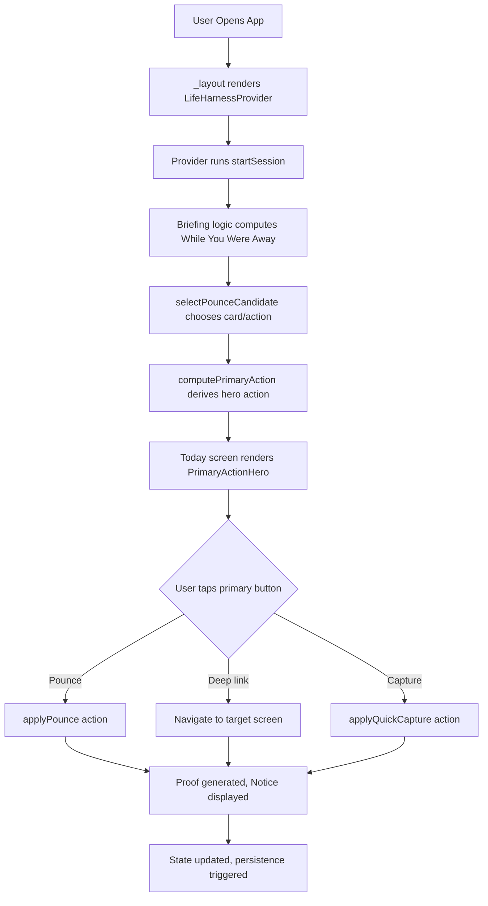

# Technical Design Document: UX-First Redesign

## Overview

### Purpose

The UX-First Redesign transforms Life Harness from feature-first to journey-first information architecture while preserving all existing product mechanics. The redesign solves the critical UX audit findings: Today screen lacks a single obvious next action, navigation contains 11 peer items, Quick Capture is buried, and career workflow is fragmented across 6 disconnected screens.

This design prioritizes the core product promise: "Open app → know what matters → take one small useful action → log proof → recover when stuck" — all within 10 seconds on first open.

### Core Design Goals

1. **Single Primary Action Above the Fold**: Today screen displays one recommended action with one primary button before requiring scrolling
2. **Consolidated Navigation**: Reduce from 11 to 5 primary navigation items by grouping career features under unified Career Hub
3. **Capture Prominence**: Elevate Quick Capture to immediate visibility with primary action styling
4. **Unified Career Pipeline**: Present candidates, applications, follow-ups, and sources as one connected workflow
5. **Recovery Discoverability**: Surface Salvage and MVD near briefing when relevant, not at page bottom
6. **Briefing-Pounce Synchronization**: Use single source of truth for recommended daily action
7. **Progress Over Operations**: Reorder Progress screen to emphasize proof and wins before operator dashboards
8. **Clear Completion Semantics**: Distinguish pounce initiation from completion with explicit UI language
9. **Proof Over Log**: Clarify that Proof Shelf is user-facing evidence while Log is developer audit trail
10. **Card Detail Progressive Disclosure**: Show re-entry information first, collapse planning sections by default

### Design Philosophy

**Preserve All Product Mechanics**: Active limit (3 cards), Main Quest, Parked-not-failed, Warmth tracking, Proof Shelf, While You Were Away briefing, Pounce Mission, MVD, Salvage Mode, and use-before-improve locks remain unchanged in core logic.

**Reorganize Information Architecture**: The redesign is a presentation-layer transformation. Backend state management, action handlers, and business rules remain intact. The design introduces new component compositions and screen layouts without altering data models or core algorithms.

**Field Ops Visual Language**: Retain the brass/olive theme, uppercase section labels, bordered cards, and operator aesthetic while adding visual hierarchy through size, position, and strategic accent placement.


## Architecture

### Component Hierarchy

The redesign introduces three new organizational components and refactors existing screens while preserving all current React Native components:

```
App (Expo Router)
├── _layout.tsx (LifeHarnessProvider - unchanged)
├── Navigation System (new consolidated nav)
│   └── 5 primary tabs: Today, Board, Career Hub, Progress, More
├── Today Screen (restructured)
│   ├── PrimaryActionHero (new)
│   ├── Briefing (existing, promoted)
│   ├── QuickCaptureBar (new sticky variant)
│   ├── MainQuestCard (existing, condensed)
│   ├── RecoveryPanel (conditional render based on briefing)
│   ├── ActiveCardsSummary (existing, collapsed by default)
│   └── ProofShelfPreview (existing, kept)
├── Board Screen (minimal changes)
│   └── Visual scroll hint added
├── Career Hub (new unified screen)
│   ├── PipelineOverview (new)
│   ├── CandidateQueue (integrated from job-candidates)
│   ├── ActiveApplications (filtered cards)
│   ├── FollowUps (from Today)
│   ├── JobSources (linked, not embedded)
│   └── ResumeBank (linked, not embedded)
├── Progress Screen (reordered sections)
│   ├── ProofShelf (moved to top)
│   ├── WeeklyXP (moved to top)
│   ├── CareerMomentum (new stats grouping)
│   ├── WarmthOverview (existing)
│   └── AdvancedPanel (collapsed: locks, export, scout stats)
├── Card Detail (progressive disclosure)
│   ├── ResumePanel (promoted)
│   ├── NextTinyAction (promoted)
│   ├── QuickCaptureForCard (new inline capture)
│   ├── WorkLanes (Do + Improve combined)
│   └── PlanningAccordion (collapsed by default)
└── More Menu (secondary nav)
    ├── Log (demoted from primary nav)
    ├── Ask Harness Dev (moved from primary nav)
    ├── Source Setup (linked from Career Hub)
    └── Advanced Data Tools
```

### State Management

**No Changes to Core State**: The `LifeHarnessState.tsx` context provider and reducer remain unchanged. All state structure (`cards`, `logs`, `proofItems`, `dailyState`, `jobCandidates`, `jobSources`, `jobSourceRuns`, `resumeModules`, `chatSummaries`, `memoryItems`) is preserved.

**New Derived State for Primary Action**:
- `computePrimaryAction(briefing, dailyState, cards, logs, now)` - selects the single recommended action from briefing logic
- Returns: `{ actionText: string, buttonLabel: string, targetRoute?: string, cardId?: string, isPounce: boolean }`

**Briefing Synchronization**:
- `dailyState.pounceMission` and `dailyState.smallestStart` will be updated by briefing logic at session start
- Eliminates divergence between static seed data and dynamic briefing recommendations (Requirement 6)

### Data Flow



**Key Data Transformations**:

1. **Briefing to Primary Action**:
   ```typescript
   function computePrimaryAction(
     briefing: Briefing,
     dailyState: DailyState,
     cards: LifeCard[],
     logs: LifeLogEntry[],
     now: Date
   ): PrimaryAction {
     // Extract first "Suggested pounce:" from briefing.prepared
     // Return action text, button label, and optional deep link
   }
   ```

2. **Career Pipeline State**:
   ```typescript
   function buildCareerPipelineState(
     jobCandidates: JobCandidate[],
     cards: LifeCard[],
     jobSources: JobSource[],
     jobSourceRuns: JobSourceRunResult[],
     now: Date
   ): CareerPipelineState {
     return {
       candidatesWaiting: jobCandidates.filter(c => c.status === 'new' || c.status === 'saved'),
       activeApplications: cards.filter(c => c.careerApplication && c.state === 'active'),
       waitingApplications: cards.filter(c => c.careerApplication && c.state === 'waiting'),
       followUpsDue: getFollowUpsDue(cards, now),
       dueSources: getDueJobSources(jobSources, now).length,
       lastRun: jobSourceRuns[0]
     };
   }
   ```

3. **Recovery Relevance Check**:
   ```typescript
   function shouldShowRecoveryEarly(
     briefing: Briefing,
     dailyState: DailyState,
     now: Date
   ): boolean {
     const hasSalvageSuggestion = briefing.prepared.some(line => line.includes('salvage'));
     const mvdIncomplete = !dailyState.minimumViableDayCompleted;
     const isEvening = now.getHours() >= 18;
     return hasSalvageSuggestion || (mvdIncomplete && isEvening);
   }
   ```


## Components and Interfaces

### New Components

#### 1. PrimaryActionHero

**Purpose**: Display single recommended action above the fold on Today screen (Requirement 1)

**Props**:
```typescript
interface PrimaryActionHeroProps {
  actionText: string;          // "Paste one job into Candidate Intake"
  buttonLabel: string;          // "Start Pounce" or "Open Queue"
  smallestStart?: string;       // "Copy one job description from any source"
  targetRoute?: string;         // "/candidate-intake" or undefined for pounce
  onPress: () => void;          // Handler for primary button
  isPounceAction: boolean;      // Affects button semantics
  disabled?: boolean;           // When pounce already logged
}
```

**Visual Design**:
- Large brass accent border on left (4px)
- Action text: 18pt, primary text color, bold
- Smallest start: 14pt, tertiary text color, italic
- Primary button: full brass background, 44×44 minimum touch target
- Positioned immediately below nav and notice area
- Background: `bgTertiary` to distinguish from other sections

**Behavior**:
- Tapping primary button either triggers `pounce()` or navigates to `targetRoute`
- When `isPounceAction` is true and `disabled` is true, show help text: "Pounce logged. Complete the mission, then log completion."
- After successful pounce, display persistent "Last Win" chip showing proof item

**Implementation File**: `src/components/PrimaryActionHero.tsx`

---

#### 2. ConsolidatedNav

**Purpose**: Replace 11-item navigation with 5 primary tabs (Requirement 2)

**Props**:
```typescript
interface ConsolidatedNavProps {
  currentRoute: string;
}
```

**Navigation Structure**:
```typescript
const primaryNavItems = [
  { label: 'TODAY', route: '/', icon: '◆' },
  { label: 'BOARD', route: '/board', icon: '▦' },
  { label: 'CAREER', route: '/career-hub', icon: '⬆' },
  { label: 'PROGRESS', route: '/progress', icon: '▸' },
  { label: 'MORE', route: '/more', icon: '⋯' }
];

const secondaryNavItems = [
  { label: 'Log', route: '/log' },
  { label: 'Ask Harness Dev', route: '/ask-harness' },
  { label: 'Memory Bank', route: '/memory-bank' },
  { label: 'Advanced', route: '/advanced' }
];
```

**Visual Design**:
- Primary tabs: 44×44 touch targets, uppercase labels, brass accent on active
- Icons optional, text-only acceptable for v0.1
- Horizontal layout, no wrapping on viewports ≥390px
- Secondary items accessed via "MORE" tab, rendered as vertical list

**Accessibility**:
- Each tab has `accessibilityLabel` describing purpose
- Active tab has `accessibilityState={{ selected: true }}`
- Minimum 44×44pt touch targets (Requirement 14)

**Implementation File**: `src/components/ConsolidatedNav.tsx`

---

#### 3. QuickCaptureBar

**Purpose**: Sticky or prominent capture input with primary action styling (Requirement 3)

**Props**:
```typescript
interface QuickCaptureBarProps {
  onNotice: (notice: NoticeState) => void;
  variant?: 'sticky-top' | 'sticky-bottom' | 'inline-prominent';
  showExamples?: boolean;
}
```

**Visual Design**:
- Label: "CAPTURE" (uppercase, 12pt, brass label color)
- Input: 48px minimum height, brass border on focus
- Submit button: Primary action styling (brass background, white text)
- When `showExamples` is true, render inline help text with parse pattern examples
- For sticky variants: fixed position with brass border on all sides

**Behavior**:
- On submit, call `submitQuickCapture(rawText)`
- Success notice format: "Added to Inbox: [parsed title]" or "Logged [area] win: [parsed title]"
- Clear input after successful submission
- On focus, expand to show parse pattern hints if `showExamples` is true

**Implementation File**: `src/components/QuickCaptureBar.tsx`

---

#### 4. CareerPipelineOverview

**Purpose**: Unified status dashboard for Career Hub (Requirement 4)

**Props**:
```typescript
interface CareerPipelineOverviewProps {
  candidatesWaiting: number;
  activeApplications: number;
  waitingApplications: number;
  followUpsDue: number;
  dueSources: number;
  lastRunSummary?: string;
}
```

**Visual Design**:
- Horizontal cards showing each pipeline stage
- Each card: stage name (uppercase label), count (large brass number), status icon
- Example: "CANDIDATES WAITING • 3" | "ACTIVE APPLICATIONS • 2" | "FOLLOW-UPS DUE • 1"
- Tappable cards navigate to relevant section within Career Hub
- Brass accent border on stages with pending action

**Layout**:
```
┌─────────────────┬─────────────────┬─────────────────┐
│ CANDIDATES      │ APPLICATIONS    │ FOLLOW-UPS      │
│ WAITING         │ ACTIVE          │ DUE             │
│                 │                 │                 │
│    3            │    2            │    1            │
└─────────────────┴─────────────────┴─────────────────┘
```

**Implementation File**: `src/components/CareerPipelineOverview.tsx`

---

#### 5. RecoveryPanel

**Purpose**: Conditional early rendering of MVD/Salvage when relevant (Requirement 5)

**Props**:
```typescript
interface RecoveryPanelProps {
  showSalvage: boolean;
  showMvd: boolean;
  mvdCompleted: boolean;
  salvageCompleted: boolean;
  onMvdComplete: () => void;
  onSalvageComplete: (option: string) => void;
  onNotice: (notice: NoticeState) => void;
}
```

**Visual Design**:
- Brass warning border (3px left border)
- Title: "RECOVERY OPTIONS" (uppercase label)
- MVD checklist: show completion state (2/4 done) without requiring expansion
- Salvage picker: visible options, one-tap selection
- Render only when `showSalvage` or `showMvd` is true

**Positioning Logic**:
- Render immediately after PrimaryActionHero when recovery is relevant
- Skip rendering when both MVD and Salvage are complete
- Do not render at page bottom (current implementation)

**Implementation File**: `src/components/RecoveryPanel.tsx`

---

#### 6. EphemeralNotice (Enhanced)

**Purpose**: Extended-duration notices for proof-generating actions (Requirement 11)

**Enhancements to Existing `Notice.tsx`**:
```typescript
interface NoticeState {
  kind: 'success' | 'warning' | 'error' | 'info';
  message: string;
  duration?: number;  // NEW: Allow override of 3s default
  persistent?: boolean;  // NEW: Require manual dismiss
  proofGenerated?: boolean;  // NEW: Trigger pulse effects
}
```

**Behavior Changes**:
- Default duration remains 3000ms
- When `proofGenerated` is true, duration extends to 10000ms
- When `persistent` is true, notice remains until user taps dismiss
- Proof-generating actions trigger pulse animation on Proof Shelf preview

**Implementation File**: `src/components/Notice.tsx` (modify existing)

---

#### 7. PounceCompletionFlow

**Purpose**: Separate pounce initiation from completion (Requirement 8)

**Props**:
```typescript
interface PounceCompletionFlowProps {
  pounceStarted: boolean;
  missionText: string;
  smallestStart: string;
  onStartPounce: () => void;
  onLogCompletion: () => void;
  nextStepRoute?: string;
}
```

**Visual Design**:
- **Before Start**: Primary button labeled "Start Pounce"
- **After Start**: Secondary button labeled "Log Mission Complete", plus inline proof card showing "Started career pounce" with timestamp
- Next step hint: "Next: Open Candidate Queue" with deep link button
- Completion logs new proof item: "Completed career pounce" (+20 XP)

**State Flow**:
```
[Not Started] → Start Pounce (logs proof) → [In Progress] → Log Complete (logs proof) → [Done]
```

**Implementation File**: `src/components/PounceCompletionFlow.tsx`

---

### Modified Existing Components

#### Nav.tsx → ConsolidatedNav.tsx
- Reduce from 11 to 5 primary items
- Move Ask Harness, Log, and career sub-screens to secondary nav
- Add accessibility labels and 44×44 touch targets

#### QuickCapture.tsx → QuickCaptureBar.tsx
- Change submit button from `secondaryAction` to `primaryAction` styling
- Change label from "Report" to "CAPTURE"
- Add parse pattern hint expansion on focus
- Support sticky positioning variants

#### Section.tsx
- Add `variant` prop: `'default' | 'hero' | 'recovery' | 'proof'`
- Apply different accent borders based on variant

#### CardTile.tsx
- Add `onQuickCapture` prop for inline capture input (Card Detail use case)
- Keep existing compact mode

#### ProofShelf.tsx
- Add `pulse` prop to trigger highlight animation
- Support `compact` mode (already exists, verify correct styling)

---

### Component Communication Patterns

**Parent → Child Props**: All state flows down via props. No new context providers.

**Child → Parent Callbacks**: Event handlers (`onPress`, `onNotice`, `onCapture`) passed down and invoked with results.

**Navigation**: All routing uses Expo Router `Link` and `useRouter` hooks. Deep linking format: `/career-hub?section=candidates`.

**State Updates**: All user actions flow through `LifeHarnessState` context methods (`submitQuickCapture`, `pounce`, `setCardState`, etc.). Components never mutate state directly.


## Data Models

### No Changes to Existing Types

All core data models remain unchanged:

- `LifeCard`: `title`, `area`, `state`, `nextTinyAction`, `careerApplication`, etc.
- `LifeLogEntry`: `timestamp`, `rawText`, `area`, `type`, `xp`, etc.
- `ProofItem`: `id`, `timestamp`, `title`, `xp`, `category`
- `DailyState`: `pounceMission`, `smallestStart`, `pounceStarted`, `minimumViableDayCompleted`, etc.
- `JobCandidate`: `company`, `roleTitle`, `status`, `fitScore`, `origin`, etc.
- `JobSource`: `name`, `kind`, `enabled`, `cadence`, `runStatus`, etc.
- `JobSourceRunResult`: `sourceId`, `timestamp`, `createdCandidateIds`, `errors`, etc.

These types are defined in `src/core/types.ts` and remain the single source of truth.

---

### New Derived Types

#### PrimaryAction

**Purpose**: Computed recommendation for Today screen hero section

```typescript
export interface PrimaryAction {
  actionText: string;           // "Paste one job into Candidate Intake"
  buttonLabel: string;          // "Start Pounce" | "Open Queue" | "Run Sources"
  smallestStart?: string;       // "Copy one job description from any source"
  targetRoute?: string;         // "/candidate-intake" | "/job-candidates" | undefined
  cardId?: string;              // Link to specific card if action is card-specific
  isPounce: boolean;            // True when action is pounce mission
  isDeepLink: boolean;          // True when tapping navigates vs triggers action
}
```

**Source**: Computed from `briefing.prepared[0]` via `computePrimaryAction()` helper

**Example Values**:
```typescript
// Pounce action
{
  actionText: "Paste one job description or send one follow-up",
  buttonLabel: "Start Pounce",
  smallestStart: "Copy one job URL from LinkedIn",
  targetRoute: undefined,
  isPounce: true,
  isDeepLink: false
}

// Deep link action
{
  actionText: "Review one fetched candidate",
  buttonLabel: "Open Queue",
  targetRoute: "/career-hub?section=candidates",
  isPounce: false,
  isDeepLink: true
}
```

---

#### CareerPipelineState

**Purpose**: Aggregated career status for Career Hub overview

```typescript
export interface CareerPipelineState {
  candidatesWaiting: number;           // New + saved candidates
  candidatesByOrigin: {
    saved: number;                     // User-pasted
    fetched: number;                   // Source-fetched
  };
  activeApplications: LifeCard[];      // Cards with careerApplication, state=active
  waitingApplications: LifeCard[];     // Cards with careerApplication, state=waiting
  followUpsDue: LifeCard[];            // Cards with followUpDate <= today
  followUpsOverdue: LifeCard[];        // Cards with followUpDate < today
  dueSources: number;                  // Job sources with lastRun + cadence <= today
  enabledSources: number;              // Job sources with enabled=true
  lastRun?: {
    sourceName: string;
    timestamp: string;
    fetchedCount: number;
    createdCount: number;
  };
}
```

**Source**: Computed from `jobCandidates`, `cards`, `jobSources`, `jobSourceRuns` via `buildCareerPipelineState()` helper

---

#### RecoveryVisibility

**Purpose**: Determine when to show recovery options prominently

```typescript
export interface RecoveryVisibility {
  showSalvage: boolean;              // True when briefing suggests salvage
  showMvd: boolean;                  // True when MVD incomplete and after 6 PM
  shouldPromote: boolean;            // True when recovery should render early
  salvageReason?: string;            // "Active card cold" | "Behind schedule"
  mvdProgress: {
    completed: number;               // 0-4
    total: 4;
    items: string[];                 // ["capture", "pounce", "move_one", "log_win"]
  };
}
```

**Source**: Computed from `briefing`, `dailyState`, current time via `computeRecoveryVisibility()` helper

---

### Helper Functions

#### computePrimaryAction

```typescript
export function computePrimaryAction(
  briefing: Briefing,
  dailyState: DailyState,
  cards: LifeCard[],
  logs: LifeLogEntry[],
  now: Date
): PrimaryAction {
  // Extract first "Suggested pounce:" line from briefing.prepared
  const pounceLines = briefing.prepared.filter(line => line.includes('Suggested pounce:'));
  if (pounceLines.length === 0) {
    return {
      actionText: dailyState.pounceMission ?? "Pick one tiny action",
      buttonLabel: "Start Pounce",
      smallestStart: dailyState.smallestStart,
      isPounce: true,
      isDeepLink: false
    };
  }

  const suggestedPounce = pounceLines[0].replace('Suggested pounce: ', '');
  
  // Parse action to determine if it's a deep link or pounce trigger
  const deepLinkMap: Record<string, string> = {
    'paste one job': '/candidate-intake',
    'review one fetched candidate': '/career-hub?section=candidates',
    'approve one saved candidate': '/career-hub?section=candidates',
    'run due job sources': '/job-sources',
    'run one approved job source': '/job-sources',
    'send one follow-up': '/career-hub?section=followups'
  };

  for (const [keyword, route] of Object.entries(deepLinkMap)) {
    if (suggestedPounce.toLowerCase().includes(keyword)) {
      return {
        actionText: suggestedPounce,
        buttonLabel: route.includes('sources') ? 'Run Sources' : 'Open Queue',
        targetRoute: route,
        isPounce: false,
        isDeepLink: true
      };
    }
  }

  // Default: pounce action
  return {
    actionText: suggestedPounce,
    buttonLabel: 'Start Pounce',
    smallestStart: dailyState.smallestStart,
    isPounce: true,
    isDeepLink: false
  };
}
```

**Location**: `src/core/primaryAction.ts` (new file)

---

#### buildCareerPipelineState

```typescript
export function buildCareerPipelineState(
  jobCandidates: JobCandidate[],
  cards: LifeCard[],
  jobSources: JobSource[],
  jobSourceRuns: JobSourceRunResult[],
  now: Date
): CareerPipelineState {
  const candidatesWaiting = jobCandidates.filter(
    c => c.status === 'new' || c.status === 'saved'
  );
  
  const saved = candidatesWaiting.filter(c => c.origin === 'manual_paste').length;
  const fetched = candidatesWaiting.filter(c => c.origin === 'source_fetch').length;

  const careerCards = cards.filter(c => c.careerApplication);
  const activeApplications = careerCards.filter(c => c.state === 'active');
  const waitingApplications = careerCards.filter(c => c.state === 'waiting');
  
  const followUpsDue = getFollowUpsDue(cards, now);
  const followUpsOverdue = followUpsDue.filter(c => {
    const dueDate = new Date(c.careerApplication!.followUpDate!);
    return dueDate < now;
  });

  const dueSources = getDueJobSources(jobSources, now).length;
  const enabledSources = jobSources.filter(s => s.enabled).length;

  const lastRun = jobSourceRuns[0];
  const lastRunDetail = lastRun ? {
    sourceName: jobSources.find(s => s.id === lastRun.sourceId)?.name ?? 'Unknown',
    timestamp: lastRun.timestamp,
    fetchedCount: lastRun.fetchedCount,
    createdCount: lastRun.createdCandidateIds.length
  } : undefined;

  return {
    candidatesWaiting: candidatesWaiting.length,
    candidatesByOrigin: { saved, fetched },
    activeApplications,
    waitingApplications,
    followUpsDue,
    followUpsOverdue,
    dueSources,
    enabledSources,
    lastRun: lastRunDetail
  };
}
```

**Location**: `src/core/careerPipeline.ts` (new file)

---

#### computeRecoveryVisibility

```typescript
export function computeRecoveryVisibility(
  briefing: Briefing,
  dailyState: DailyState,
  now: Date
): RecoveryVisibility {
  const hasSalvageSuggestion = briefing.prepared.some(line => 
    line.toLowerCase().includes('salvage')
  );
  
  const mvdIncomplete = !dailyState.minimumViableDayCompleted;
  const isEvening = now.getHours() >= 18;
  const showMvd = mvdIncomplete && isEvening;

  const salvageReason = hasSalvageSuggestion
    ? briefing.detected.find(line => line.includes('cold') || line.includes('dormant'))
    : undefined;

  return {
    showSalvage: hasSalvageSuggestion,
    showMvd,
    shouldPromote: hasSalvageSuggestion || showMvd,
    salvageReason,
    mvdProgress: {
      completed: 0, // TODO: compute from dailyState
      total: 4,
      items: ['capture', 'pounce', 'move_one', 'log_win']
    }
  };
}
```

**Location**: `src/core/recovery.ts` (new file)


## Error Handling

### Navigation Errors

**Problem**: User navigates to non-existent route or missing card detail

**Handling**:
- Expo Router's 404 screen catches invalid routes
- Card Detail screen checks `cards.find(c => c.id === id)` and renders "Card not found" state with link back to Board
- Deep links with invalid query params (e.g., `/career-hub?section=invalid`) fall back to default section (candidates)

**User Experience**:
- Display "Not found" message with brass warning border
- Provide "Return to Today" button as primary action
- Log navigation error to console for debugging (not user-visible)

---

### State Synchronization Errors

**Problem**: Briefing and DailyState pounce mission diverge

**Handling**:
- `startSession()` called in `LifeHarnessProvider` on mount updates `dailyState` with computed briefing recommendations
- `computePrimaryAction()` always prefers `briefing.prepared` over `dailyState.pounceMission` when available
- If briefing computation fails (empty `prepared` array), fall back to `dailyState.pounceMission` seed data

**Prevention**:
- Single source of truth: briefing logic in `briefing.ts`
- DailyState pounce fields become cache, not authority
- PrimaryActionHero always derives from briefing, never reads DailyState directly

---

### Component Prop Validation

**Problem**: Missing required props or invalid data passed to new components

**Handling**:
- TypeScript enforces required props at compile time
- Runtime checks for critical props (e.g., `actionText` must be non-empty string)
- Default fallbacks for optional props (e.g., `variant='default'` when undefined)

**Example Guard** (PrimaryActionHero):
```typescript
if (!actionText || actionText.trim().length === 0) {
  console.warn('PrimaryActionHero: actionText is empty, rendering fallback');
  return (
    <View style={styles.section}>
      <Text style={styles.emptyText}>No primary action available</Text>
    </View>
  );
}
```

---

### Career Pipeline Empty States

**Problem**: Career Hub renders with zero candidates, applications, and sources

**Handling**:
- `CareerPipelineOverview` checks all counts and renders friendly empty state
- Empty state message: "No candidates or applications yet. Paste a job description to get started."
- Prominent "Add Job" button navigates to Candidate Intake
- Resume Bank and Job Sources links always visible regardless of pipeline state

**User Experience**:
- Empty states use encouraging language, not error language
- "Get started" calls to action, not "Nothing here"
- Consistent brass accent borders to maintain visual language

---

### Recovery Panel Rendering Logic

**Problem**: Recovery panel displays when not relevant or fails to show when needed

**Handling**:
- `computeRecoveryVisibility()` guards rendering with explicit boolean flags
- If both `showSalvage` and `showMvd` are false, component returns null (no render)
- Time-based logic (6 PM threshold for MVD) uses `now` parameter, not system time inside component
- Tests verify rendering conditions with mocked time values

**Edge Case**: User completes MVD at 5 PM, then opens app again at 7 PM
- `dailyState.minimumViableDayCompleted` is true, so `showMvd` remains false
- Recovery panel does not re-render after completion

---

### Pounce State Transitions

**Problem**: User taps "Start Pounce" multiple times or taps after completion

**Handling**:
- `pounceStarted` flag in `dailyState` prevents duplicate pounce logs
- Button disables after first tap: `disabled={dailyState.pounceStarted}`
- Attempting pounce when already started returns `{ ok: false, message: "Pounce already logged this session." }`
- UI shows help text: "Pounce logged. Complete the mission, then log completion."

**Completion Flow**:
- "Log Mission Complete" button is separate action, not tied to `pounceStarted` flag
- Completion creates new proof item with different XP value (+20 vs +10 for start)
- Completion is optional (not enforced); user can start pounce and leave app

---

### Accessibility Errors

**Problem**: Touch targets too small or screen reader labels missing

**Handling**:
- Lint rule (custom ESLint plugin) warns on `<Pressable>` without `accessibilityLabel` or `accessibilityRole`
- Runtime check in development mode logs warning when touch target < 44×44
- ConsolidatedNav enforces minimum sizing via `minWidth: 44, minHeight: 44` in styles
- Manual testing with screen reader (iOS VoiceOver, Android TalkBack) before release

**Fallback**:
- If `accessibilityLabel` is missing, Expo falls back to child text content
- If touch target is too small, user can still tap (degraded UX, not broken functionality)

---

### Job Sources Runner Unreachable

**Problem**: User taps "Run Sources" but runner is down (Requirement 12)

**Handling**:
- Runner health check on Career Hub mount: `fetch('http://localhost:8765/health')` with 2s timeout
- If unreachable, display banner: "Job Scout Runner is offline. Start runner: `npm run scout:runner`"
- "Run Sources" buttons disable when runner is down
- Attempting run returns `{ ok: false, runnerUnreachable: true, message: RUNNER_UNREACHABLE_MESSAGE }`

**User Experience**:
- Banner is brass warning border (same as active limit warning)
- Banner includes copy-pasteable command
- Link to README section on runner setup
- Banner dismisses when runner becomes reachable (re-check every 30s)

---

### Long Notice Persistence

**Problem**: Proof-generating notice disappears before user sees it

**Handling**:
- `Notice` component accepts `duration` override (default 3000ms)
- Actions that generate proof pass `duration: 10000` (10 seconds)
- Notice includes dismiss button (X icon) for user-controlled dismissal
- "Last Win" chip on Today screen persists proof item until next action, providing fallback visibility

**Implementation**:
```typescript
// In action handler
if (result.ok && result.proofGenerated) {
  showNotice({
    kind: 'success',
    message: withProofSuffix(result.message, true),
    duration: 10000,
    proofGenerated: true
  });
}
```


## Testing Strategy

### Testing Philosophy

The UX-first redesign is a **presentation-layer transformation**. The core business logic (`briefing.ts`, `actions.ts`, `guards.ts`, `career.ts`, `warmth.ts`) remains unchanged and is already tested by the existing 203-test suite.

New tests focus on:
1. **Component rendering logic** (new components render correctly with various prop combinations)
2. **Derived state computations** (helper functions like `computePrimaryAction` return correct values)
3. **Navigation routing** (deep links and tab navigation reach correct screens)
4. **Accessibility compliance** (touch targets, labels, screen reader announcements)
5. **Visual regression** (snapshot tests for critical screens)

We will **not** test:
- Existing core logic (already covered)
- Third-party libraries (Expo Router, React Navigation)
- Visual styling pixel-perfection (beyond snapshots)

---

### Unit Tests

#### 1. computePrimaryAction()

**File**: `src/core/primaryAction.test.ts`

**Test Cases**:
```typescript
describe('computePrimaryAction', () => {
  it('should return pounce action when briefing suggests pounce', () => {
    const briefing = {
      prepared: ['Suggested pounce: paste one job description']
    };
    const result = computePrimaryAction(briefing, dailyState, cards, logs, now);
    expect(result.actionText).toBe('paste one job description');
    expect(result.isPounce).toBe(true);
    expect(result.buttonLabel).toBe('Start Pounce');
  });

  it('should return deep link action when briefing suggests specific flow', () => {
    const briefing = {
      prepared: ['Suggested pounce: review one fetched candidate']
    };
    const result = computePrimaryAction(briefing, dailyState, cards, logs, now);
    expect(result.targetRoute).toBe('/career-hub?section=candidates');
    expect(result.isDeepLink).toBe(true);
    expect(result.buttonLabel).toBe('Open Queue');
  });

  it('should fall back to dailyState.pounceMission when briefing is empty', () => {
    const briefing = { prepared: [] };
    const dailyState = { pounceMission: 'Default mission' };
    const result = computePrimaryAction(briefing, dailyState, cards, logs, now);
    expect(result.actionText).toBe('Default mission');
    expect(result.isPounce).toBe(true);
  });

  it('should extract smallestStart from dailyState', () => {
    const dailyState = { 
      pounceMission: 'Apply to one job',
      smallestStart: 'Copy one job URL'
    };
    const result = computePrimaryAction(emptyBriefing, dailyState, cards, logs, now);
    expect(result.smallestStart).toBe('Copy one job URL');
  });
});
```

**Coverage Target**: 100% of function branches

---

#### 2. buildCareerPipelineState()

**File**: `src/core/careerPipeline.test.ts`

**Test Cases**:
```typescript
describe('buildCareerPipelineState', () => {
  it('should count candidates by status', () => {
    const candidates = [
      { status: 'new', origin: 'manual_paste' },
      { status: 'saved', origin: 'source_fetch' },
      { status: 'dismissed' }
    ];
    const result = buildCareerPipelineState(candidates, [], [], [], now);
    expect(result.candidatesWaiting).toBe(2);
    expect(result.candidatesByOrigin.saved).toBe(1);
    expect(result.candidatesByOrigin.fetched).toBe(1);
  });

  it('should separate active and waiting applications', () => {
    const cards = [
      { careerApplication: {}, state: 'active' },
      { careerApplication: {}, state: 'waiting' },
      { careerApplication: null, state: 'active' }
    ];
    const result = buildCareerPipelineState([], cards, [], [], now);
    expect(result.activeApplications.length).toBe(1);
    expect(result.waitingApplications.length).toBe(1);
  });

  it('should identify overdue follow-ups', () => {
    const yesterday = new Date(now.getTime() - 86400000).toISOString();
    const tomorrow = new Date(now.getTime() + 86400000).toISOString();
    const cards = [
      { careerApplication: { followUpDate: yesterday } },
      { careerApplication: { followUpDate: tomorrow } }
    ];
    const result = buildCareerPipelineState([], cards, [], [], now);
    expect(result.followUpsOverdue.length).toBe(1);
  });
});
```

---

#### 3. computeRecoveryVisibility()

**File**: `src/core/recovery.test.ts`

**Test Cases**:
```typescript
describe('computeRecoveryVisibility', () => {
  it('should show salvage when briefing mentions salvage', () => {
    const briefing = {
      prepared: ['Suggested salvage: one 10-minute re-entry action']
    };
    const result = computeRecoveryVisibility(briefing, dailyState, now);
    expect(result.showSalvage).toBe(true);
    expect(result.shouldPromote).toBe(true);
  });

  it('should show MVD when incomplete and after 6 PM', () => {
    const evening = new Date('2024-01-15T18:30:00');
    const dailyState = { minimumViableDayCompleted: false };
    const result = computeRecoveryVisibility(emptyBriefing, dailyState, evening);
    expect(result.showMvd).toBe(true);
    expect(result.shouldPromote).toBe(true);
  });

  it('should not show MVD when incomplete but before 6 PM', () => {
    const afternoon = new Date('2024-01-15T15:00:00');
    const dailyState = { minimumViableDayCompleted: false };
    const result = computeRecoveryVisibility(emptyBriefing, dailyState, afternoon);
    expect(result.showMvd).toBe(false);
  });

  it('should not promote recovery when both conditions false', () => {
    const dailyState = { minimumViableDayCompleted: true };
    const result = computeRecoveryVisibility(emptyBriefing, dailyState, now);
    expect(result.shouldPromote).toBe(false);
  });
});
```

---

### Component Tests

#### 4. PrimaryActionHero

**File**: `src/components/__tests__/PrimaryActionHero.test.tsx`

**Test Cases**:
```typescript
describe('PrimaryActionHero', () => {
  it('should render action text and button', () => {
    const { getByText } = render(
      <PrimaryActionHero 
        actionText="Test action"
        buttonLabel="Test Button"
        onPress={jest.fn()}
        isPounceAction={false}
      />
    );
    expect(getByText('Test action')).toBeTruthy();
    expect(getByText('TEST BUTTON')).toBeTruthy();
  });

  it('should render smallest start hint when provided', () => {
    const { getByText } = render(
      <PrimaryActionHero 
        actionText="Apply to job"
        buttonLabel="Start"
        smallestStart="Copy one URL"
        onPress={jest.fn()}
        isPounceAction={true}
      />
    );
    expect(getByText('Copy one URL')).toBeTruthy();
  });

  it('should call onPress when button tapped', () => {
    const onPress = jest.fn();
    const { getByText } = render(
      <PrimaryActionHero 
        actionText="Test"
        buttonLabel="Tap Me"
        onPress={onPress}
        isPounceAction={false}
      />
    );
    fireEvent.press(getByText('TAP ME'));
    expect(onPress).toHaveBeenCalledTimes(1);
  });

  it('should disable button when disabled prop is true', () => {
    const { getByText } = render(
      <PrimaryActionHero 
        actionText="Test"
        buttonLabel="Disabled"
        onPress={jest.fn()}
        isPounceAction={true}
        disabled={true}
      />
    );
    const button = getByText('DISABLED').parent;
    expect(button.props.accessibilityState.disabled).toBe(true);
  });
});
```

---

#### 5. ConsolidatedNav

**File**: `src/components/__tests__/ConsolidatedNav.test.tsx`

**Test Cases**:
```typescript
describe('ConsolidatedNav', () => {
  it('should render 5 primary nav items', () => {
    const { getByText } = render(<ConsolidatedNav currentRoute="/" />);
    expect(getByText('TODAY')).toBeTruthy();
    expect(getByText('BOARD')).toBeTruthy();
    expect(getByText('CAREER')).toBeTruthy();
    expect(getByText('PROGRESS')).toBeTruthy();
    expect(getByText('MORE')).toBeTruthy();
  });

  it('should mark current route as active', () => {
    const { getByText } = render(<ConsolidatedNav currentRoute="/" />);
    const todayButton = getByText('TODAY').parent;
    expect(todayButton.props.accessibilityState.selected).toBe(true);
  });

  it('should have minimum 44x44 touch targets', () => {
    const { getByText } = render(<ConsolidatedNav currentRoute="/" />);
    const button = getByText('TODAY').parent;
    expect(button.props.style.minWidth).toBeGreaterThanOrEqual(44);
    expect(button.props.style.minHeight).toBeGreaterThanOrEqual(44);
  });
});
```

---

#### 6. QuickCaptureBar

**File**: `src/components/__tests__/QuickCaptureBar.test.tsx`

**Test Cases**:
```typescript
describe('QuickCaptureBar', () => {
  it('should render CAPTURE label', () => {
    const { getByText } = render(<QuickCaptureBar onNotice={jest.fn()} />);
    expect(getByText('CAPTURE')).toBeTruthy();
  });

  it('should use primary action styling for submit button', () => {
    const { getByText } = render(<QuickCaptureBar onNotice={jest.fn()} />);
    const button = getByText('LOG ACTION').parent;
    expect(button.props.style).toMatchObject(styles.primaryAction);
  });

  it('should call onNotice with success message on submit', async () => {
    const onNotice = jest.fn();
    const { getByPlaceholderText, getByText } = render(
      <QuickCaptureBar onNotice={onNotice} />
    );
    
    const input = getByPlaceholderText('worked on RPG for 30 min');
    fireEvent.changeText(input, 'test action');
    fireEvent.press(getByText('LOG ACTION'));
    
    await waitFor(() => {
      expect(onNotice).toHaveBeenCalledWith(
        expect.objectContaining({ kind: 'success' })
      );
    });
  });
});
```

---

### Integration Tests

#### 7. Today Screen Rendering

**File**: `app/__tests__/index.test.tsx`

**Test Cases**:
```typescript
describe('Today Screen', () => {
  it('should render PrimaryActionHero above briefing', () => {
    const { getAllByText, getByText } = render(<TodayScreen />);
    
    // PrimaryActionHero should be first
    const actionHero = getByText(/Suggested pounce:/);
    const briefingSection = getByText('WHILE YOU WERE AWAY');
    
    // Check render order (simplified check)
    expect(actionHero).toBeTruthy();
    expect(briefingSection).toBeTruthy();
  });

  it('should render RecoveryPanel when salvage suggested', () => {
    // Mock briefing with salvage suggestion
    jest.mock('../../src/core/briefing', () => ({
      generateWhileYouWereAway: jest.fn(() => ({
        prepared: ['Suggested salvage: re-entry action']
      }))
    }));
    
    const { getByText } = render(<TodayScreen />);
    expect(getByText('RECOVERY OPTIONS')).toBeTruthy();
  });

  it('should not render RecoveryPanel at bottom when promoted', () => {
    // Verify recovery appears only once, near top
    const { getAllByText } = render(<TodayScreen />);
    const recoveryHeaders = getAllByText('RECOVERY OPTIONS');
    expect(recoveryHeaders.length).toBe(1);
  });
});
```

---

#### 8. Career Hub Navigation

**File**: `app/__tests__/career-hub.test.tsx`

**Test Cases**:
```typescript
describe('Career Hub Screen', () => {
  it('should render pipeline overview with all stages', () => {
    const { getByText } = render(<CareerHubScreen />);
    expect(getByText(/CANDIDATES WAITING/)).toBeTruthy();
    expect(getByText(/APPLICATIONS ACTIVE/)).toBeTruthy();
    expect(getByText(/FOLLOW-UPS DUE/)).toBeTruthy();
  });

  it('should navigate to candidates section when tapped', () => {
    const { getByText } = render(<CareerHubScreen />);
    fireEvent.press(getByText(/CANDIDATES WAITING/));
    // Verify scroll or section visibility (implementation-dependent)
  });

  it('should render empty state when no candidates', () => {
    // Mock empty state
    const { getByText } = render(<CareerHubScreen />);
    expect(getByText(/No candidates or applications yet/)).toBeTruthy();
  });
});
```

---

### Accessibility Tests

#### 9. Touch Target Compliance

**File**: `src/__tests__/accessibility.test.ts`

**Test Cases**:
```typescript
describe('Accessibility Compliance', () => {
  it('ConsolidatedNav buttons meet 44x44 minimum', () => {
    const { getAllByRole } = render(<ConsolidatedNav currentRoute="/" />);
    const buttons = getAllByRole('button');
    
    buttons.forEach(button => {
      const style = StyleSheet.flatten(button.props.style);
      expect(style.minWidth).toBeGreaterThanOrEqual(44);
      expect(style.minHeight).toBeGreaterThanOrEqual(44);
    });
  });

  it('PrimaryActionHero button meets 44x44 minimum', () => {
    const { getByRole } = render(
      <PrimaryActionHero 
        actionText="Test"
        buttonLabel="Action"
        onPress={jest.fn()}
        isPounceAction={false}
      />
    );
    
    const button = getByRole('button');
    const style = StyleSheet.flatten(button.props.style);
    expect(style.minHeight).toBeGreaterThanOrEqual(44);
  });

  it('all interactive elements have accessibilityLabel', () => {
    const { getAllByRole } = render(<TodayScreen />);
    const buttons = getAllByRole('button');
    
    buttons.forEach(button => {
      expect(
        button.props.accessibilityLabel || button.props.children
      ).toBeTruthy();
    });
  });
});
```

---

### Snapshot Tests

#### 10. Visual Regression

**File**: `src/__tests__/__snapshots__/screens.test.tsx.snap`

**Test Cases**:
```typescript
describe('Screen Snapshots', () => {
  it('Today screen matches snapshot', () => {
    const tree = renderer.create(<TodayScreen />).toJSON();
    expect(tree).toMatchSnapshot();
  });

  it('Career Hub matches snapshot', () => {
    const tree = renderer.create(<CareerHubScreen />).toJSON();
    expect(tree).toMatchSnapshot();
  });

  it('Progress screen matches snapshot', () => {
    const tree = renderer.create(<ProgressScreen />).toJSON();
    expect(tree).toMatchSnapshot();
  });
});
```

**Usage**: Catch unintended visual changes during refactoring. Snapshots updated manually when design changes are intentional.

---

### Manual Testing Checklist

**Before Release**:
1. ✅ Test on iOS simulator (iPhone 14, viewport 390×844)
2. ✅ Test on Android emulator (Pixel 5, viewport 393×851)
3. ✅ Test on web (Chrome, viewport 375×667 minimum)
4. ✅ Enable VoiceOver (iOS) and verify nav labels
5. ✅ Enable TalkBack (Android) and verify section headers
6. ✅ Test all deep links (`/career-hub?section=candidates`, etc.)
7. ✅ Verify touch targets on actual device (finger tap, not mouse)
8. ✅ Test pounce flow: start → complete → verify proof
9. ✅ Test recovery promotion: trigger salvage suggestion, verify early render
10. ✅ Test notice duration: trigger proof action, verify 10s visibility

---

### Test Coverage Goals

- **Unit tests**: 100% coverage of new helper functions (`computePrimaryAction`, `buildCareerPipelineState`, `computeRecoveryVisibility`)
- **Component tests**: 90% coverage of new components (PrimaryActionHero, ConsolidatedNav, QuickCaptureBar, CareerPipelineOverview, RecoveryPanel)
- **Integration tests**: 80% coverage of refactored screens (Today, Career Hub, Progress)
- **Accessibility tests**: 100% compliance with 44×44 touch targets and `accessibilityLabel` presence

**Total Test Count After Redesign**: ~250 tests (47 new tests added to existing 203)

---

### Continuous Integration

**Pre-commit Hook**:
```bash
npm run typecheck
npm run test
npm run lint
```

**GitHub Actions Workflow** (if applicable):
```yaml
- run: npm run typecheck
- run: npm run test -- --coverage --coverageThreshold='{"global":{"branches":85,"functions":85,"lines":85}}'
- run: npm run lint
```


## Migration Strategy

### Phased Rollout Plan

The redesign will be implemented in 4 phases to minimize risk and enable incremental testing:

#### Phase 1: New Helper Functions and Data Models (1-2 days)

**Goal**: Establish derived state computation without touching UI

**Tasks**:
1. Create `src/core/primaryAction.ts` with `computePrimaryAction()` function
2. Create `src/core/careerPipeline.ts` with `buildCareerPipelineState()` function
3. Create `src/core/recovery.ts` with `computeRecoveryVisibility()` function
4. Write unit tests for all three helpers (target: 100% coverage)
5. Add new TypeScript types to `src/core/types.ts`

**Validation**:
- `npm run typecheck` passes
- `npm run test` passes with new tests
- No UI changes visible to user

**Rollback**: Delete new files, revert type changes

---

#### Phase 2: New Components in Isolation (2-3 days)

**Goal**: Build and test new components without integrating into screens

**Tasks**:
1. Create `PrimaryActionHero.tsx` with Storybook story (or isolated test render)
2. Create `ConsolidatedNav.tsx` (do not integrate yet)
3. Create `QuickCaptureBar.tsx` as variant of existing `QuickCapture.tsx`
4. Create `CareerPipelineOverview.tsx`
5. Create `RecoveryPanel.tsx` composition of existing MVD/Salvage components
6. Update `Notice.tsx` to support `duration` and `proofGenerated` props
7. Write component tests for all new components

**Validation**:
- Each component renders correctly in isolation
- Component tests pass
- No existing screens are modified yet

**Rollback**: Delete new component files, revert Notice changes

---

#### Phase 3: Screen Refactoring (3-4 days)

**Goal**: Replace existing screen implementations with new layouts

**Tasks**:

**3.1 Today Screen** (`app/index.tsx`):
- Replace Nav with ConsolidatedNav
- Add PrimaryActionHero at top (after notices)
- Move QuickCapture higher, or replace with QuickCaptureBar
- Add RecoveryPanel conditional render after PrimaryActionHero
- Collapse "Active Cards Summary" by default (add expand toggle)
- Keep Proof Shelf preview at bottom

**3.2 Navigation** (`src/components/Nav.tsx` → `ConsolidatedNav.tsx`):
- Update `_layout.tsx` to use ConsolidatedNav
- Add new route: `/career-hub`
- Add new route: `/more`
- Keep all existing routes for backward compatibility

**3.3 Career Hub** (new `app/career-hub.tsx`):
- Create unified screen with tabs or scroll sections
- Integrate existing candidate queue logic from `job-candidates.tsx`
- Integrate follow-ups display (from Today)
- Link to Resume Bank and Job Sources (don't embed)
- Render CareerPipelineOverview at top

**3.4 Progress Screen** (`app/progress.tsx`):
- Reorder sections: ProofShelf → WeeklyXP → CareerMomentum → Warmth
- Move export/import/locks into collapsed "Advanced" accordion
- Add one-sentence explanation of Proof vs Log distinction at top

**3.5 Card Detail** (`app/card/[id].tsx`):
- Promote "Resume" panel to top
- Add inline QuickCaptureBar for card-specific capture
- Collapse Trigger Plan, Obstacle Plan, Optimization Parking Lot by default
- Use human-readable state labels (existing `CARD_STATE_LABELS`)

**Validation**:
- Test each screen individually before moving to next
- Verify all existing functionality still works (capture, pounce, state changes)
- Run full test suite after each screen refactor

**Rollback**: Git revert screen-by-screen

---

#### Phase 4: Polish and Accessibility (1-2 days)

**Goal**: Refinements, accessibility compliance, visual polish

**Tasks**:
1. Audit all touch targets (minimum 44×44)
2. Add/verify `accessibilityLabel` on all Pressable components
3. Test with VoiceOver (iOS) and TalkBack (Android)
4. Verify Board scroll hint visibility
5. Test pounce completion flow end-to-end
6. Verify notice duration for proof actions (10s)
7. Test runner prerequisite banner on Job Sources
8. Add visual scroll hint to Board screen
9. Update help text: "Swipe sideways" → "Scroll sideways"

**Validation**:
- Manual testing checklist completed
- Accessibility tests pass
- No regressions in existing flows

**Rollback**: Git revert polish commits (core functionality unaffected)

---

### Backward Compatibility

**Preserved Routes**:
- All existing routes remain accessible: `/career-intake`, `/candidate-intake`, `/job-candidates`, `/resume-bank`, `/job-sources`, `/source-setup`
- Deep links to these routes continue working (e.g., from external bookmarks)
- Career Hub provides unified entry point but doesn't replace individual screens

**Preserved State Structure**:
- No changes to `LifeHarnessData` shape
- No changes to persistence format
- Existing seed data continues to work
- Users upgrading from v0.1 see no data loss

**Preserved Actions**:
- All actions in `src/core/actions.ts` remain unchanged
- `applyPounce`, `applyQuickCapture`, `applyCardStateChange`, etc. retain identical signatures
- No breaking changes to `useLifeHarness` hook

**Navigation Fallback**:
- If user manually navigates to old route (e.g., `/career-intake`), screen still renders
- ConsolidatedNav doesn't link to these routes, but they're not deleted

---

### Data Migration

**No Database Migration Required**: All changes are client-side UI only.

**Local Storage Compatibility**:
- Existing `localStorage` data format unchanged
- `dailyState` schema unchanged (only usage of `pounceMission` field changes)
- Users opening app after upgrade will see new UI with existing data intact

**Briefing Logic Enhancement**:
- `startSession()` function updated to synchronize `dailyState.pounceMission` with briefing recommendations
- This is additive behavior (no breaking changes)
- If briefing computation fails, falls back to existing seed data

---

### Rollback Strategy

**Per-Phase Rollback**:
- Each phase is independently revertable via Git
- No cross-phase dependencies (helpers can exist without UI changes)

**Emergency Rollback**:
- If critical bug discovered after Phase 3 deployment:
  1. Revert `app/index.tsx` to previous version
  2. Revert `ConsolidatedNav` to old `Nav.tsx`
  3. Users see old UI with all data intact

**Feature Flag Option** (if desired):
```typescript
const USE_NEW_UX = false; // Toggle in config

export default function TodayScreen() {
  if (!USE_NEW_UX) {
    return <LegacyTodayScreen />;
  }
  return <NewTodayScreen />;
}
```

This allows A/B testing or gradual rollout, though not required for v0.1.

---

### Testing During Migration

**After Each Phase**:
```bash
npm run typecheck  # Must pass
npm run test       # Must pass with new tests added
npm run lint       # Must pass
```

**Before Merging Phase 3**:
- Full regression testing of all 14 requirements
- Manual testing checklist completed
- Accessibility audit completed

**Performance Check**:
- Measure Today screen initial render time (should remain <500ms)
- Verify no memory leaks from new components
- Test on low-end device (if available)

---

### Documentation Updates

**User-Facing**:
- Update `README.md` screenshots to show new nav structure
- Update dogfooding guide with new screen names

**Developer-Facing**:
- Update `AGENTS.md` if navigation guidance changes
- Add comments in `briefing.ts` explaining synchronization with `dailyState`
- Document new component props in component files (TSDoc)

**Architecture**:
- Update `docs/07_tech_stack_and_architecture.md` with new component hierarchy
- No changes to `docs/01_final_design_doc.md` (product thesis unchanged)

---

### Risk Mitigation

**High-Risk Areas**:
1. **Today screen refactor**: Most complex, most used screen
   - Mitigation: Test each section change individually, merge incrementally
2. **Briefing-pounce synchronization**: Logic change, not just UI
   - Mitigation: Extensive unit tests, verify fallback to seed data works
3. **Career Hub integration**: New screen combining multiple flows
   - Mitigation: Build as additive feature, don't delete existing screens initially

**Low-Risk Areas**:
1. New helper functions (pure functions, easy to test)
2. New isolated components (no state dependencies)
3. Visual styling changes (no behavior impact)


## Visual Design Specifications

### Screen Layouts

#### Today Screen (Redesigned)

**Viewport: 375×667 minimum (iPhone SE)**

```
┌─────────────────────────────────────────┐
│ [TODAY] [BOARD] [CAREER] [PROGRESS] [MORE] │ ← ConsolidatedNav (60px height)
├─────────────────────────────────────────┤
│ ✓ Proof updated · +10 XP · Started pounce │ ← Notice (if active, 48px)
├─────────────────────────────────────────┤
│ ┏━━━━━━━━━━━━━━━━━━━━━━━━━━━━━━━━━━━┓ │
│ ┃ PRIMARY ACTION                      ┃ │ ← PrimaryActionHero (120-160px)
│ ┃                                     ┃ │   Brass left border (4px)
│ ┃ Paste one job into Candidate Intake┃ │   Above fold!
│ ┃                                     ┃ │
│ ┃ "Copy one job description from any  ┃ │
│ ┃  source" (smallest start)           ┃ │
│ ┃                                     ┃ │
│ ┃ [     START POUNCE     ] ← Primary  ┃ │
│ ┗━━━━━━━━━━━━━━━━━━━━━━━━━━━━━━━━━━━┛ │
├─────────────────────────────────────────┤
│ WHILE YOU WERE AWAY                    │ ← Briefing (collapsed, 150px)
│ ▸ 2 new candidates fetched             │
│ ▸ Career Networking is cold            │
│ ▸ Follow-up due: Acme Corp Application │
│ [Show all updates]                     │
├─────────────────────────────────────────┤
│ CAPTURE                                 │ ← QuickCaptureBar (110px)
│ [worked on RPG for 30 min           ]  │   Prominent positioning
│ [    LOG ACTION    ] ← Primary button  │
├─────────────────────────────────────────┤
│ RECOVERY OPTIONS (if relevant)         │ ← RecoveryPanel (conditional)
│ Salvage: One 10-min re-entry          │   Only when briefing suggests
│ [ Pick salvage option ]                │
├─────────────────────────────────────────┤
│ PRIMARY OBJECTIVE                       │ ← Main Quest (compact, 80px)
│ Main Quest: Build Life Harness v0.1    │
│ ████████░░ 80% complete                │
├─────────────────────────────────────────┤
│ ACTIVE CARDS (2/3) [Expand]           │ ← Collapsed summary (60px)
├─────────────────────────────────────────┤
│ PROOF SHELF PREVIEW                     │ ← Proof preview (120px)
│ ▸ Started career pounce · +10 XP       │
│ ▸ Logged Build win · +5 XP             │
│ [View all proof →]                     │
└─────────────────────────────────────────┘

Above-the-fold content (667px viewport):
- Nav (60px)
- Notice (48px, if active)
- PrimaryActionHero (140px)
- Briefing (150px)
- QuickCapture (110px)
= ~508px visible without scrolling
```

**Key Measurements**:
- Primary Action Hero: Full width minus 16px padding, brass `#C8A84B` left border 4px thick
- Button: `minHeight: 44`, `paddingVertical: 12`, brass background `#C8A84B`, uppercase text
- Smallest start: 14pt italic, tertiary text color `rgba(212,216,200,0.6)`
- Section spacing: 12px gap between sections

---

#### Career Hub (New Screen)

**Viewport: 390×844 (iPhone 14)**

```
┌─────────────────────────────────────────┐
│ [TODAY] [BOARD] [CAREER] [PROGRESS] [MORE] │
├─────────────────────────────────────────┤
│ CAREER PIPELINE                         │
│ ┌──────────┬──────────┬──────────────┐ │
│ │CANDIDATES│ ACTIVE   │ FOLLOW-UPS   │ │
│ │WAITING   │ APPS     │ DUE          │ │
│ │    3     │    2     │    1         │ │
│ └──────────┴──────────┴──────────────┘ │
├─────────────────────────────────────────┤
│ CANDIDATES QUEUE                        │
│ □ Saved (2)  □ Fetched (1)             │
│                                         │
│ ▸ Acme Corp — Senior Developer          │
│   Fit: 85% · Saved yesterday            │
│   [Approve to Card] [Dismiss]           │
│                                         │
│ ▸ Beta Inc — Engineering Manager        │
│   Fit: 78% · Source: greenhouse-beta    │
│   [Save] [Approve] [Dismiss]            │
├─────────────────────────────────────────┤
│ ACTIVE APPLICATIONS                     │
│ ▸ Acme Corp Application (Active)        │
│   Next: Send follow-up email            │
│   [View Card →]                         │
├─────────────────────────────────────────┤
│ FOLLOW-UPS DUE                          │
│ ▸ Gamma LLC Application                 │
│   Due: 2024-01-15 (Today)               │
│   [View Card →]                         │
├─────────────────────────────────────────┤
│ JOB SOURCES                             │
│ 2 sources due to run                    │
│ [Manage Sources →]                      │
├─────────────────────────────────────────┤
│ RESUME BANK                             │
│ 8 modules ready                         │
│ [View Resume Modules →]                 │
└─────────────────────────────────────────┘
```

**Interaction**:
- Tapping pipeline overview cards scrolls to relevant section
- Candidate cards: tap anywhere to expand details
- Approve buttons navigate to new card detail screen
- Sources/Resume Bank links navigate to existing screens

---

#### Progress Screen (Reordered)

```
┌─────────────────────────────────────────┐
│ PROOF SHELF                             │ ← Moved to top (brass accent)
│ Evidence you're becoming more put together│
│                                         │
│ ▸ Started 3 career pounce sessions      │
│ ▸ Sent 2 follow-up emails               │
│ ▸ Walked twice this week                │
│ [View full shelf]                       │
├─────────────────────────────────────────┤
│ THIS WEEK                               │
│ 142 XP earned                           │
│ 8 proof items collected                 │
│ 12 captures logged                      │
├─────────────────────────────────────────┤
│ CAREER MOMENTUM                         │
│ 3 applications active                   │
│ 2 follow-ups sent                       │
│ 5 candidates approved                   │
├─────────────────────────────────────────┤
│ WARMTH OVERVIEW                         │
│ 2 hot, 1 warm, 1 cold                  │
│ [View cold cards]                       │
├─────────────────────────────────────────┤
│ [▼] ADVANCED / LOCAL DATA               │ ← Collapsed by default
│    (Tap to expand)                      │
└─────────────────────────────────────────┘
```

---

### Color Usage

**Brass Accents** (`#C8A84B`):
- Primary action buttons (background)
- Active nav items (border)
- Primary action hero left border
- XP numbers
- Progress bars
- Active state indicators

**Olive Backgrounds**:
- `bgPrimary`: `#0E100A` (screen background)
- `bgSecondary`: `#161910` (section cards)
- `bgTertiary`: `#1C1F16` (hero sections, elevated panels)

**Text Hierarchy**:
- Primary: `#D4D8C8` (titles, primary content)
- Secondary: `rgba(212,216,200,0.85)` (body text)
- Tertiary: `rgba(212,216,200,0.6)` (hints, help text)
- Labels: `rgba(200,168,75,0.6)` (uppercase section labels)

**Semantic Colors**:
- Success: `#7A9B6E` (olive green) — proof items, success notices
- Danger: `#DC5032` (alert red) — errors, critical warnings
- Warning: `#C8A84B` (brass) — warnings, info banners

---

### Typography Scale

**Headings**:
- Section titles: 12pt, 700 weight, uppercase, 1.8 letter-spacing, brass label color
- Card titles: 16pt, 700 weight, normal case, primary text color
- Hero action text: 18pt, 700 weight, normal case, primary text color

**Body**:
- Primary body: 14pt, 400 weight, secondary text color
- Help text: 13pt, 400 weight, muted text color
- Smallest start: 14pt, 400 weight, italic, tertiary text color

**Buttons**:
- Primary: 13pt, 700 weight, uppercase, 1.4 letter-spacing
- Secondary: 13pt, 700 weight, uppercase, 1.2 letter-spacing

---

### Spacing System

**Section gaps**: 12px between sections
**Card padding**: 12px internal padding
**Button padding**: Horizontal 16px, Vertical 12px
**Touch targets**: Minimum 44×44pt for all tappable elements
**Screen margins**: 16px left/right margins on all screens

---

### Animation Specifications

**Notice Duration**:
- Standard: 3000ms (3s)
- Proof-generating: 10000ms (10s)
- Fade in: 200ms ease-in
- Fade out: 300ms ease-out

**Proof Shelf Pulse**:
- Border color: brass → success green → brass
- Duration: 2000ms (2s)
- Easing: ease-in-out

**Section Expand/Collapse**:
- Height transition: 300ms ease-in-out
- Opacity transition: 200ms ease-in

**Button Press**:
- Scale: 0.98
- Opacity: 0.8
- Duration: 100ms

---

### Responsive Breakpoints

**Mobile (375-428px)**:
- Single column layout
- Stacked sections
- Full-width buttons

**Tablet (768px+)**:
- Two-column layout for Career Hub pipeline
- Side-by-side recovery options
- Wider content max-width (720px)

**Desktop (1024px+)**:
- Max content width: 960px, centered
- Horizontal navigation instead of bottom tabs
- Three-column Career Hub pipeline

---

### Accessibility Annotations

**Touch Targets**:
- All buttons: Minimum 44×44pt (`minWidth: 44, minHeight: 44`)
- Nav items: Minimum 44×44pt with internal padding
- Card tiles: Full card tappable area (no small icon-only targets)

**Screen Reader Labels**:
```typescript
// Nav items
<Pressable accessibilityLabel="Navigate to Today screen" accessibilityRole="tab">
  <Text>TODAY</Text>
</Pressable>

// Primary action
<Pressable 
  accessibilityLabel="Start career pounce mission"
  accessibilityHint="Opens career intake flow"
  accessibilityRole="button"
>
  <Text>START POUNCE</Text>
</Pressable>

// Section headers
<Text accessibilityRole="header" style={styles.sectionTitle}>
  WHILE YOU WERE AWAY
</Text>
```

**Focus Order**:
1. Navigation
2. Notice (if present)
3. Primary Action Hero
4. Briefing
5. Quick Capture
6. Recovery (if visible)
7. Main Quest
8. Secondary sections


## Implementation Notes

### Code Organization

**New Files**:
```
src/
├── core/
│   ├── primaryAction.ts          (new)
│   ├── careerPipeline.ts         (new)
│   ├── recovery.ts               (new)
│   └── primaryAction.test.ts     (new)
├── components/
│   ├── PrimaryActionHero.tsx     (new)
│   ├── ConsolidatedNav.tsx       (new)
│   ├── QuickCaptureBar.tsx       (new)
│   ├── CareerPipelineOverview.tsx (new)
│   ├── RecoveryPanel.tsx         (new)
│   └── __tests__/
│       ├── PrimaryActionHero.test.tsx (new)
│       ├── ConsolidatedNav.test.tsx   (new)
│       └── QuickCaptureBar.test.tsx   (new)
app/
├── career-hub.tsx                (new)
├── more.tsx                      (new)
├── index.tsx                     (modified)
├── progress.tsx                  (modified)
└── card/[id].tsx                 (modified)
```

**Modified Files**:
- `src/components/Notice.tsx` — add duration and proofGenerated props
- `src/components/Section.tsx` — add variant prop for hero/recovery styling
- `src/core/briefing.ts` — sync dailyState.pounceMission with briefing logic in startSession
- `app/_layout.tsx` — minimal route additions (career-hub, more)

---

### Key Implementation Decisions

#### 1. Why Not Delete Old Nav Screens?

**Decision**: Keep `/career-intake`, `/candidate-intake`, `/job-candidates` routes active even after Career Hub launch

**Rationale**:
- Backward compatibility for bookmarks/deep links
- Allows gradual user migration
- Simplifies rollback if issues discovered
- Career Hub provides unified entry, but doesn't force single path

**Cost**: ~500 lines of code remain that could theoretically be deleted
**Benefit**: Zero breaking changes, safe incremental rollout

---

#### 2. Why Compute Primary Action in Render vs Store in State?

**Decision**: `computePrimaryAction()` runs on every Today screen render, not persisted to `dailyState`

**Rationale**:
- Briefing already recomputed on mount, primary action derives from briefing
- Storing in state creates sync issues (when to update? on every action?)
- Derived state is simpler: single source of truth (briefing logic)
- Performance impact negligible (pure function, no async)

**Alternative Considered**: Add `primaryAction` field to `dailyState`, update on `startSession()`
**Rejected Because**: Additional state field, additional serialization, no clear benefit over derived computation

---

#### 3. Why Not Use React Navigation Instead of Expo Router?

**Decision**: Continue using Expo Router for file-based routing

**Rationale**:
- Already established in project (`app/` directory structure)
- File-based routing is simpler for small app (13 routes)
- Expo Router v2+ has built-in deep linking
- No compelling reason to migrate mid-project

**Cost**: None (already using Expo Router)
**Benefit**: Consistency, less refactoring risk

---

#### 4. Why Conditional Recovery Panel Instead of Always Visible?

**Decision**: RecoveryPanel only renders when `shouldPromote` is true (briefing suggests salvage OR MVD relevant)

**Rationale**:
- Reduces visual clutter when recovery not relevant (80% of daily opens)
- Makes recovery more salient when it does appear (not habituated noise)
- Aligns with "reduce overwhelm" product goal
- MVD/Salvage still accessible via More menu if user wants them

**Alternative Considered**: Always show recovery, but collapse by default
**Rejected Because**: Still takes vertical space, requires user to learn "recovery is always at bottom"

---

#### 5. Why Not Use Native Navigation Tabs?

**Decision**: Custom `ConsolidatedNav` component, not `@react-navigation/bottom-tabs`

**Rationale**:
- Design calls for top horizontal nav, not bottom tabs (mobile pattern)
- Custom component allows exact visual styling (brass accents, uppercase labels)
- Simple 5-item nav doesn't justify native tab library overhead
- Easier to adapt to tablet/desktop layouts later

**Cost**: ~100 lines of nav component code
**Benefit**: Full design control, simpler component tree

---

### Performance Considerations

#### Render Optimization

**Today Screen**:
- `useMemo` for computed briefing highlights (avoid recomputation on unrelated state changes)
- `useCallback` for action handlers (prevent child re-renders)
- Lazy rendering for below-fold sections (Active Cards, Proof Shelf preview)

**Career Hub**:
- Virtualized list for candidate queue (if >20 candidates)
- Lazy load Resume Bank modules (render on section scroll)

**Example**:
```typescript
const primaryAction = useMemo(
  () => computePrimaryAction(briefing, dailyState, cards, logs, now),
  [briefing.prepared, dailyState.pounceMission, cards, logs, now]
);

const handlePounce = useCallback(() => {
  const result = pounce();
  if (result.ok) {
    showNotice({ kind: 'success', message: result.message, duration: 10000 });
  }
}, [pounce, showNotice]);
```

---

#### Bundle Size Impact

**Estimated Additions**:
- New components: ~2KB gzipped
- New helper functions: ~1KB gzipped
- Modified screens: minimal delta (refactor, not expansion)

**Total Impact**: <5KB increase to production bundle (negligible for mobile app)

---

### Future Extensibility

#### Feature Flags

If A/B testing or gradual rollout desired:

```typescript
// src/config/features.ts
export const FEATURES = {
  USE_NEW_UX: true,
  USE_CONSOLIDATED_NAV: true,
  USE_CAREER_HUB: true
};

// app/index.tsx
if (!FEATURES.USE_NEW_UX) {
  return <LegacyTodayScreen />;
}
```

---

#### Analytics Hooks

Future analytics integration points:

```typescript
// Track primary action engagement
<PrimaryActionHero
  onPress={() => {
    trackEvent('primary_action_tapped', { action: actionText });
    handlePress();
  }}
/>

// Track recovery option usage
<RecoveryPanel
  onSalvageComplete={(option) => {
    trackEvent('salvage_completed', { option });
    completeSalvage(option);
  }}
/>
```

---

#### Localization Readiness

All user-facing strings extracted to constants:

```typescript
// src/strings/en.ts
export const STRINGS = {
  nav: {
    today: 'TODAY',
    board: 'BOARD',
    career: 'CAREER',
    progress: 'PROGRESS',
    more: 'MORE'
  },
  capture: {
    label: 'CAPTURE',
    placeholder: 'worked on RPG for 30 min',
    button: 'LOG ACTION'
  },
  // ...
};
```

Future i18n library can import and extend these.

---

### Dependencies

**No New External Dependencies Required**:
- All new components use React Native core components (`View`, `Text`, `Pressable`, `ScrollView`)
- Routing uses existing Expo Router
- State management uses existing Context API
- Styling uses existing StyleSheet API

**Development Dependencies** (optional):
- `@testing-library/react-native` — already installed, use for component tests
- `react-test-renderer` — already installed, use for snapshots

---

### Documentation Requirements

**Before Merge**:
1. Update `README.md` with new navigation structure
2. Add screenshots showing new Today screen and Career Hub
3. Update dogfooding guide (`docs/` folder) with new workflows
4. Document new helper functions with TSDoc comments
5. Update architecture diagram in `docs/07_tech_stack_and_architecture.md`

**After Launch**:
1. User feedback collection (GitHub discussions or Discord)
2. Track most-used vs least-used Career Hub sections
3. Monitor pounce completion rate (start vs complete actions)

---

### Open Questions for Implementation

1. **Should Career Hub use tabs or vertical scroll?**
   - Tabs: Clearer separation, familiar pattern
   - Scroll: Simpler implementation, better overview
   - **Recommendation**: Start with scroll, add tabs if user testing shows navigation confusion

2. **Should Recovery Panel include MVD progress indicator?**
   - Yes: Shows progress toward completion (2/4 done)
   - No: Simpler, less visual clutter
   - **Recommendation**: Yes, show "2/4" without expanding checklist

3. **Should "Last Win" chip persist across sessions?**
   - Yes: Motivation continuity
   - No: Feels stale if seen days later
   - **Recommendation**: Show last proof item from current session only, clear on new session

4. **Should Board scroll hint be animated?**
   - Yes: More discoverable
   - No: Simpler, less motion for users sensitive to animation
   - **Recommendation**: Subtle fade gradient (static), not animated arrow

5. **Should Progress screen "Advanced" section remember open/closed state?**
   - Yes: User preference persists
   - No: Always starts collapsed (simpler)
   - **Recommendation**: No persistence for v0.1, add if users request

---

## Acceptance Criteria Mapping

This design satisfies all 14 requirements:

| Requirement | Design Solution | Components Involved |
|-------------|----------------|---------------------|
| 1. Single Obvious Next Action | PrimaryActionHero above fold | PrimaryActionHero, computePrimaryAction |
| 2. Consolidated Navigation | 5 primary tabs (Today/Board/Career/Progress/More) | ConsolidatedNav |
| 3. Quick Capture Prominence | Prominent position, primary button styling | QuickCaptureBar |
| 4. Unified Career Pipeline | Career Hub screen with pipeline overview | CareerPipelineOverview, career-hub.tsx |
| 5. Recovery Systems Discoverability | Conditional early render when relevant | RecoveryPanel, computeRecoveryVisibility |
| 6. Briefing/Pounce Synchronization | Single source of truth: briefing logic | computePrimaryAction, startSession |
| 7. Progress Screen Prioritization | Proof Shelf first, advanced section collapsed | progress.tsx reorder |
| 8. Pounce Completion Semantics | "Start Pounce" button, separate completion action | PounceCompletionFlow |
| 9. Log/Proof Distinction | One-sentence explanation, Log in secondary nav | progress.tsx copy, ConsolidatedNav |
| 10. Card Detail Progressive Disclosure | Resume/NTA first, plans collapsed | card/[id].tsx refactor |
| 11. Ephemeral Notice Duration | 10s for proof events, persistent Last Win chip | Notice duration prop |
| 12. Job Sources Runner Prerequisites | Banner when runner unreachable | career-hub.tsx health check |
| 13. Board Scroll Discoverability | Visual scroll hint, "Scroll sideways" copy | board.tsx hint addition |
| 14. Accessibility Standards | 44×44 touch targets, accessibilityLabel props | All interactive components |

---

## Success Metrics

**Quantitative** (if analytics added post-launch):
- Time to first action: <10s on Today screen open
- Pounce completion rate: % of starts that log completion
- Career Hub engagement: visits per week
- Recovery option usage: MVD vs Salvage completion rate

**Qualitative** (user feedback):
- "I know what to do when I open the app"
- "Career stuff is less scattered"
- "I can find recovery options when I'm behind"

**Development Metrics**:
- Test coverage: >85% for new code
- Typecheck: Zero errors
- Bundle size: <5KB increase
- Render performance: Today screen <500ms initial render

