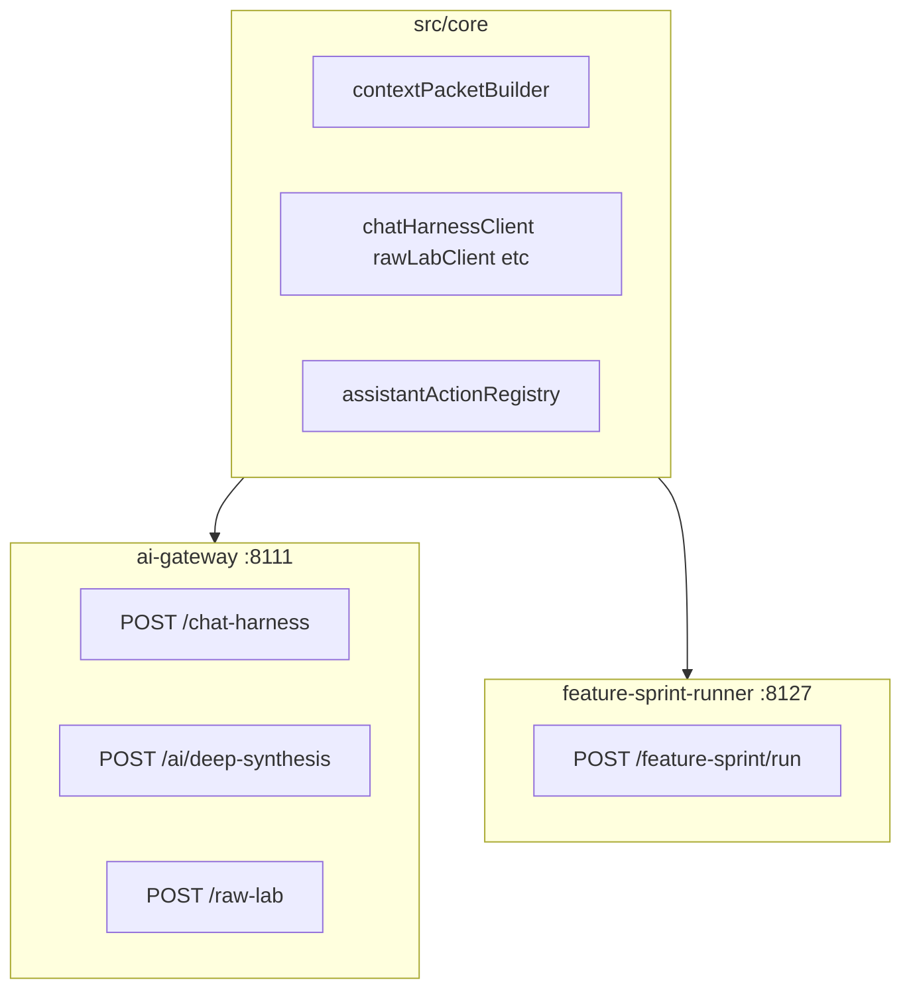

# Agent Spine Inventory v0.1

## Purpose

This document records the **first consolidation layer** for Life Harness AI-adjacent workflows. The machine-readable source of truth is [`src/core/agentWorkflowRegistry.ts`](../src/core/agentWorkflowRegistry.ts), with parity tests in [`src/core/agentWorkflowRegistry.test.ts`](../src/core/agentWorkflowRegistry.test.ts).

**This sprint intentionally changes no runtime behavior.** The registry documents what exists today; clients, gateway routes, UI, and containment boundaries are unchanged.

For the human-oriented workflow map, see [`ai-workflows-current.md`](ai-workflows-current.md).

---

## Three runtimes (partial spine today)

Life Harness already has a **partial agent spine** split across three runtimes:



| Runtime | Role | Examples |
|---------|------|----------|
| **ai-gateway** | Local LLM gateway (mock default, OpenVINO optional) | Chat Harness, Raw Lab, Deep Synthesis, transcript analysis |
| **src/core** | Context packing, send budgets, clients, permissioned actions, run history | `contextPacketBuilder`, `chatHarnessSendBudget`, `featureSprintRunnerHistory` |
| **feature-sprint-runner** | External Codex/Cursor bridge (not ai-gateway) | Scoping, implementation, review packets |

Job Scout (`job-scout-runner` on :8122) is **adjacent but deterministic** — fetch/parse only, no LLM.

---

## Registry helpers

```typescript
import {
  AGENT_WORKFLOWS,
  getAgentWorkflowDefinition,
  listAgentWorkflowDefinitions,
  listGatewayAgentWorkflows,
  listIsolatedAgentWorkflows,
  listMutableAgentWorkflows
} from "../src/core/agentWorkflowRegistry";
```

- **`listGatewayAgentWorkflows()`** — workflows whose `providerSurface` is `ai_gateway`
- **`listIsolatedAgentWorkflows()`** — Raw Lab containment (`raw_lab_isolated`)
- **`listMutableAgentWorkflows()`** — any workflow with a non-`none` mutation policy

---

## Agent Policy v0.1

`src/core/agentPolicy.ts` adds the next explicit spine layer:

```text
workflow registry -> performance mode -> resolved policy
```

This is a resolver only. It does not wire runtime behavior into UI, clients, gateway routes, state, or provider selection.

Performance modes (`quiet`, `balanced`, `fast`, `ultra`) change compute and verification budgets only. They do not expand context permissions, mutation policy, provider surface, or containment. The invariant is: **performance mode can increase compute, but never permissions.**

`ultra` is descriptive and future-facing in v0.1. It does not perform GPU auto-tuning, enable slots, add endpoints, or change ai-gateway behavior.

### Agent Policy v0.2

Agent Policy v0.2 adds pure consumer helpers and compact introspection summaries on top of the resolver. Future UI, dev, debug, and runtime code should ask for policy through `resolveWorkflowAgentPolicy`, `resolveAgentPolicySummary`, `listResolvedAgentPolicies`, or `listAgentPolicySummaries` instead of re-reading registry fields by hand.

The summary shape is intentionally small: workflow label, performance mode, provider surface, context sources, mutation policy, containment, model tier, and compute/verification settings. It does not include prompts, payloads, endpoint bodies, or large config blobs.

No gateway, UI, state, provider execution, or mutation behavior is wired to policy yet. Permissions still come from the workflow registry, and `agentPolicyPermissionsMatchRegistry` exists to keep that invariant explicit.

### Agent Policy v0.3

Agent Policy v0.3 adds pure enforcement primitives for future consumers. `checkAgentPolicyProviderSurface`, `checkAgentPolicyContextSource`, `checkAgentPolicyMutation`, `checkAgentPolicyContainment`, and `checkAgentPolicyOperation` return compact allow/deny decisions instead of throwing.

These helpers are intended to be called before provider, context, mutation-sensitive, or containment-sensitive actions. They still do not wire policy into UI, gateway, state, provider execution, or board mutation. Performance mode remains compute-only; permission decisions continue to derive from the workflow registry.

### Agent Policy v0.4

Agent Policy v0.4 adds pure audit/report helpers for dev and debug introspection. `buildAgentPolicyAuditRow`, `listAgentPolicyAuditRows`, and `buildAgentPolicyAuditReport` summarize provider surface, context posture, mutation policy, containment, and compact findings for each registered workflow.

The audit report is descriptive only. Future UI, gateway, and runtime consumers should still use the v0.3 check helpers for actual decisions. The report also checks that performance modes do not drift permissions and that resolved policy permissions still match the registry. Performance mode remains compute-only.

---

## Workflow inventory (condensed)

Status labels are honest: **implemented**, **partial**, **stale**, **doc_only**.

### ai-gateway (:8111)

| ID | Label | Status | Endpoint | Model tier | Mutation |
|----|-------|--------|----------|------------|----------|
| `chat_harness` | Companion (Chat Harness) | implemented | `POST /chat-harness` | companion_fast | user_approved_actions_only |
| `ask_harness_legacy` | Ask Harness (legacy) | stale | `POST /ask-harness` | companion_fast | none |
| `deep_synthesis` | Deep Synthesis (inline) | implemented | `POST /ai/deep-synthesis` | companion_fast | user_approved_proposals_only |
| `deep_synthesis_job` | Deep Synthesis (async) | implemented | `POST /ai/deep-synthesis-jobs` | critic_small / stretch_batch | user_approved_proposals_only |
| `ai_job_status` | AI job poll | implemented | `GET /ai/jobs/{id}` | none | none |
| `raw_lab` | Raw Signal | implemented | `POST /raw-lab` | companion_fast | none |
| `raw_lab_stream` | Raw Lab streaming | partial | `POST /raw-lab/stream` | companion_fast | none |
| `raw_lab_self_reflection` | Raw Lab self-reflection | implemented | `POST /raw-lab/self-reflection` | companion_fast | user_approved_proposals_only |
| `raw_lab_thread_reflection` | Raw Lab thread reflection | implemented | `POST /raw-lab/reflect-thread` | companion_fast | user_approved_proposals_only |
| `analyze_transcript` | Transcript analysis | partial | `POST /analyze-transcript` | companion_fast | none |
| `gateway_health` | Gateway health | implemented | `GET /health` | none | none |
| `gateway_playground` | Dev playground | doc_only | `GET /playground` | none | none |

**Partial / stale notes:**

- **`ask_harness_legacy`**: Gateway endpoint retained; Expo app uses `POST /chat-harness`.
- **`analyze_transcript`**: Scripts and gateway only; no app UI.
- **`raw_lab_stream`**: SSE chunks a complete answer; not true token streaming.
- **`deep_synthesis_job`**: `with_stretch` remains mock-simulated, but now probes `stretch_batch` and reports `stretch_slot_status` (`slot_unavailable` vs `slot_ready_not_wired`).

### External runners

| ID | Label | Status | Endpoint | Model tier | Mutation |
|----|-------|--------|----------|------------|----------|
| `feature_sprint_runner` | Feature Sprint runner | implemented | `POST /feature-sprint/run` | external_frontier | external_agent_scoped |
| `feature_sprint_worktree_cleanup` | Worktree cleanup | implemented | `POST /feature-sprint/cleanup-worktree` | none | external_agent_scoped |
| `job_scout_runner` | Job Scout runner | implemented | `POST /run-source` | none | none |

### Deterministic adjacency (no model)

| ID | Label | Status | Notes |
|----|-------|--------|-------|
| `context_packet_build` | Context packet builder | implemented | Feeds grounded gateway workflows |
| `memory_bank` | Memory Bank | implemented | User-approved durable memories |
| `feature_sprint_orchestrator` | Feature Sprint orchestrator | implemented | Rules-only; S3 blocked |
| `agent_workbench` | Agent Workbench | implemented | Manual packets + session log |
| `career_source_pack` | Career Source Pack | implemented | JSON/markdown import |
| `assistant_actions_apply` | Assistant actions | implemented | Post-processes chat output; user approves |
| `raw_lab_companion_handoff` | Raw Lab → Companion handoff | implemented | Sanitized digest navigation only |

---

## Shared spine components (already exist)

| Component | Location | Used by |
|-----------|----------|---------|
| Context packet build + redaction | `src/core/contextPacket*.ts` | Chat Harness, Deep Synthesis |
| Send budget / compaction | `chatHarnessSendBudget.ts`, `rawLabContextBudget.ts` | Companion, Raw Lab (parallel impl) |
| Thread verifier | `services/ai-gateway/app/thread_verifier.py` | Chat finalize, Raw Lab finalize |
| Chat finalize + repair | `chat_harness_finalize.py` | Chat Harness |
| Deep critic pipeline | `chat_harness_deep.py`, `critic_backend.py` | Chat `reasoning_depth=deep` |
| Synthesis verifier | `synthesis_verifier.py` | Deep Synthesis |
| AI job queue | `synthesis_jobs.py`, `aiJobClient.ts` | Deep Synthesis async profiles |
| Inference orchestrator | `orchestrator/inference_orchestrator.py` | **Chat Harness only** today |
| Model slot manager | `slots/manager.py`, `models.yaml` | Slot catalog; only `companion_fast` enabled by default |

---

## Known gaps (not fixed in v0.1)

- **InferenceOrchestrator** routes only `/chat-harness`; Raw Lab and Deep Synthesis call providers directly.
- **`stretch_batch`**, **`coder_daily`**, **`memory_embed`** slots catalogued but disabled by default; no `/ai/code-*` endpoints. A retrieval seam exists in gateway (`app/retrieval/embedding_slot.py`), but embeddings are not executed yet.
- **No unified AgentRun log** across gateway jobs, Feature Sprint runs, and Companion sends.
- **Raw Lab** lacks S3 sensitivity gate (commented TODO in gateway `main.py`).
- **RTK Query network layer** remains doc-only ([`plans/agent-ergonomics-rtk-query-upgrade-plan.md`](plans/agent-ergonomics-rtk-query-upgrade-plan.md)).

---

## Next consolidation phases

1. **Phase 1 (this sprint)** — Typed workflow registry + tests + this doc. **Done when registry and tests land; no runtime wiring.**
2. **Phase 2** — Shared `AgentPolicy` / performance mode mapping from user-facing depth to slot plans.
3. **Phase 3** — Shared run log schema (gateway jobs + feature sprint history + optional Companion trace).
4. **Phase 4** — Shared verifier/repair hook facade in gateway.
5. **Phase 5** — Optional Ultra/Performance mode: enable critic/stretch slots with VRAM mutex.

---

## Verify

```powershell
npm run agent:typecheck
npm run agent:test -- -- src/core/agentWorkflowRegistry.test.ts
```

Gateway contract tests remain separate:

```powershell
cd services/ai-gateway
$env:SCOUT_PROVIDER="mock"
pytest -q
```
