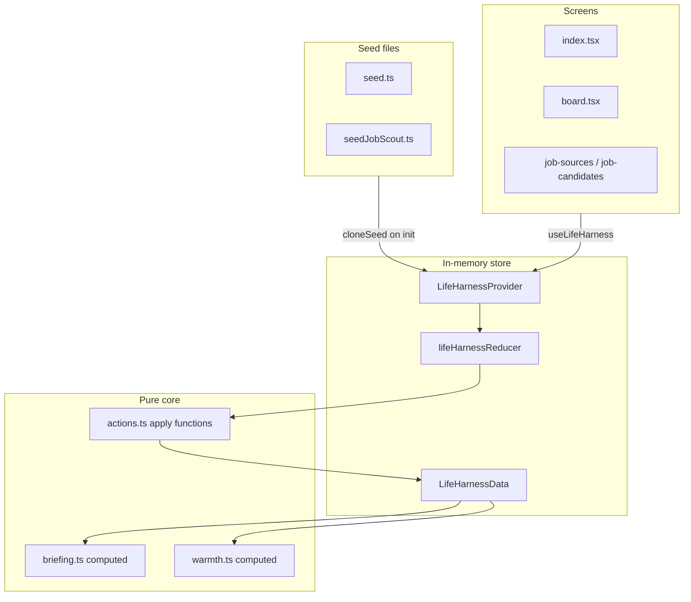
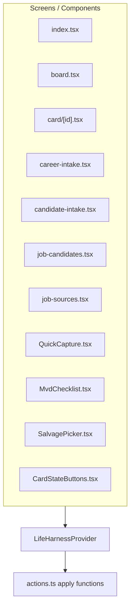
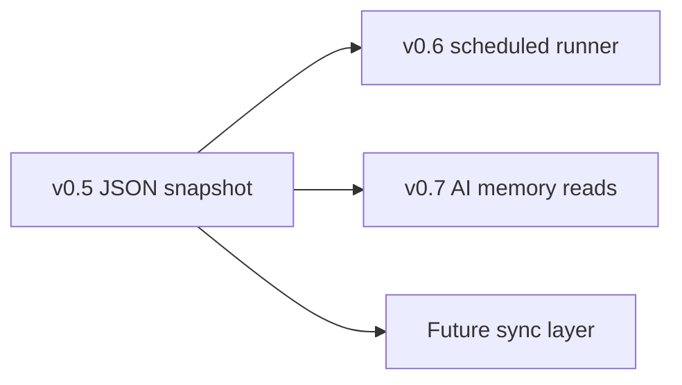

# Persistence Audit v0.5

Audit of Life Harness / Momentum Board state before adding local persistence. Covers Career Command Board v0.1, Job Scout Foundation v0.2, and Job Scout Local Source Runner v0.4.

**Recommendation:** JSON snapshot persistence with a storage adapter interface, `schemaVersion`, load-on-start, save-after-mutations, export/import, reset-to-seed, and migration tests. No cloud, no SQLite, no behavior changes in this ticket.

---

## Executive summary

The app stores all product state in a single immutable reducer model (`LifeHarnessData`) inside [`LifeHarnessProvider`](../src/state/LifeHarnessState.tsx). State is cloned from seed files on every cold start and lost on refresh.

The smallest safe v0.5 path is **Option A: JSON snapshot persistence**:

- Wrap `LifeHarnessData` in a versioned envelope (`schemaVersion`, `savedAt`).
- Load on app start; save after reducer actions (debounced).
- Use a platform `StorageAdapter` interface; ship a web `localStorage` backend first for dogfood.
- Add export/import JSON and explicit reset-to-seed.
- Run hydrate-time fixes (day rollover, orphaned `runStatus`, link validation).
- Merge seed reference data on upgrade without overwriting user slices.

This audit is documentation only. No persistence code ships in v0.5 audit ticket.

---

## Current architecture



**Initialization today** ([`createInitialState`](../src/state/LifeHarnessState.tsx)):

1. Deep-clone seed arrays from [`seed.ts`](../src/data/seed.ts) and [`seedJobScout.ts`](../src/data/seedJobScout.ts).
2. Call `startSession(seedDailyState, nowIso())` for session timestamps.
3. Set `jobSourceRuns: []` (not seeded).
4. On mount, dispatch `app_session_started` → `startSession` again.

**Canonical persisted shape** — [`LifeHarnessData`](../src/core/actions.ts):

```typescript
interface LifeHarnessData {
  cards: LifeCard[];
  logs: LifeLogEntry[];
  proofItems: ProofItem[];
  dailyState: DailyState;
  resumeModules: ResumeModule[];
  jobCandidates: JobCandidate[];
  jobSources: JobSource[];
  jobSourceRuns: JobSourceRunResult[];
}
```

---

## 1. Current state inventory

### Top-level slices

| Slice | Source today | User-created | Seed/reference | Derived/computable | Cache/history | Sensitive/personal | Persist? | Reset from seed? |
|-------|--------------|--------------|----------------|--------------------|---------------|-------------------|----------|-------------------|
| `cards` | `seedCards` + actions | Yes (intake, capture, approve) | 7 fixed seed IDs | `warmth` stored but UI uses `computeCardWarmth`; `progress` base + session wins via `computeCardProgress` | No | Yes — career apps S2, some cards S1/S2 | **Yes** | Partial — fixed IDs only |
| `logs` | `seedLogs` + all actions | Yes | 2 seed entries | XP computed at write time | Append-only history | Yes — raw text, some S2 | **Yes** | Partial |
| `proofItems` | `seedProofItems` + log actions | Yes | 2 seed entries | Created alongside logs | No | Moderate | **Yes** | Partial |
| `dailyState` | `seedDailyState` + session | Session flags | Initial template | `briefingSinceAt` / `sessionStartedAt` set by `startSession` | Session-scoped | Low | **Yes** (with day rollover on hydrate) | Partial — daily flags reset on new date |
| `resumeModules` | `seedResumeModules` only | No | Full bank | Fit scoring reads at runtime | No | Moderate (resume content) | **Yes** | **Yes** — full replace safe |
| `jobCandidates` | `seedJobCandidates` + intake/fetch | Yes | 1 sample candidate | `fitScore` computed at create | No | Yes — full job descriptions | **Yes** | Partial |
| `jobSources` | `seedJobSources` + `addJobSource` | User-added sources | Registry stubs with fixed IDs | No | Run metadata on source row | Low (URLs) | **Yes** | Merge-by-id |
| `jobSourceRuns` | Starts `[]` | Yes (each run) | None | No | Run history for locks/briefing | Low (errors, counts) | **Yes** (cap recommended) | **Yes** — safe to drop |

### Fixed seed card IDs

From [`seed.ts`](../src/data/seed.ts):

- `career-networking`, `ev-tracker-kalshi`, `text-rpg`, `fitness-return`, `local-llm-setup`, `life-harness`, `qualcomm-application`

### Fixed seed source IDs

From [`seedJobScout.ts`](../src/data/seedJobScout.ts):

- `source-fixture-greenhouse`, `source-microsoft`, `source-northrop`, `source-viasat`, `source-qualcomm`, `source-county-jobs`, `source-manual`

### Derived state — do not persist

| Concept | Computed by | Used in |
|---------|-------------|---------|
| Briefing ("While You Were Away") | `generateWhileYouWereAway` | Today screen |
| Briefing highlights | `getBriefingHighlightItems` | Today screen |
| Career stats | `buildCareerStats` | Progress screen |
| Job scout stats | `buildJobScoutStats` | Progress screen |
| Use-before-improve locks | `checkJobScoutLocks` / `checkCareerUseBeforeImproveLocks` | Progress screen |
| Card warmth (display) | `computeCardWarmth` | CardTile, briefing, progress |
| Card progress (display) | `computeCardProgress` | Today, progress |
| Follow-ups due | `getFollowUpsDue` | Today screen |
| Pounce candidate selection | `selectPounceCandidate` | Briefing logic |

Types `Briefing` and `BriefingHighlight` exist in [`types.ts`](../src/core/types.ts) but are never stored.

### Sensitivity (per AGENTS.md)

| Level | Examples in current data |
|-------|--------------------------|
| **S2** | Career application cards (`createCareerApplicationCard` sets `sensitivity: "S2"`), career-networking card, fitness card, job descriptions in candidates/applications, salvage logs |
| **S1** | Build cards (EV Tracker, Text RPG, Life Harness), some logs |
| **S0** | Source registry metadata, run counts |

Local JSON persistence is acceptable for v0.5 web dogfood. Encryption, cloud export gates, and provider sensitivity checks are future concerns (v0.7+).

---

## 2. Mutation map

All mutations flow through one store. Components never call `dispatch` directly — only [`LifeHarnessProvider`](../src/state/LifeHarnessState.tsx) helpers.



### Reducer actions (internal)

| Reducer action | Trigger | State changed |
|----------------|---------|---------------|
| `app_session_started` | Provider mount `useEffect` | `dailyState` via `startSession` |
| `pounce` | `pounce()` | via `applyPounce` |
| `mvd_completed` | `completeMinimumViableDay()` | via `applyMvd` |
| `salvage_completed` | `completeSalvage(optionLabel)` | via `applySalvage` |
| `quick_capture_applied` | `submitQuickCapture()` | full replace from `applyQuickCapture` |
| `card_state_applied` | `setCardState()` | full replace from `applyCardStateChange` |
| `career_intake_applied` | `submitCareerIntake()` | full replace from `applyCareerIntake` |
| `job_candidate_intake_applied` | `submitJobCandidateIntake()` | full replace from `applyJobCandidateIntake` |
| `job_candidate_updated` | save / dismiss / approve candidate | full replace from respective `apply*` |
| `job_source_updated` | add / update / record run | full replace from respective `apply*` |

### Public API → core function → slices

| Public API | Core function | Slices touched | UI entry points |
|------------|---------------|----------------|-----------------|
| *(auto)* session start | `startSession` | `dailyState` | Provider mount |
| `pounce` | `applyPounce` | cards, logs, proofItems, dailyState | Today |
| `completeMinimumViableDay` | `applyMvd` | logs, proofItems, dailyState | MvdChecklist |
| `completeSalvage` | `applySalvage` | logs, proofItems, dailyState | SalvagePicker |
| `submitQuickCapture` | `applyQuickCapture` | cards, logs, proofItems | QuickCapture |
| `setCardState` | `applyCardStateChange` / `applyParkCard` | cards (+ logs, proof on park) | Board, Card detail |
| `submitCareerIntake` | `applyCareerIntake` | cards, logs, proofItems | career-intake |
| `submitJobCandidateIntake` | `applyJobCandidateIntake` | jobCandidates, logs | candidate-intake |
| `saveJobCandidate` | `applySaveJobCandidate` | jobCandidates | job-candidates |
| `dismissJobCandidate` | `applyDismissJobCandidate` | jobCandidates | job-candidates |
| `approveJobCandidate` | `applyApproveJobCandidate` | cards, logs, proofItems, jobCandidates | job-candidates |
| `addJobSource` | `applyAddJobSource` | jobSources | job-sources |
| `updateJobSource` | `applyUpdateJobSource` | jobSources | job-sources (edit + pre-run `running`) |
| `recordJobSourceRun` | `applyRunJobSourceResult` | jobCandidates, jobSources, jobSourceRuns, logs, proofItems | job-sources (after runner) |

### Quick capture sub-actions

| Intent | Result |
|--------|--------|
| `new idea:` | New inbox card + log + proof |
| `park` | Park matched card + log + proof |
| `applied` | Social/career log + applied proof |
| `follow-up` / `texted` / `emailed` | Social/career log + follow-up proof |
| `worked on` / win patterns | Win log (+ proof if card matched) |
| Leak patterns | Leak log |

### Read-only consumers (no mutations)

- `app/progress.tsx` — stats, warmth, locks
- `app/log.tsx` — log list
- `app/resume-bank.tsx` — resume modules display
- `ProofShelf`, `ActiveLimitBanner` — display only

### Slices never mutated at runtime

- **`resumeModules`** — seed-only today; all Job Scout scoring reads this array but nothing writes it.

---

## 3. Persistence risks

| Risk | Description | v0.5 mitigation |
|------|-------------|-----------------|
| **Seed data duplication** | Seed entities get copied into every snapshot. App upgrades must not re-inject demo cards/candidates over user data on normal load. | First-run uses seeds; upgrade merges reference slices only; never auto-merge demo cards/candidates. |
| **Version migrations** | No `schemaVersion` today. Job Scout v0.4 added `jobSourceRuns` — shape will keep evolving. | Envelope with `schemaVersion: 1`; single `migrate()` pipeline before hydrate. |
| **Stale source runs** | `jobSourceRuns` grows unbounded. `runStatus: "running"` can survive crash mid-fetch ([`job-sources.tsx`](../app/job-sources.tsx) sets running before async call). | Cap history (e.g. 50 runs). On hydrate, reset orphaned `running` → `idle` or `error`. |
| **Cards linked to job candidates** | Approve sets `candidate.applicationCardId` and `card.careerApplication.jobCandidateId` ([`applyApproveJobCandidate`](../src/core/actions.ts)). | Validate bidirectional links on load; repair or warn on orphans. |
| **Proof/log/card links** | Logs hold `proofItemId`; proof holds `sourceLogId`; cards hold `proofItemIds`. | Validate referential integrity on hydrate. |
| **`applicationStatus` / `card.state` sync** | Option A rule ([career-command-board-v0.1.md](./career-command-board-v0.1.md)): always match via [`syncApplicationStatus`](../src/core/career.ts). | Re-sync application cards on load if drift detected (manual JSON edit risk). |
| **`JobCandidate.status` vs card state** | Separate enums. After approve, candidate stays `card_created`; card lifecycle is independent. | Document; do not attempt cross-sync. |
| **Proof/log duplication** | Pounce/MVD/salvage guarded once per session in memory; not across days until day rollover. | Hydrate-time day rollover resets daily flags when `dailyState.date !== today`. |
| **Runner errors saved as runs** | Failed runs append to `jobSourceRuns` (needed for lock progress via `countSuccessfulManualSourceRuns`). | Keep errors in history; cap length; do not treat as fatal load failure. |
| **Sensitive descriptions** | Full job posting text in candidates and `careerApplication.jobDescription`. Local plaintext JSON. | S2 default; local-only v0.5; no cloud export without explicit future gate. |
| **Stored vs computed fields** | `card.warmth` in seed may disagree with `computeCardWarmth`. `card.progress` is base + session overlay. | Treat stored warmth as legacy; UI already computes. Do not persist computed warmth separately. |
| **Daily state without day rollover** | `dailyState.date` exists but no midnight reset in app today. | Add hydrate step: new calendar day → reset `pounceStarted`, `minimumViableDayCompleted`, `salvageCompleted`; update `date`. |

### Link model reference

**Candidate ↔ application card** (set on approve):

```
candidate.applicationCardId  ←→  card.careerApplication.jobCandidateId
candidate.status = "card_created"  (frozen after approve)
card.state / applicationStatus     (independent lifecycle via syncApplicationStatus)
```

**Log ↔ proof ↔ card**:

```
log.proofItemId  ←→  proof.sourceLogId
card.proofItemIds[]  →  proof.id
```

---

## 4. Storage options comparison

| Option | Complexity | Web dogfood | Native later | Migration/sync | Privacy risks | Recommendation |
|--------|------------|-------------|--------------|----------------|---------------|----------------|
| **A. JSON snapshot** | Low | Yes — `localStorage` or file export/import | Yes — swap adapter (AsyncStorage, file) | `schemaVersion` + `migrate()`; manual export/import | Local-only; browser profile / shared machine | **Recommended v0.5** |
| **B. Expo SQLite** | Medium–high | Weak — expo-sqlite web support limited | Strong for large/query-heavy data | SQL migrations | Local DB file | Defer until query/volume needs grow (v0.6+) |
| **C. Supabase** | High | Yes | Yes | Built-in sync | Cloud exposure of S2 career data | **Explicit non-goal** for v0.5 |
| **D. Hybrid local-first later** | High | Adapter + optional sync layer | Yes | CRDT / conflict rules | Depends on sync policy and sensitivity gates | Future path atop A or B |

**Why JSON fits:** `LifeHarnessData` is already an immutable snapshot model. Every mutation returns a new object via `apply*` functions. Round-trip JSON serialize/parse matches the reducer architecture with minimal new concepts.

---

## 5. Recommended v0.5 implementation

Smallest safe implementation for a **follow-up ticket** (not this audit):

### Module layout

```
src/persistence/
  types.ts                 # PersistedEnvelope { schemaVersion, savedAt, data: LifeHarnessData }
  migrate.ts               # migrate(envelope) -> LifeHarnessData
  hydrate.ts               # day rollover, orphan runStatus fix, link validation
  seedMerge.ts             # merge resumeModules + registry jobSources on upgrade
  serialize.ts             # JSON stringify/parse + basic validation
  storageAdapter.ts        # interface: load(), save(), clear()
  webLocalStorageAdapter.ts  # v0.5 web dogfood backend
  index.ts                 # loadPersistedState(), savePersistedState()
```

### Envelope shape

```typescript
interface PersistedEnvelope {
  schemaVersion: number;
  savedAt: string;          // ISO timestamp
  data: LifeHarnessData;
}
```

### Wiring (future)

1. **`createInitialState`** in [`LifeHarnessState.tsx`](../src/state/LifeHarnessState.tsx):
   - Try `load()` from adapter.
   - If found: `migrate()` → `hydrate()` → `seedMerge()` (upgrade path).
   - If not found: current seed clone behavior.
2. **Save after mutations:** subscribe to reducer state; debounce ~300ms; skip initial mount save.
3. **User tools:** export JSON (download), import JSON (replace with confirm), reset-to-seed (explicit, with optional export backup first).

### Hydrate responsibilities

| Step | Action |
|------|--------|
| Day rollover | If `dailyState.date !== today`, reset pounce/MVD/salvage flags; set `date` to today |
| Orphan runs | Any `jobSource.runStatus === "running"` → `idle` or `error` with message |
| Link validation | Verify candidate↔card, log↔proof, card↔proof IDs |
| Application sync | Re-run `syncApplicationStatus` logic if `card.state !== careerApplication.applicationStatus` |
| Run cap | Trim `jobSourceRuns` to last N (e.g. 50) |

### Tests (future ticket)

| Test | Purpose |
|------|---------|
| Round-trip | Seed → serialize → parse → deep equal |
| Migration | Old envelope (missing `jobSourceRuns`) → current shape |
| Day rollover | Persisted yesterday's flags → today's hydrate resets them |
| Approve link integrity | Candidate + card IDs survive round-trip |
| Seed merge | New seed module added on upgrade without overwriting user module |

### Save trigger points

Persist after any successful reducer transition that changes `LifeHarnessData`. Equivalent to saving after every row in the mutation map (Section 2). No need to instrument individual screens.

---

## 6. Data versioning plan

### Current schemaVersion

**`schemaVersion: 1`** — matches current `LifeHarnessData` with all 8 slices:

- `cards`, `logs`, `proofItems`, `dailyState`
- `resumeModules`, `jobCandidates`, `jobSources`, `jobSourceRuns`

Pre-v0.5 in-memory apps had no version field. Version 1 is the first persisted format.

### Migration strategy

```text
load raw JSON
  → parse envelope
  → if schemaVersion < CURRENT: run migrateV1, migrateV2, ...
  → hydrate(data)
  → seedMerge(data)   // only on app version upgrade, not every load
  → return LifeHarnessData
```

Rules:

- Bump `schemaVersion` when slice shape or required fields change.
- Never mutate [`seed.ts`](../src/data/seed.ts) or [`seedJobScout.ts`](../src/data/seedJobScout.ts) at runtime.
- Failed migration → fall back to seed with user-visible warning (or offer import repair).

### Seed merge strategy

| Slice | On app upgrade | On explicit reset-to-seed |
|-------|----------------|---------------------------|
| `resumeModules` | Add new seed modules by `id`; never overwrite existing | Full replace from seed |
| `jobSources` | Add new registry stubs by fixed seed `id`; preserve user edits on matching ids | Full replace from seed |
| `cards` | **Never auto-merge** demo cards into user state | Full replace from seed |
| `jobCandidates` | **Never auto-merge** demo candidates | Full replace from seed |
| `logs`, `proofItems` | Never auto-merge | Full replace from seed |
| `jobSourceRuns` | Cap on load; no seed source | Clear to `[]` |
| `dailyState` | Hydrate rollover only | Fresh seed + `startSession` |

**Avoid overwriting user data when seed modules change:** merge-by-id for reference slices only (`resumeModules`, registry `jobSources`). User-created entities (dynamic card IDs, user-added sources, fetched candidates) are never touched by merge.

### First-run vs returning user

| Scenario | Behavior |
|----------|----------|
| No snapshot exists | Clone seeds (current behavior) |
| Snapshot exists | Load → migrate → hydrate → optional seed merge |
| User clicks reset | Replace all slices from seeds; clear adapter storage |

---

## 7. Future path

### v0.6 — Scheduled runner

Requires persistence from v0.5:

- `jobSources.cadence`, `lastCheckedAt`, `enabled` survive restarts
- `jobSourceRuns` history for lock clearance ([`checkJobScoutLocks`](../src/core/jobScout.ts) — 5 successful manual runs)
- Stable candidate dedupe keys (`sourceUrl|company|roleTitle`) across sessions
- Scheduled job likely lives in `services/job-scout-runner/`, reading/writing via same envelope or runner-local schedule file

### v0.7 — AI / chat over memory

Requires persisted logs, cards, candidates for context:

- Must check sensitivity before any provider call (S2 career data → local AI preferred; S3 → rules-only)
- Provider abstraction rule from AGENTS.md unchanged
- Memory = read persisted slices; no new store

### Future — Supabase / local-first sync

- Sync layer wraps persisted envelope or SQLite — not a replacement for local-first truth
- Conflict policy needed for append-only logs vs last-write-wins cards
- Career/candidate data defaults S2 → local-first or explicit opt-in cloud
- Auth and sync are separate tickets; v0.5 adapter interface keeps the door open



---

## Explicit non-goals (preserved)

This audit and v0.5 scope exclude:

- Supabase
- Auth
- Cloud sync
- SQLite implementation
- AsyncStorage implementation (adapter interface only; web backend first)
- App behavior changes
- Changes to `services/ai-gateway/`
- Scheduled fetching
- AI / chatbot features

---

## Acceptance criteria

| Criterion | Status |
|-----------|--------|
| Audit document exists at `docs/persistence-audit-v0.5.md` | This file |
| No runtime behavior changed | Audit only — no `src/` changes |
| No persistence code added | Audit only |
| Clear v0.5 recommendation | JSON snapshot + storage adapter (Section 5) |
| Explicit non-goals preserved | Section above |

---

## References

- [Career Command Board v0.1](./career-command-board-v0.1.md)
- [Job Scout Foundation v0.2](./job-scout-foundation-v0.2.md)
- [Job Scout Local Runner v0.4](./job-scout-runner-v0.4.md)
- [AGENTS.md](../AGENTS.md) — sensitivity rules, v0.1 constraints
