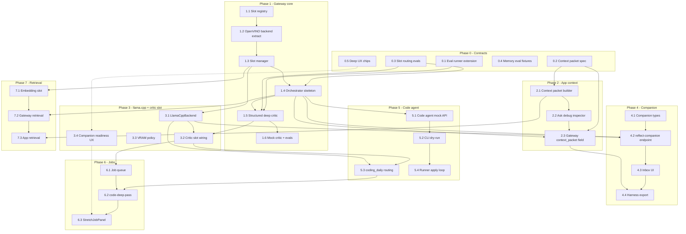

# A770 Local Intelligence — Integrated Implementation Roadmap

**Status:** Planning only (no runtime code in this document).  
**Last updated:** 2026-06-10.

This document merges and sequences all local-intelligence plans under `docs/plans/`. When individual plans conflict, this file is the **integration authority** for build order; slice docs remain authoritative for API shapes and acceptance criteria.

## Source plans

| Plan | Role in integration |
|------|---------------------|
| [`a770-local-intelligence-roadmap.md`](./a770-local-intelligence-roadmap.md) | Master cognitive architecture, phases 0–5, retrieval cross-cut |
| [`model-stack-freeze-v3.md`](./model-stack-freeze-v3.md) | **Frozen** model catalog, load policy, promotion gate |
| [`ai-gateway-model-slots-v0.1.md`](./ai-gateway-model-slots-v0.1.md) | Slot registry refactor, backends, VRAM mutex (catalog → freeze v3) |
| [`phi4-critic-deep-pass-v0.1.md`](./phi4-critic-deep-pass-v0.1.md) | Structured deep critic (Pass 2) for `reasoning_depth=deep` |
| [`local-ai-evals-v0.1.md`](./local-ai-evals-v0.1.md) | Eval suites, scorers, CI policy |
| [`context-packet-builder-v0.1.md`](./context-packet-builder-v0.1.md) | App-side ranked `AiContextPacket` + gateway shim |
| [`companion-reflection-engine-v0.1.md`](./companion-reflection-engine-v0.1.md) | Durable companion state + `POST /reflect-companion` |
| [`local-coding-agent-loop-v0.1.md`](./local-coding-agent-loop-v0.1.md) | Dev-only `/ai/code-*` loop + CLI runner |
| [`local-ai-deep-ux-v0.1.md`](./local-ai-deep-ux-v0.1.md) | Human-first Fast / Deliberate / Deep UX |
| [`agent-instructions-local-ai.md`](./agent-instructions-local-ai.md) | Agent guardrails, CI/tooling follow-ups |

**Guardrails:** [`docs/local-ai-agent-guide.md`](../local-ai-agent-guide.md), root [`AGENTS.md`](../../AGENTS.md).

### Naming reconciliation

| Topic | Resolved choice | Notes |
|-------|-----------------|-------|
| Reflection endpoint | **`POST /reflect-companion`** | Per [`companion-reflection-engine-v0.1.md`](./companion-reflection-engine-v0.1.md). [`a770-local-intelligence-roadmap.md`](./a770-local-intelligence-roadmap.md) used `/companion/reflect` — treat as alias to consolidate in implementation ticket. |
| Critic backend v0.1 | **Structured critic via `CriticBackend` seam** | [`phi4-critic-deep-pass-v0.1.md`](./phi4-critic-deep-pass-v0.1.md) ships `SCOUT_CRITIC_SLOT=same` first; dedicated `critic` slot (Phi-4) follows in Phase 2 via [`ai-gateway-model-slots-v0.1.md`](./ai-gateway-model-slots-v0.1.md) Phase E. |
| Product vs code context packet | **Separate specs** | `services/ai-gateway/docs/context-packet-v1.md` (board/Ask); `services/ai-gateway/docs/code-context-packet-v1.md` (repo tickets). Orthogonal builders. |

---

## 1. Unified roadmap

### Principles (non-negotiable)

```text
App core = rules-first. Gateway = optional. No model names in Expo UI.
Mock pytest + vitest before GPU. Smallest diff per PR.
S3 rejected before provider. Mutations approval-gated.
Raw Lab stays isolated. Stretch models = dev/power-user until rubric-proven.
```

### Phase 0 — Contracts, evals, and UX language (1–2 weeks)

**Goal:** Lock schemas and quality gates before loading a second model or restructuring providers.

| ID | Deliverable | Primary files | Exit criteria |
|----|-------------|---------------|---------------|
| **0.1** | Eval runner extension (harness + transcript + schema suites) | `services/ai-gateway/app/eval_scorers.py`, `eval_runner.py`, `evals/{transcript,harness,schema}/*.json`, `tests/test_*_eval_fixtures.py` | `SCOUT_PROVIDER=mock pytest` green; 3+ new fixture suites |
| **0.2** | Gateway context packet spec + Pydantic | `services/ai-gateway/docs/context-packet-v1.md`, `app/context_packet.py` | Unit tests validate packet without GPU |
| **0.3** | Slot routing + deep quality eval fixtures | `evals/routing/slot_plan.json`, `evals/thread/deep_reasoning_quality.json`, `evals/thread/critic_ablation.json`, `tests/test_slot_routing_eval.py` | Mock orchestrator expectations documented |
| **0.4** | App memory proposal eval fixtures | `src/core/harnessMemoryBank.test.ts` (extend) | `npm test` green |
| **0.5** | Deep UX labels + composer chips (app-only) | `src/core/companionLabels.ts`, `ReasoningDepthChips.tsx`, `ChatComposer.tsx`, `ChatThread.tsx`, `app/ask-harness.tsx` | No OpenVINO/model jargon in UI; thinking placeholder for Deep |

**Phase 0 exit:** Mock CI proves pounce/reflection/schema gates; context packet schema frozen; Ask composer exposes Fast/Deliberate/Deep without inspector.

---

### Phase 1 — Gateway slot scaffold + structured deep critic (2–3 weeks)

**Goal:** `ModelSlotManager` + `InferenceOrchestrator` for Chat Harness; replace same-model self-critique with structured critic pass.

| ID | Deliverable | Primary files | Exit criteria |
|----|-------------|---------------|---------------|
| **1.1** | Slot registry + `models.yaml` | `app/slots/{types,registry}.py`, `models.yaml`, `tests/test_slot_registry.py` | Yaml + env overrides parse; `experimental_qwen30` disabled |
| **1.2** | OpenVINO backend extract | `app/backends/{base,openvino_backend}.py`, refactor `openvino_provider.py` | Behavior identical to pre-refactor |
| **1.3** | Slot manager (companion_fast pin) | `app/slots/manager.py`, `main.py` lifespan warm | `/health` optional `slots.companion_fast` |
| **1.4** | Orchestrator skeleton | `app/orchestrator/{slot_plan,inference_orchestrator}.py`, `tests/test_orchestrator_routing.py` | fast/deliberate/deep → slot plan; delegates existing chat path |
| **1.5** | Structured deep critic (Phase A) | `chat_harness_deep.py`, `critic_backend.py`, `prompts/chat_harness_critic.md`, `tests/test_chat_harness_deep_critic.py` | draft → critic verdict → conditional final; `SCOUT_DEEP_MAX_EXTRA_PASSES` enforced |
| **1.6** | Mock critic rules + eval pass | `providers/mock.py`, update `test_chat_harness_reasoning_contract.py` | `deep_reasoning_quality.json` passes on mock |

**Phase 1 exit:** Deep mode uses structured critic (same backend default); slot infrastructure ready for Phi-4 / llama.cpp without another rewrite. **No Expo changes required.**

---

### Phase 2 — App context packet + gateway native field (2 weeks)

**Goal:** Smarter Ask exports without RAG; optional native `context_packet` on wire.

| ID | Deliverable | Primary files | Exit criteria |
|----|-------------|---------------|---------------|
| **2.1** | App packet types + builder + shim | `src/core/contextPacket.ts`, `contextPacketBuilder.ts`, `contextPacketRanking.ts`, `contextPacketRedaction.ts`, `contextPacketShim.ts`, `contextPacketBuilder.test.ts` | Seed board deterministic; S3 excluded |
| **2.2** | Debug packet inspector in Ask | `app/ask-harness.tsx`, `AskHarnessAdvancedPanel.tsx` | Still sends `HarnessContext` shim; slice counts visible |
| **2.3** | Gateway `context_packet` field (Phase B) | `models.py`, `prompt_loader.py`, `tests/test_chat_harness_contract.py` | Prefers packet when present; fallback to `context` |
| **2.4** | Companion + recovery in packet | `contextProjectDocs.ts`, companion export from Phase 3 when ready | Briefing/recovery signals in ranked slices |

**Phase 2 exit:** Ask sends semantically ranked context; gateway prompt uses packet sections when enabled.

---

### Phase 3 — Secondary critic slot + llama.cpp backend (2–3 weeks)

**Goal:** Dedicated Phi-4 (or equivalent) critic on `critic` slot; foundation for coding/reflection stretch models.

| ID | Deliverable | Primary files | Exit criteria |
|----|-------------|---------------|---------------|
| **3.1** | LlamaCppBackend (HTTP to `llama-server`) | `app/backends/llamacpp_backend.py`, `tests/test_llamacpp_backend.py` | Mocked HTTP in CI; manual SYCL smoke documented |
| **3.2** | Critic slot wiring | `slots/manager.py` heavy mutex, `orchestrator` deep path | Deep uses `companion_fast` + `critic` slots in OpenVINO/llama smoke |
| **3.3** | VRAM policy + health | `config.py`, `README.md`, `docs/plans/llamacpp-sycl-setup.md` | Idle unload; one heavy slot at a time |
| **3.4** | Companion readiness UX | `HarnessReadCard.tsx`, health poll in `ask-harness.tsx` | “Companion ready” / “Warming up” — no model names |

**Phase 3 exit:** Deep critique quality lift on A770; companion_fast stays responsive via mutex.

---

### Phase 4 — Companion reflection engine (2–3 weeks)

**Goal:** Approval-gated durable companion; slow reflection separate from live chat.

| ID | Deliverable | Primary files | Exit criteria |
|----|-------------|---------------|---------------|
| **4.1** | Companion core types + persistence | `src/core/types.ts`, `companionState.ts`, `companionReflection.ts`, `actions.ts`, migrations | Fresh seed has empty companion |
| **4.2** | `POST /reflect-companion` | `main.py`, `models.py`, `prompts/reflect_companion.md`, `companion_reflection_verifier.py`, `tests/test_reflect_companion_contract.py` | Mock proposals; S3 rejected |
| **4.3** | App client + inbox UI | `companionReflectionClient.ts`, `CompanionInbox.tsx`, `ask-harness.tsx` | Nothing persists until Approve |
| **4.4** | Export companion lines to harness | `harnessContext.ts` `buildCompanionAnalyses()` | `Companion:` prefixed analyses only when approved |
| **4.5** | Reflection stretch (optional) | `reflection_stretch` slot via llama.cpp | Fallback to deliberate `companion_fast` |

**Phase 4 exit:** Manual “Reflect on session” works mock + one GPU path; Raw Lab personality never auto-promotes.

---

### Phase 5 — Coding daily slot + dev code agent (3–4 weeks)

**Goal:** Ticket-scoped local implementer; no product UI.

| ID | Deliverable | Primary files | Exit criteria |
|----|-------------|---------------|---------------|
| **5.1** | Code agent mock API | `models.py` code schemas, `code_context_packet.py`, `main.py` `/ai/code-*`, `tests/test_code_agent_contract.py` | Diff path validation; S3 → 422 |
| **5.2** | CLI builder + dry-run runner | `scripts/build_code_context_packet.py`, `scripts/code_agent_runner.py` | `--dry-run` prints plan + diff; no `git apply` |
| **5.3** | `coding_daily` routing | `orchestrator` routes `task_mode` ∈ `{write_code, debug, teach}` | Fallback to `companion_fast` + confidence note |
| **5.4** | Runner apply + verify + repair | `code_agent_runner.py --apply`, `code_verify.py` | Human re-approves each repair pass |
| **5.5** | Coding eval smoke | `evals/coding/*.json` | `model_smoke` manual only |

**Phase 5 exit:** Dev can run mock code loop on a ticket; Coder 14B optional via llama.cpp.

---

### Phase 6 — Job queue + stretch operations (2–3 weeks)

**Goal:** Async coding review and reflection without blocking fast chat.

| ID | Deliverable | Primary files | Exit criteria |
|----|-------------|---------------|---------------|
| **6.1** | Job queue core | `job_models.py`, `job_queue.py`, `tests/test_job_queue.py` | Max 1 stretch model loaded |
| **6.2** | `POST /ai/code-deep-pass` + poll | `tasks/code_deep_pass.py`, `GET /ai/jobs/{id}` | Mock completes &lt;1s |
| **6.3** | App stretch UX | `StretchJobPanel.tsx`, `codeReviewClient.ts` / `aiJobClient.ts` | Card Detail or Ask dev panel; Fast chat still works |
| **6.4** | `coding_stretch` slot | llama.cpp 32B batch-only | Review JSON only — never auto-apply diff |

**Phase 6 exit:** Submit job → poll → structured review; companion chat responsive.

---

### Phase 7 — Retrieval + embeddings (cross-cutting, 2–3 weeks)

**Goal:** Additive snippets with provenance; board snapshot remains source of truth.

| ID | Deliverable | Primary files | Exit criteria |
|----|-------------|---------------|---------------|
| **7.1** | Embedding slot | `model_slots`, `openvino_backend` Qwen3-Embedding-0.6B | Lazy load |
| **7.2** | Gateway retrieval | `app/retrieval.py` | top-k chunks with labels |
| **7.3** | App pre-rank | `src/core/retrieval.ts` | Memory Bank ranker |
| **7.4** | Orchestrator inject | `orchestrator.py`, `prompt_loader.py` | `retrieved_chunks` section |
| **7.5** | Eval | `evals/thread/retrieval_grounding.json` | Mock grounding checks |

**Starts after Phase 1** (orchestrator must exist). Can overlap Phase 5–6 if gateway bandwidth allows.

---

### Phase 8 — Stretch experiments (ongoing)

Manual only; env flags default off.

- `reflection_stretch`: Gemma 3 27B vs fast companion + Phi critic
- `experimental_qwen30`: Qwen3-30B-A3B latency/quality
- `services/ai-gateway/docs/stretch-model-benchmarks.md`
- **Out of scope:** Qwen3-Next-80B daily use on A770

---

### Agent / CI follow-ups (parallel anytime)

From [`agent-instructions-local-ai.md`](./agent-instructions-local-ai.md):

- Root `gateway:test` npm scripts
- CI job for mock `pytest` in `services/ai-gateway`
- `prompts/local_ai_ticket_prompt_template.md`
- `run_local_ai_evals.py` unified CLI ([`local-ai-evals-v0.1.md`](./local-ai-evals-v0.1.md) v0.1b)

---

## 2. Dependency graph



**Legend:** Solid arrows = hard dependency. Dotted = soft / UX-only coupling.

---

## 3. First five implementation tickets

Concrete tickets in **recommended merge order**. Each is one PR-sized slice.

---

### Ticket 1 — Eval runner extension (mock-only, CI-safe)

**Source:** [`local-ai-evals-v0.1.md`](./local-ai-evals-v0.1.md) §5  
**Branch slice:** gateway only

**Files:**

```text
services/ai-gateway/app/eval_scorers.py                    (new)
services/ai-gateway/app/eval_runner.py                     (extend)
services/ai-gateway/evals/transcript/synthetic_single_pounce.json
services/ai-gateway/evals/harness/pounce_prefers_cold_career_over_hot_build.json
services/ai-gateway/evals/schema/analyze_transcript_mock_schema.json
services/ai-gateway/tests/test_transcript_eval_fixtures.py (new)
services/ai-gateway/tests/test_harness_eval_fixtures.py    (new)
services/ai-gateway/README.md                              (eval commands)
src/core/harnessMemoryBank.test.ts                         (3 memory proposal cases)
```

**Acceptance criteria:**

- `SCOUT_PROVIDER=mock pytest` passes including new fixture tests
- `npm test` passes with memory proposal cases
- `eval_scorers` supports `expect_schema`, `heuristic_checks` (`single_pounce`, `inbox_default`, `proposed_updates_require_approval`)
- No production prompt behavior change unless required for fixture pass

---

### Ticket 2 — Model slot registry + OpenVINO backend extract

**Source:** [`ai-gateway-model-slots-v0.1.md`](./ai-gateway-model-slots-v0.1.md) §7 Phase A–B  
**Branch slice:** gateway refactor only; behavior unchanged

**Files:**

```text
services/ai-gateway/models.yaml
services/ai-gateway/app/slots/types.py
services/ai-gateway/app/slots/registry.py
services/ai-gateway/app/backends/base.py
services/ai-gateway/app/backends/openvino_backend.py
services/ai-gateway/app/config.py                         (models_config_path, warm_slots)
services/ai-gateway/app/providers/openvino_provider.py    (delegate to backend)
services/ai-gateway/tests/test_slot_registry.py
services/ai-gateway/pyproject.toml                        (pyyaml if needed)
services/ai-gateway/README.md
```

**Acceptance criteria:**

- All existing `pytest` modules pass unchanged
- `models.yaml` parses; `companion_fast` enabled; stretch slots `enabled: false`
- `SCOUT_PROVIDER=openvino` with missing model → same 503 on `/chat-harness`
- No Expo app changes

---

### Ticket 3 — Orchestrator skeleton + slot manager (companion_fast only)

**Source:** [`ai-gateway-model-slots-v0.1.md`](./ai-gateway-model-slots-v0.1.md) §7 Phase C–D, [`a770-local-intelligence-roadmap.md`](./a770-local-intelligence-roadmap.md) P1-3  
**Depends on:** Ticket 2

**Files:**

```text
services/ai-gateway/app/slots/manager.py
services/ai-gateway/app/orchestrator/slot_plan.py
services/ai-gateway/app/orchestrator/inference_orchestrator.py
services/ai-gateway/app/main.py                           (lifespan warm companion_fast)
services/ai-gateway/app/models.py                         (HealthResponse.slots optional)
services/ai-gateway/tests/test_orchestrator_routing.py
services/ai-gateway/tests/test_health_slots.py
services/ai-gateway/evals/routing/slot_plan.json
services/ai-gateway/tests/test_slot_routing_eval.py
```

**Acceptance criteria:**

- `resolve_slots_for_chat_harness`: fast/deliberate/deep → `[companion_fast]` for now
- `run_chat_harness()` behavior identical to pre-orchestrator (deep still same-model critique until Ticket 4)
- `/health` reports `slots.companion_fast` when configured
- `slot_plan.json` eval passes on mock

---

### Ticket 4 — Structured deep critic (Phi-4 seam Phase A)

**Source:** [`phi4-critic-deep-pass-v0.1.md`](./phi4-critic-deep-pass-v0.1.md) §6  
**Depends on:** Ticket 3

**Files:**

```text
services/ai-gateway/app/chat_harness_critic.py
services/ai-gateway/app/critic_backend.py
services/ai-gateway/app/chat_harness_deep.py
services/ai-gateway/app/prompts/chat_harness_critic.md
services/ai-gateway/app/models.py                         (CriticCheck, ChatHarnessCriticVerdict)
services/ai-gateway/app/config.py                         (critic_slot default same)
services/ai-gateway/app/prompt_loader.py
services/ai-gateway/app/providers/openvino_provider.py
services/ai-gateway/app/providers/mock.py
services/ai-gateway/tests/test_chat_harness_deep_critic.py
services/ai-gateway/tests/test_chat_harness_reasoning_contract.py
services/ai-gateway/evals/thread/deep_reasoning_quality.json
docs/conversation-thread-intelligence.md                  (one paragraph)
```

**Acceptance criteria:**

- `reasoning_depth=deep`: draft → structured critic → conditional final on mock and OpenVINO
- `/chat-harness` request/response schema unchanged
- `SCOUT_DEEP_MAX_EXTRA_PASSES` enforced
- Seven critic failure modes + pass path covered in tests
- No model names in API responses or Expo types

---

### Ticket 5 — Deep UX: composer depth chips + thinking status

**Source:** [`local-ai-deep-ux-v0.1.md`](./local-ai-deep-ux-v0.1.md) §6  
**Parallel with:** Tickets 1–4 (app-only)

**Files:**

```text
src/core/companionLabels.ts
src/core/companionLabels.test.ts
src/components/askHarness/ReasoningDepthChips.tsx
src/components/askHarness/ChatComposer.tsx
src/components/askHarness/ChatThread.tsx
src/components/askHarness/AskHarnessAdvancedPanel.tsx
app/ask-harness.tsx
src/core/chatThreadState.ts                               (Think harder sentinel)
```

**Acceptance criteria:**

- Fast / Deliberate / Deep selectable without opening inspector
- No user-visible `OpenVINO`, `Qwen`, `Phi`, `VRAM`, or slot names
- `loading` shows placeholder bubble (“Thinking…” / “Checking my work…” for Deep)
- **Think harder** escalates depth and re-sends last user turn
- `npm run typecheck` and `npm run test` pass

---

## 4. Parallelization guidance

| Workstream | Tickets / phases | Can run in parallel with |
|------------|------------------|--------------------------|
| **Gateway evals** | Ticket 1, Phase 0.3 slot eval JSON | Ticket 5 (app UX); Ticket 2 only after eval baselines if changing mock output |
| **Slot scaffold** | Tickets 2 → 3 → 4 (sequential) | Ticket 5; Ticket 1; Phase 0.2 context packet **spec** (docs only) |
| **App UX** | Ticket 5 | All gateway tickets 1–4 |
| **Context packet builder** | Phase 2.1–2.2 | Phase 1 gateway (uses shim, not native field); Ticket 5 |
| **Memory vitest** | Phase 0.4 | Ticket 1 (often same PR as eval extension) |
| **Companion engine** | Phase 4 | Phase 3.1+ (needs orchestrator from Phase 1) |
| **Code agent mock** | Phase 5.1–5.2 | Phase 3 llama.cpp (no hard dep until 5.3) |
| **Retrieval** | Phase 7 | Phase 5–6 if orchestrator stable |
| **Agent/CI scripts** | `gateway:test` npm script | Anytime |

**Do not parallelize on the same PR:**

- Tickets 2 + 3 + 4 (same hot files — see §5)
- Phase 2.3 gateway `context_packet` + prompt shell sync with heavy `harnessContext.ts` changes without coordination
- Phase 4 companion types + Phase 2 packet `companion` slice — sequence companion types first

**Recommended pairing for velocity:**

```text
Developer A: Tickets 2 → 3 → 4 (gateway spine)
Developer B: Ticket 1 + Ticket 5 (evals + UX)
Developer C: Phase 0.2 context-packet-v1.md + context_packet.py (docs/types only)
```

---

## 5. Hot files (merge conflict risk)

Multiple tickets touch these files — **serialize edits** or assign one owner per phase.

| File | Touching tickets / phases |
|------|---------------------------|
| `services/ai-gateway/app/main.py` | 3 (lifespan), 4 (critic routes later), 4.2 reflect, 5.1 code routes, 6.2 jobs, health |
| `services/ai-gateway/app/models.py` | 3 (health), 4 (critic types), 2.3 context_packet, 4.2 reflect, 5.1 code schemas |
| `services/ai-gateway/app/config.py` | 2, 3, 4 (critic_slot), 3.3 slots env, 5.x coding flags |
| `services/ai-gateway/app/providers/openvino_provider.py` | 2, 3, 4 (deep refactor) |
| `services/ai-gateway/app/providers/mock.py` | 4 (deep critic), 4.2 reflect, 5.1 code agent, 1.6 critic rules |
| `services/ai-gateway/app/providers/base.py` | 2 (protocol), 5.1 code methods |
| `services/ai-gateway/app/prompt_loader.py` | 4 (critic prompt), 2.3 packet sections, 4.2 reflect, 7.4 retrieval |
| `services/ai-gateway/app/eval_runner.py` | 1, 0.3 slot evals, 5.5 coding evals |
| `services/ai-gateway/README.md` | Almost every gateway ticket |
| `services/ai-gateway/AGENTS.md` | Slot/critic/orchestrator docs |
| `src/core/chatHarnessClient.ts` | 2.3 optional packet field, 3.4 health (future) |
| `src/core/harnessContext.ts` | 2.1 packet builder integration, 4.4 companion export, 7.3 retrieval |
| `app/ask-harness.tsx` | 5, 2.2 debug, 3.4 health, 4.3 reflect trigger |
| `src/components/askHarness/AskHarnessAdvancedPanel.tsx` | 5, 2.2, 4.3 |
| `src/components/askHarness/ChatThread.tsx` | 5, 4.3 reflect button |
| `src/core/chatThreadState.ts` | 5 Think harder, thread features |
| `docs/conversation-thread-intelligence.md` | 4, slot mapping |
| `docs/README.md` | Index updates |
| Root `AGENTS.md` | Guardrail updates when new endpoints ship |

**Lower conflict (safe parallel):**

- `src/core/contextPacket*.ts` (new modules)
- `src/core/companionLabels.ts` (new)
- `services/ai-gateway/app/slots/*` (new package, Tickets 2–3)
- `services/ai-gateway/evals/**` (fixtures)
- `services/ai-gateway/tests/test_*` (new test files)

---

## 6. Recommended first implementation branch

### Branch name

```text
feat/gateway-eval-and-slot-scaffold
```

Alternative if splitting: `feat/local-ai-evals-v0.1a` (Ticket 1 only) then `feat/gateway-model-slots-v0.1` (Tickets 2–3).

### PR 1 recommended scope

**Smallest high-leverage merge:** **Ticket 1 (eval runner extension)** alone.

**Rationale:**

1. Establishes quality bar before architecture churn ([`a770-local-intelligence-roadmap.md`](./a770-local-intelligence-roadmap.md) Phase 0).
2. No provider refactor risk — all existing tests must stay green.
3. Unblocks `deep_reasoning_quality.json` and harness regression for Tickets 3–4.
4. App-side memory cases land in same PR without gateway conflict.

### PR 2 recommended scope

**Tickets 2 + 3** (slot registry + orchestrator skeleton, companion_fast only).

**Rationale:** Single vertical slice per [`ai-gateway-model-slots-v0.1.md`](./ai-gateway-model-slots-v0.1.md); unlocks critic slot in PR 3 without rewriting providers again.

### PR 3 recommended scope

**Ticket 4** (structured deep critic) — highest ROI on A770 per master roadmap §6.

### Parallel PR (anytime)

**Ticket 5** (Deep UX) — independent app PR; merge before or after PR 3.

### Verify commands (every PR)

```powershell
# App (if src/ touched)
npm run typecheck
npm test

# Gateway
cd services/ai-gateway
$env:SCOUT_PROVIDER="mock"
pytest -q
pytest tests/test_thread_eval_fixtures.py -q
pytest tests/test_prompt_shell_sync.py -q   # if harnessContext or prompt shell changed
```

---

## 7. Phase → plan doc index

| Integrated phase | Primary plan docs |
|------------------|-------------------|
| 0 | `local-ai-evals-v0.1.md`, `context-packet-builder-v0.1.md` §7, `local-ai-deep-ux-v0.1.md` §6 |
| 1 | `ai-gateway-model-slots-v0.1.md`, `phi4-critic-deep-pass-v0.1.md`, `a770-local-intelligence-roadmap.md` §3 Phase 0–1 |
| 2 | `context-packet-builder-v0.1.md` |
| 3 | `ai-gateway-model-slots-v0.1.md` §4 VRAM, Phase E |
| 4 | `companion-reflection-engine-v0.1.md`, `local-ai-deep-ux-v0.1.md` §3 reflection states |
| 5–6 | `local-coding-agent-loop-v0.1.md`, `a770-local-intelligence-roadmap.md` §3 Phase 3–4 |
| 7 | `a770-local-intelligence-roadmap.md` §2.2 Retrieval, `context-packet-builder-v0.1.md` (future RAG note) |
| 8 | `a770-local-intelligence-roadmap.md` §3 Phase 5 |
| CI/agents | `agent-instructions-local-ai.md`, `local-ai-agent-guide.md` |

---

## 8. Risks (integrated)

| Risk | Mitigation | Plans |
|------|------------|-------|
| VRAM contention (companion + critic + coder) | Heavy mutex; critic on-demand; batch-only stretch | model-slots §4, a770 §5 |
| Slow cold start | `SCOUT_WARM_SLOTS=companion_fast`; UI “Warming up” | deep-ux §3.4, model-slots §4 |
| Multi-pass JSON parse failures | Critic plain JSON; single `finalize_chat_harness_response` choke | phi4 §2, a770 §5 |
| Companion memory safety | Approval inbox; no auto Memory Bank; S2/S3 filters | companion §5, AGENTS.md |
| Broad rewrites | Smallest diff; mock-first; one phase per PR | agent-instructions §4 |
| Endpoint name drift | Standardize on `/reflect-companion` in implementation | § Naming reconciliation above |

---

## Related

- [`docs/local-a770-plan.md`](../local-a770-plan.md) — gateway phases shipped (0–2)
- [`docs/08_ai_provider_and_a770_plan.md`](../08_ai_provider_and_a770_plan.md) — sensitivity + task endpoint vision
- [`services/ai-gateway/README.md`](../../services/ai-gateway/README.md) — endpoint reference
- [`docs/README.md`](../README.md) — documentation index
