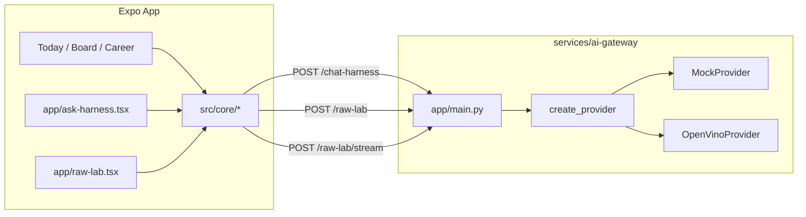
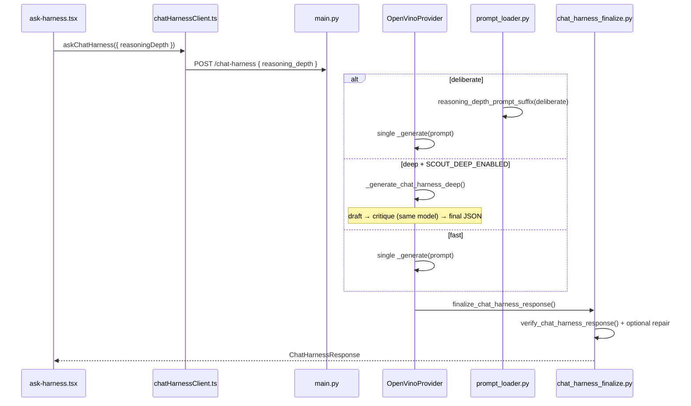
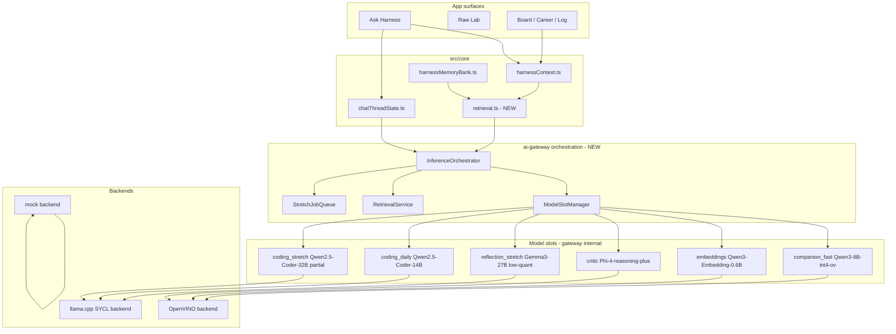

# A770 Local Intelligence Roadmap

Companion to [`docs/local-a770-plan.md`](../local-a770-plan.md) and [`docs/08_ai_provider_and_a770_plan.md`](../08_ai_provider_and_a770_plan.md).

**Thesis:** Do not chase one giant model on Intel Arc A770 16GB. Build **cognitive architecture**: always-on fast local model + retrieved state + tools + critics + evals + reflection + approval-gated memory/personality updates.

**User-facing rule:** The app exposes simple controls (`reasoningDepth: fast | deliberate | deep`, task endpoints, mode). The gateway maps those to **model slots** and backends — stretch model names never appear in the Expo UI.

**Status:** Planning only. No runtime changes in this document.

---

## 1. Current architecture map

### 1.1 End-to-end flow (today)



### 1.2 Relevant app files

| File | Role |
|------|------|
| [`app/ask-harness.tsx`](../../app/ask-harness.tsx) | Ask screen: thread UI, `reasoningDepth` state, context export mode, Memory Bank save, gateway URL |
| [`app/raw-lab.tsx`](../../app/raw-lab.tsx) | Raw Lab screen: in-memory thread + personality, handoff to Ask, streaming toggle |
| [`src/components/askHarness/AskHarnessAdvancedPanel.tsx`](../../src/components/askHarness/AskHarnessAdvancedPanel.tsx) | Mode, sensitivity, `reasoningDepth` pills, gateway URL |
| [`src/components/askHarness/ChatThread.tsx`](../../src/components/askHarness/ChatThread.tsx) | Renders chat turns, variant buttons |
| [`src/components/askHarness/ChatThreadContextPanel.tsx`](../../src/components/askHarness/ChatThreadContextPanel.tsx) | Thread state inspector |
| [`src/components/rawLab/RawLabThreadMemoryPanel.tsx`](../../src/components/rawLab/RawLabThreadMemoryPanel.tsx) | Raw Lab thread memory + personality panels |
| [`src/components/rawLab/RawLabBudgetInspector.tsx`](../../src/components/rawLab/RawLabBudgetInspector.tsx) | Send-budget diagnostics |

### 1.3 Relevant core files

| File | Role |
|------|------|
| [`src/core/harnessContext.ts`](../../src/core/harnessContext.ts) | `buildHarnessContext()`, compact export, `resolveChatHarnessSendBundle()`, `estimateChatHarnessPromptChars()` |
| [`src/core/chatHarnessClient.ts`](../../src/core/chatHarnessClient.ts) | `askChatHarness()` → `POST /chat-harness`; maps `reasoningDepth` → `reasoning_depth` |
| [`src/core/askHarnessThreadAdapter.ts`](../../src/core/askHarnessThreadAdapter.ts) | `buildConversationHistoryFromThread()` |
| [`src/core/chatThreadState.ts`](../../src/core/chatThreadState.ts) | Shared thread state, digest, reference resolution, `packConversationHistoryForGateway()` |
| [`src/core/rawLabClient.ts`](../../src/core/rawLabClient.ts) | `askRawLab()`, `streamRawLab()` → gateway Raw Lab endpoints |
| [`src/core/rawLabThreadState.ts`](../../src/core/rawLabThreadState.ts) | Raw Lab thread + personality state (session-only) |
| [`src/core/rawLabContextBudget.ts`](../../src/core/rawLabContextBudget.ts) | `buildRawLabSendBundle()` — app-side send-only compaction |
| [`src/core/gatewayBudget.ts`](../../src/core/gatewayBudget.ts) | `DEFAULT_GATEWAY_MAX_INPUT_CHARS` (12_000) |
| [`src/core/harnessMemoryBank.ts`](../../src/core/harnessMemoryBank.ts) | User-approved durable memory (not RAG) |

### 1.4 Relevant ai-gateway files

| File | Role |
|------|------|
| [`services/ai-gateway/app/main.py`](../../services/ai-gateway/app/main.py) | FastAPI routes, `create_provider()`, S3 gate, CORS |
| [`services/ai-gateway/app/models.py`](../../services/ai-gateway/app/models.py) | Request/response schemas, `ReasoningDepth`, `ChatHarnessRequest` |
| [`services/ai-gateway/app/config.py`](../../services/ai-gateway/app/config.py) | `Settings`: provider, model path, `deep_enabled`, `deep_max_extra_passes` |
| [`services/ai-gateway/app/prompt_loader.py`](../../services/ai-gateway/app/prompt_loader.py) | `build_chat_harness_prompt()`, `build_raw_lab_system_prompt()` |
| [`services/ai-gateway/app/providers/base.py`](../../services/ai-gateway/app/providers/base.py) | `TranscriptProvider` protocol, `parse_strict_json()`, fallbacks |
| [`services/ai-gateway/app/providers/mock.py`](../../services/ai-gateway/app/providers/mock.py) | Deterministic scout + chat + Raw Lab heuristics |
| [`services/ai-gateway/app/providers/openvino_provider.py`](../../services/ai-gateway/app/providers/openvino_provider.py) | Single lazy `LLMPipeline`, all endpoints |
| [`services/ai-gateway/app/chat_harness_finalize.py`](../../services/ai-gateway/app/chat_harness_finalize.py) | `finalize_chat_harness_response()` — one verifier repair max |
| [`services/ai-gateway/app/thread_verifier.py`](../../services/ai-gateway/app/thread_verifier.py) | `verify_chat_harness_response()`, `reasoning_depth_prompt_suffix()` |
| [`services/ai-gateway/app/raw_lab_budget.py`](../../services/ai-gateway/app/raw_lab_budget.py) | `prepare_raw_lab_request()` — gateway-side compaction |
| [`services/ai-gateway/app/eval_runner.py`](../../services/ai-gateway/app/eval_runner.py) | Thread eval fixture runner |
| [`services/ai-gateway/app/prompts/chat_harness.md`](../../services/ai-gateway/app/prompts/chat_harness.md) | Chat Harness system template |
| [`services/ai-gateway/evals/thread/*.json`](../../services/ai-gateway/evals/thread/) | CI/manual thread intelligence fixtures |

### 1.5 Existing `reasoningDepth` flow



**App wiring**

- [`app/ask-harness.tsx`](../../app/ask-harness.tsx): `useState<ReasoningDepth>("fast")`, passed to `askChatHarness()`.
- [`src/core/chatHarnessClient.ts`](../../src/core/chatHarnessClient.ts): `body.reasoning_depth = input.reasoningDepth` when set.
- [`src/components/askHarness/AskHarnessAdvancedPanel.tsx`](../../src/components/askHarness/AskHarnessAdvancedPanel.tsx): UI for `fast | deliberate | deep`.

**Gateway wiring**

- [`services/ai-gateway/app/models.py`](../../services/ai-gateway/app/models.py): `ReasoningDepth` enum on `ChatHarnessRequest`.
- [`services/ai-gateway/app/thread_verifier.py`](../../services/ai-gateway/app/thread_verifier.py): `reasoning_depth_prompt_suffix()` — `deliberate` adds private checklist text; `deep` adds “careful reasoning” suffix; `fast` is concise.
- [`services/ai-gateway/app/prompt_loader.py`](../../services/ai-gateway/app/prompt_loader.py): injects `{reasoning_depth}` and `{reasoning_depth_suffix}` into `chat_harness.md`.

**Deep pass (OpenVINO only today)**

Implemented in [`OpenVinoProvider._generate_chat_harness_deep()`](../../services/ai-gateway/app/providers/openvino_provider.py):

1. Draft: `_generate(prompt)` with full chat-harness prompt.
2. Critique: `_generate(_CHAT_HARNESS_DEEP_CRITIQUE_PROMPT)` — **same Qwen3-8B pipeline**, plain-text critique.
3. Final: `_generate(prompt + draft + critique)` — return corrected JSON.
4. Falls back to draft if final JSON parse fails.

`SCOUT_DEEP_MAX_EXTRA_PASSES` exists in [`config.py`](../../services/ai-gateway/app/config.py) but is **not yet enforced** in the deep loop (hard-coded 2 extra generations). Mock provider does **not** run multi-pass; it appends a confidence note only.

**Post-generation pipeline (all Chat Harness paths)**

- [`finalize_chat_harness_response()`](../../services/ai-gateway/app/chat_harness_finalize.py) → [`verify_chat_harness_response()`](../../services/ai-gateway/app/thread_verifier.py): anti-repeat, board-mutation-claim, steering, code-block checks.
- OpenVINO JSON parse failure → one repair pass → `CHAT_HARNESS_PARSE_FALLBACK` (HTTP 200, not 502).

### 1.6 Existing provider / model situation

| Capability | Implementation |
|------------|----------------|
| Provider selection | `SCOUT_PROVIDER=mock\|openvino` → [`create_provider()`](../../services/ai-gateway/app/main.py) |
| Single model | `OpenVINO/Qwen3-8B-int4-ov` via `SCOUT_MODEL_PATH` |
| Pipeline load | Lazy `_ensure_pipeline()` on first inference |
| Structured endpoints | `/analyze-transcript`, `/ask-harness` — strict JSON + 502 on failure |
| Conversational endpoint | `/chat-harness` — safe fallback on parse failure |
| Sandbox | `/raw-lab`, `/raw-lab/stream` — plain text, hedging/anti-repeat repairs |
| Evals | `evals/thread/*.json`, `pytest tests/test_thread_eval_fixtures.py` |
| Embeddings / RAG | **Not implemented** — Memory Bank is manual save + rules export |
| Multi-model / job queue | **Not implemented** |
| llama.cpp / SYCL | **Not implemented** — documented as future in `08_ai_provider_and_a770_plan.md` |

### 1.7 Gaps vs target intelligence

```text
Same model does draft + critique + repair → limited critic quality
No retrieval over logs/cards/proof beyond static HarnessContext export
No embedding index for Memory Bank or career artifacts
No dedicated coding slot or async stretch jobs
No reflection endpoint separate from chat-harness mode=reflection
Task-level /ai/* endpoints from 08 doc are aspirational only
```

---

## 2. Proposed target architecture

### 2.1 Cognitive stack



### 2.2 Components

#### InferenceOrchestrator (`services/ai-gateway/app/orchestrator.py` — new)

Single entry for **task routing**, not raw model calls.

Responsibilities:

- Map HTTP task + `reasoning_depth` + `mode` + sensitivity → **slot plan** (which models, how many passes).
- Assemble **context packet**: `HarnessContext` + `thread_state` + `conversation_history` + **retrieved chunks** + Memory Bank items (when enabled).
- Run pass pipeline: `draft → critic → verifier → optional reflection`.
- Enforce budgets: `SCOUT_MAX_INPUT_CHARS`, per-slot timeouts, max extra passes.
- Return user-safe response shapes unchanged (`ChatHarnessResponse`, etc.).

Providers (`OpenVinoProvider`, `MockProvider`) shrink to **backend adapters** called by the orchestrator — not the routing brain.

#### ModelSlotManager (`services/ai-gateway/app/model_slots.py` — new)

Internal registry; never exposed to Expo.

| Slot | Model (target) | Backend | Load policy | Typical tasks |
|------|----------------|---------|-------------|---------------|
| `companion_fast` | Qwen3-8B-int4-ov | OpenVINO GPU | Always resident | Chat Harness fast/deliberate, Raw Lab, classify-log |
| `embeddings` | Qwen3-Embedding-0.6B | OpenVINO CPU/GPU | Lazy, keep warm | Memory Bank + log/card retrieval |
| `critic` | Phi-4-reasoning-plus (int4 OV or SYCL) | OpenVINO or llama.cpp | Lazy; unload when idle | `reasoning_depth=deep` critique pass |
| `reflection_stretch` | Gemma 3 27B low quant | llama.cpp SYCL partial GPU | On-demand; queue | `/companion/reflect`, weekly review drafts |
| `coding_daily` | Qwen2.5-Coder-14B Q4_K_M | llama.cpp SYCL | Lazy | `task_mode=write_code\|debug`, code teaching evals |
| `coding_stretch` | Qwen2.5-Coder-32B partial offload | llama.cpp batch only | Job queue only | Multi-file refactors, deep code review |
| `experimental_moe` | Qwen3-30B-A3B | TBD | Manual flag | Phase 5 experiments only |

Slot config via env (example):

```text
SCOUT_SLOT_COMPANION_FAST_BACKEND=openvino
SCOUT_SLOT_COMPANION_FAST_MODEL=models/qwen3-8b-int4-ov
SCOUT_SLOT_CRITIC_BACKEND=openvino
SCOUT_SLOT_CRITIC_MODEL=models/phi-4-reasoning-plus-int4-ov
SCOUT_SLOT_CODING_DAILY_BACKEND=llamacpp
SCOUT_SLOT_CODING_DAILY_MODEL=models/qwen2.5-coder-14b-q4_k_m.gguf
```

`GET /health` extends to report per-slot readiness without loading all weights.

#### OpenVINO backend (evolve `openvino_provider.py`)

- Hold **one pipeline per loaded slot** (not one global pipeline).
- `companion_fast` + `embeddings` + `critic` when critic fits in OV int4 on A770.
- Keep existing prompt builders and repair patterns.

#### llama.cpp / SYCL backend (`services/ai-gateway/app/providers/llamacpp_provider.py` — new)

- Used for `coding_daily`, `coding_stretch`, `reflection_stretch` where OV int4 catalog is thin or VRAM needs partial CPU offload.
- Subprocess or `llama-server` on localhost with strict 127.0.0.1 bind.
- Same `generate(slot, prompt, ...)` interface as OpenVINO adapter.

#### mock backend (keep `mock.py`)

- Deterministic slot simulation for CI: critic returns fixed critique text, stretch jobs complete instantly.
- All new orchestration paths must have mock coverage before GPU work.

#### Task endpoints (gateway public API)

Keep existing endpoints; add **task-level** routes per [`docs/08_ai_provider_and_a770_plan.md`](../08_ai_provider_and_a770_plan.md):

| Endpoint | Slot plan | Sync/async |
|----------|-----------|------------|
| `POST /chat-harness` | `companion_fast`; deep adds `critic` | Sync |
| `POST /raw-lab` | `companion_fast` only | Sync |
| `POST /companion/reflect` | `reflection_stretch` or deliberate `companion_fast` fallback | Sync with timeout; async if stretch |
| `POST /ai/classify-log` | `companion_fast` | Sync |
| `POST /ai/suggest-pounce` | `companion_fast` + retrieval | Sync |
| `POST /ai/weekly-review` | `reflection_stretch` | Async job |
| `POST /ai/code-review` | `coding_daily`; deep → job | Async job |
| `GET /ai/jobs/{id}` | — | Poll stretch results |

App continues to call **task endpoints** only — no model names in [`chatHarnessClient.ts`](../../src/core/chatHarnessClient.ts).

#### StretchJobQueue (`services/ai-gateway/app/job_queue.py` — new)

For `coding_stretch`, `reflection_stretch`, and future Qwen3-30B experiments.

```text
POST /ai/jobs → { job_id, status: queued }
Background worker → loads stretch slot (evict other stretch models) → runs → stores result
GET /ai/jobs/{id} → { status, result?, error? }
```

Properties:

- In-memory or sqlite under `services/ai-gateway/.local/jobs.db` (gitignored).
- Max 1 stretch model loaded at a time on A770.
- Jobs inherit sensitivity gate (S3 rejected before enqueue).
- User notification via polling from app — no push in v0.4.

#### Retrieval layer (new, both sides)

**App (`src/core/retrieval.ts`)** — optional pre-gateway ranking of Memory Bank + recent logs for export.

**Gateway (`services/ai-gateway/app/retrieval.py`)** — embedding index over:

- Active + inbox card titles/actions
- Recent logs (S0–S2 only)
- Memory Bank items
- Proof shelf summaries

Flow: query → `embeddings` slot → top-k chunks → injected into context packet **below** full `HarnessContext` (board snapshot remains source of truth; retrieval is additive snippets with source labels).

### 2.3 `reasoningDepth` → slot mapping (target)

| UI `reasoningDepth` | Passes | Slots |
|---------------------|--------|-------|
| `fast` | 1 | `companion_fast` |
| `deliberate` | 1 + stronger prompt suffix | `companion_fast` |
| `deep` | draft → **critic** → final + verifier repair | `companion_fast` + `critic` |

Coding threads (`thread_state.task_mode` in `write_code` / `debug` / `teach`):

| Condition | Slots |
|-----------|-------|
| Normal send | `coding_daily` if job queue idle, else `companion_fast` fallback |
| User taps “deep code review” (future) | async `coding_stretch` job |

### 2.4 Context packet shape (Phase 0 deliverable)

Standard object passed between app export and orchestrator:

```json
{
  "harness_context": { "cards": [], "logs": [], "...": "..." },
  "conversation_history": [],
  "thread_state": {},
  "retrieved_chunks": [
    { "source_type": "memory", "label": "...", "text": "...", "score": 0.82 }
  ],
  "budget": { "max_input_chars": 12000, "reserved_message_chars": 400 },
  "routing": { "reasoning_depth": "deep", "mode": "operator", "sensitivity": "S1" }
}
```

Documented in `services/ai-gateway/docs/context-packet-v1.md` (Phase 0).

---

## 3. Phased build plan

### Phase 0 — Docs, evals, context packet (1–2 weeks)

**Goal:** Lock contracts before loading second model.

Deliverables:

- `services/ai-gateway/docs/context-packet-v1.md` — context packet schema.
- Extend [`evals/thread/`](../../services/ai-gateway/evals/thread/) with:
  - `deep_reasoning_quality.json` — deep mode must beat fast on grounding checks.
  - `critic_ablation.json` — same prompt with/without critic pass (mock simulates).
  - `retrieval_grounding.json` — answer cites retrieved chunk labels.
- `evals/routing/slot_plan.json` — orchestrator picks expected slots per request.
- Update [`docs/conversation-thread-intelligence.md`](../conversation-thread-intelligence.md) with slot mapping section (doc only).
- App: no UI change; optional `estimateChatHarnessPromptChars` helper already sufficient.

Exit criteria:

- `SCOUT_PROVIDER=mock pytest` green with new fixtures.
- Context packet validated in unit tests without GPU.

### Phase 1 — Phi-4 critic deep pass (2–3 weeks)

**Goal:** Replace same-model self-critique with dedicated `critic` slot for `reasoning_depth=deep`.

Work:

- Introduce `ModelSlotManager` + minimal `InferenceOrchestrator` for Chat Harness deep path only.
- Load `critic` (Phi-4-reasoning-plus) alongside `companion_fast` on OpenVINO when VRAM allows; else sequential load with cache eviction policy.
- Refactor [`OpenVinoProvider._generate_chat_harness_deep()`](../../services/ai-gateway/app/providers/openvino_provider.py) to call `orchestrator.run_deep_chat_harness()`.
- Wire `SCOUT_DEEP_MAX_EXTRA_PASSES` for real.
- Mock backend returns deterministic critic text.
- Manual OpenVINO smoke: compare deep latency + rubric vs Phase 0 baseline.

Exit criteria:

- Deep mode uses **different slot** for critique in OpenVINO mode.
- `test_chat_harness_reasoning_contract.py` + `deep_reasoning_quality.json` pass on mock.
- Ask UI unchanged — still `reasoningDepth: deep`.

### Phase 2 — Companion reflection endpoint (2 weeks)

**Goal:** On-demand deeper reflection without blocking fast chat.

Work:

- `POST /companion/reflect` — input: message + `HarnessContext` + optional thread slice; output: `{ reflection, patterns, suggested_moves, confidence_notes }`.
- Routing: try `reflection_stretch` via llama.cpp if `SCOUT_REFLECTION_BACKEND=llamacpp` and job not contended; else `companion_fast` with `mode=reflection` prompt.
- App: optional “Deeper reflection” button on Ask thread (uses new client in `src/core/reflectionClient.ts`).
- Sensitivity: S3 rejected; S2 allowed (local only).
- Eval: `evals/tasks/weekly_reflection.json`.

Exit criteria:

- Endpoint works mock + one GPU path.
- Does not auto-write Memory Bank — user approves saves via existing flow.

### Phase 3 — `coding_daily` local slot (2–3 weeks)

**Goal:** Better code teaching / debug answers in Ask Harness.

Work:

- llama.cpp SYCL backend + `coding_daily` slot (Qwen2.5-Coder-14B).
- Orchestrator routes when `thread_state.task_mode` ∈ `{ write_code, debug, teach }` and `SCOUT_CODING_ENABLED=true`.
- [`thread_verifier.py`](../../services/ai-gateway/app/thread_verifier.py) code-block check stays — critic optional for code.
- Extend [`evals/thread/code_teaching.json`](../../services/ai-gateway/evals/thread/code_teaching.json) with slot assertions.
- VRAM policy: unload `critic` when coding slot loads if needed.

Exit criteria:

- Code teaching eval passes on mock + manual Coder 14B smoke.
- Fallback to `companion_fast` when coder not ready (503 avoided — degrade with confidence note).

### Phase 4 — Code deep-pass job queue (2–3 weeks)

**Goal:** Async stretch coding without freezing chat UI.

Work:

- `job_queue.py` + `POST /ai/code-review` + `GET /ai/jobs/{id}`.
- `coding_stretch` slot: Qwen2.5-Coder-32B partial offload, batch-only.
- App: dev-only job panel on Ask or Career screen (poll job status).
- Max one active stretch job; cancel support.
- Eval: `evals/tasks/code_review_job.json` (mock completes in <1s).

Exit criteria:

- Submit job → poll → receive structured review JSON.
- Companion chat remains responsive (stretch model not blocking `companion_fast`).

### Phase 5 — Gemma / Qwen stretch experiments (ongoing)

**Goal:** Measure whether larger on-demand models justify VRAM cost.

Experiments (manual, not daily drivers):

- `reflection_stretch`: Gemma 3 27B low quant — weekly review quality vs Phi critic + fast companion.
- `experimental_moe`: Qwen3-30B-A3B — latency/quality tradeoff.
- **Out of scope:** Qwen3-Next-80B on A770 daily use.

Deliverables:

- `services/ai-gateway/docs/stretch-model-benchmarks.md` — latency, VRAM, rubric scores.
- Env flags default **off**; no app exposure.

---

## 4. File-by-file implementation tickets

Tickets are ordered roughly by phase. Each should be small enough for one PR.

### Phase 0

| Ticket | Files | Action |
|--------|-------|--------|
| P0-1 Context packet spec | `services/ai-gateway/docs/context-packet-v1.md` | Define JSON schema + examples |
| P0-2 Context packet types | `services/ai-gateway/app/context_packet.py` | Pydantic models mirroring spec |
| P0-3 Deep reasoning eval | `services/ai-gateway/evals/thread/deep_reasoning_quality.json` | New fixture |
| P0-4 Slot routing eval | `services/ai-gateway/evals/routing/slot_plan.json`, `tests/test_slot_routing_eval.py` | Mock orchestrator expectations |
| P0-5 Eval runner extend | `services/ai-gateway/app/eval_runner.py` | Support `slot_plan` + `reflect` endpoints |
| P0-6 Roadmap cross-link | `docs/local-a770-plan.md`, `docs/README.md` | Link to this plan |

### Phase 1

| Ticket | Files | Action |
|--------|-------|--------|
| P1-1 Model slot config | `services/ai-gateway/app/model_slots.py`, `app/config.py` | Slot registry + env parsing |
| P1-2 Slot manager | `services/ai-gateway/app/model_slots.py` | `get_pipeline(slot)`, LRU eviction hooks |
| P1-3 Orchestrator skeleton | `services/ai-gateway/app/orchestrator.py` | `run_chat_harness(request)` delegation |
| P1-4 Deep pass refactor | `services/ai-gateway/app/orchestrator.py`, `providers/openvino_provider.py` | Critic slot for deep mode |
| P1-5 Mock critic | `services/ai-gateway/app/providers/mock.py` | Deterministic critic output |
| P1-6 Health extension | `services/ai-gateway/app/main.py`, `app/models.py` | Per-slot status in `/health` |
| P1-7 Tests | `tests/test_model_slots.py`, `tests/test_orchestrator_deep.py` | CI-safe |
| P1-8 Docs | `services/ai-gateway/README.md`, `services/ai-gateway/AGENTS.md` | Env vars for critic slot |

### Phase 2

| Ticket | Files | Action |
|--------|-------|--------|
| P2-1 Reflect endpoint | `services/ai-gateway/app/main.py`, `app/models.py` | `POST /companion/reflect` |
| P2-2 Reflect prompt | `services/ai-gateway/app/prompts/companion_reflect.md`, `prompt_loader.py` | Template |
| P2-3 Reflect orchestration | `services/ai-gateway/app/orchestrator.py` | Slot selection + fallback |
| P2-4 App client | `src/core/reflectionClient.ts` | Fetch wrapper |
| P2-5 Ask UI hook | `app/ask-harness.tsx`, `src/components/askHarness/ChatThread.tsx` | Optional button |
| P2-6 Tests | `tests/test_companion_reflect_contract.py` | Mock contract |
| P2-7 Eval | `services/ai-gateway/evals/tasks/weekly_reflection.json` | |

### Phase 3

| Ticket | Files | Action |
|--------|-------|--------|
| P3-1 llama.cpp provider | `services/ai-gateway/app/providers/llamacpp_provider.py` | HTTP/subprocess adapter |
| P3-2 Coding slot wiring | `services/ai-gateway/app/model_slots.py`, `orchestrator.py` | Route by `task_mode` |
| P3-3 OpenVINO split | `providers/openvino_provider.py` | Multi-pipeline per slot |
| P3-4 pyproject optional dep | `services/ai-gateway/pyproject.toml` | `[llamacpp]` extra |
| P3-5 Tests | `tests/test_llamacpp_provider.py`, extend `code_teaching.json` | |
| P3-6 Setup doc | `docs/plans/llamacpp-sycl-setup.md` | Windows A770 instructions |

### Phase 4

| Ticket | Files | Action |
|--------|-------|--------|
| P4-1 Job models | `services/ai-gateway/app/job_models.py` | Job state enums |
| P4-2 Job queue | `services/ai-gateway/app/job_queue.py` | Queue + worker thread |
| P4-3 Job routes | `services/ai-gateway/app/main.py` | POST/GET job endpoints |
| P4-4 Code review task | `services/ai-gateway/app/tasks/code_review.py` | Stretch pipeline |
| P4-5 App job client | `src/core/aiJobClient.ts` | Poll helper |
| P4-6 Dev UI | `app/ask-harness.tsx` or `app/career.tsx` | Job status panel (dev) |
| P4-7 Tests | `tests/test_job_queue.py`, `evals/tasks/code_review_job.json` | |

### Phase 5

| Ticket | Files | Action |
|--------|-------|--------|
| P5-1 Benchmark script | `services/ai-gateway/scripts/benchmark_slots.py` | Latency + VRAM log |
| P5-2 Stretch benchmarks doc | `services/ai-gateway/docs/stretch-model-benchmarks.md` | Results template |
| P5-3 MoE experiment flag | `app/config.py`, `model_slots.py` | `SCOUT_EXPERIMENTAL_MOE=false` |

### Retrieval (cross-cutting; start after P1)

| Ticket | Files | Action |
|--------|-------|--------|
| R-1 Embedding slot | `model_slots.py`, `providers/openvino_provider.py` | Qwen3-Embedding-0.6B |
| R-2 Gateway retrieval | `services/ai-gateway/app/retrieval.py` | Index + search |
| R-3 App retrieval export | `src/core/retrieval.ts` | Memory Bank ranker |
| R-4 Context inject | `orchestrator.py`, `prompt_loader.py` | `retrieved_chunks` section |
| R-5 Eval | `evals/thread/retrieval_grounding.json` | |
| R-6 Product doc | `docs/harness-context-quality-v0.1.md` | Update when retrieval ships |

---

## 5. Risks and constraints

### VRAM contention (A770 16GB)

```text
companion_fast (~5GB) + critic (~4–8GB) may exceed headroom
coding_daily 14B Q4 (~9GB) conflicts with companion resident
Policy: one "large" slot at a time; companion_fast priority; explicit eviction in ModelSlotManager
```

Mitigation: sequential load for deep pass; telemetry in `/health`; never load `coding_stretch` + `reflection_stretch` together.

### Slow model loading

OpenVINO lazy load already causes **~20–30s first token** on cold start ([`local-a770-plan.md`](../local-a770-plan.md) smoke). Adding slots multiplies risk.

Mitigation:

- Warm `companion_fast` on gateway start (optional `SCOUT_WARM_SLOTS=companion_fast`).
- Keep stretch models off hot path; job queue amortizes load time.
- UI: existing “gateway not ready” handling in Ask/Raw Lab; extend for job polling.

### Bad JSON from models

Already handled for Chat Harness (repair + fallback) and Ask Harness (502). Multi-pass deep increases parse failure surface.

Mitigation:

- Critic outputs **plain text** only; final pass must JSON.
- Keep [`finalize_chat_harness_response()`](../../services/ai-gateway/app/chat_harness_finalize.py) as single repair choke point.
- Add golden **invalid JSON** fixtures to evals.

### Companion memory safety

Life Harness memory must stay **approval-gated** ([`AGENTS.md`](../../AGENTS.md), [`memory-bank-v0.1.md`](../memory-bank-v0.1.md)).

Mitigation:

- Retrieval injects snippets — never auto-writes Memory Bank.
- Reflection endpoint returns suggestions only.
- Raw Lab personality remains isolated ([`raw-lab-thread-state.md`](../raw-lab-thread-state.md)) — no slot routing change for Raw Lab except `companion_fast`.
- S3 gate stays in [`main.py`](../../services/ai-gateway/app/main.py) before orchestrator.

### Avoiding broad rewrites

```text
Do not replace harnessContext export — extend it
Do not merge Raw Lab into Chat Harness
Do not expose model slots in Expo UI
Do not block core Momentum Board loop on gateway availability
Keep TranscriptProvider protocol until orchestrator parity proven, then thin providers
```

### Product constraints (unchanged)

- v0.1 core loop stays rules-only without gateway.
- No cloud AI in this roadmap.
- No autonomous board mutations.
- Stretch models are dev/power-user paths until rubric-proven.

---

## 6. Recommended first implementation ticket

**Start with P1-1 + P1-3 + P1-4: Model slot config + orchestrator skeleton + critic-based deep pass.**

Why this first:

1. **Builds on existing code** — [`_generate_chat_harness_deep()`](../../services/ai-gateway/app/providers/openvino_provider.py) and `reasoning_depth=deep` UI already exist; lowest integration risk.
2. **Immediate quality lift** — Phi-4 critic is the highest ROI stretch on A770 before 27B reflection or 32B coder.
3. **Unlocks everything else** — `ModelSlotManager` and `InferenceOrchestrator` are prerequisites for coding slots, job queue, and retrieval without another rewrite.
4. **CI-safe path** — mock critic + slot routing evals land before GPU setup.

**Concrete first PR scope:**

```text
services/ai-gateway/app/model_slots.py       (new — companion_fast + critic only)
services/ai-gateway/app/orchestrator.py      (new — chat_harness deep path)
services/ai-gateway/app/config.py            (slot env vars)
services/ai-gateway/app/providers/openvino_provider.py  (delegate deep to orchestrator)
services/ai-gateway/app/providers/mock.py    (mock critic)
services/ai-gateway/tests/test_orchestrator_deep.py
services/ai-gateway/evals/thread/deep_reasoning_quality.json
```

**Out of scope for first PR:** llama.cpp, job queue, app UI changes, retrieval, new endpoints.

**Manual validation after merge:**

```powershell
cd services/ai-gateway
$env:SCOUT_PROVIDER="mock"
pytest tests/test_orchestrator_deep.py tests/test_chat_harness_reasoning_contract.py -q

# GPU path (when critic weights present)
$env:SCOUT_PROVIDER="openvino"
$env:SCOUT_SLOT_CRITIC_MODEL="models/phi-4-reasoning-plus-int4-ov"
uvicorn app.main:app --host 127.0.0.1 --port 8111
python scripts/run_thread_eval.py
```

---

## Related docs

- [`docs/local-a770-plan.md`](../local-a770-plan.md) — gateway phases 0–2 (shipped)
- [`docs/08_ai_provider_and_a770_plan.md`](../08_ai_provider_and_a770_plan.md) — sensitivity + task endpoint vision
- [`docs/ask-harness-v0.1.md`](../ask-harness-v0.1.md) — Ask screen setup
- [`docs/conversation-thread-intelligence.md`](../conversation-thread-intelligence.md) — thread + reasoning depth
- [`services/ai-gateway/README.md`](../../services/ai-gateway/README.md) — endpoint reference
