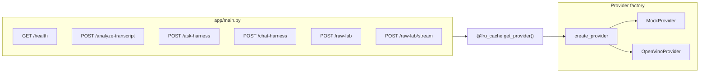
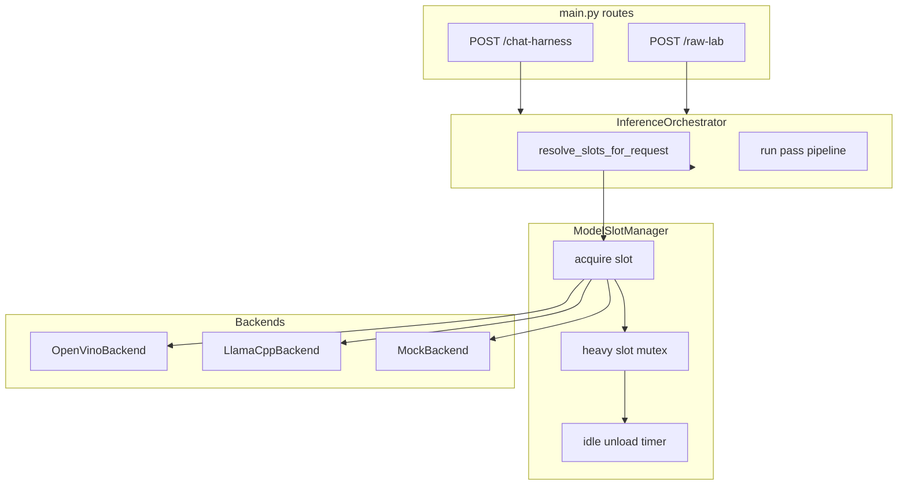
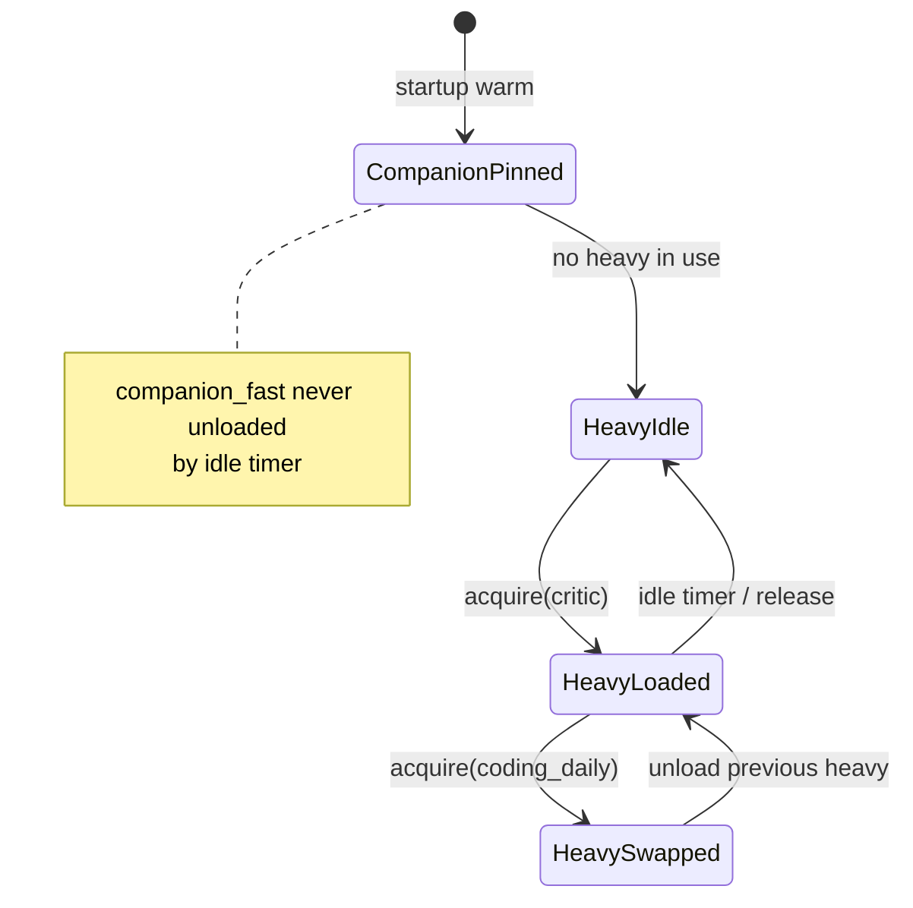
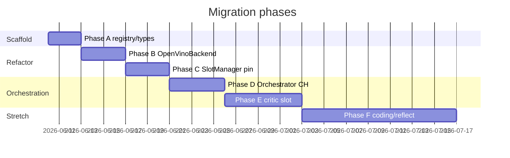

# AI Gateway Model Slots v0.1 — Planning Document

> **Catalog superseded** for model choices and load policy by [`model-stack-freeze-v3.md`](./model-stack-freeze-v3.md) (2026-06-10). This doc remains useful for gateway refactor history, backend seams, and VRAM mutex design.

Planning only. No implementation in this document.

**Goal:** Refactor `services/ai-gateway/` so multiple **local model roles** can run on Intel Arc A770 16GB — always-on fast companion, on-demand stretch models, and a dedicated critic — without changing Expo-facing API contracts.

**Related docs:**

- [`docs/plans/a770-local-intelligence-roadmap.md`](a770-local-intelligence-roadmap.md) — cognitive stack, phased roadmap, retrieval
- [`docs/plans/phi4-critic-deep-pass-v0.1.md`](phi4-critic-deep-pass-v0.1.md) — structured deep critic pass (first consumer of `critic` slot)
- [`docs/local-a770-plan.md`](../local-a770-plan.md) — gateway phases shipped to date
- [`services/ai-gateway/README.md`](../../services/ai-gateway/README.md) — endpoints and env vars today

**User-facing rule (unchanged):** App sends `reasoning_depth` or calls task endpoints. Gateway maps internally to model slots. Model names never appear in the Expo UI.

---

## 1. Current gateway architecture summary

### 1.1 Layout (actual)

```text
services/ai-gateway/
  app/
    main.py                 # FastAPI routes, create_provider(), S3 gate, CORS
    models.py               # Pydantic request/response schemas, ReasoningDepth
    config.py               # Settings dataclass (single model path, provider toggle)
    prompt_loader.py        # build_*_prompt() for all modes
    chat_harness_finalize.py
    thread_verifier.py
    raw_lab_budget.py
    eval_runner.py
    providers/
      base.py               # TranscriptProvider protocol, parse_strict_json(), errors
      mock.py               # MockProvider — deterministic heuristics, CI default
      openvino_provider.py  # OpenVinoProvider — single lazy LLMPipeline, all endpoints
    prompts/
      transcript_analysis.md, ask_harness.md, chat_harness.md, raw_lab.md
  tests/                    # 25 pytest modules; SCOUT_PROVIDER=mock default
  evals/thread/             # 8 JSON fixtures for thread intelligence
  scripts/                  # analyze_file, ask_harness, chat_harness, smoke_openvino, run_thread_eval
  playground/ask_harness.html
  pyproject.toml            # [dev], [openvino] extras only — no llama.cpp yet
  README.md, AGENTS.md
```

No Docker, no `.env.example`, no `models.yaml` today. Configuration is **env-only** via [`app/config.py`](../../services/ai-gateway/app/config.py).

### 1.2 Request flow today



Every route calls `get_provider()` ([`app/main.py`](../../services/ai-gateway/app/main.py) lines 71–73, 159–172) and delegates to `TranscriptProvider` methods defined in [`app/providers/base.py`](../../services/ai-gateway/app/providers/base.py).

### 1.3 Provider selection

| Mechanism | Location | Behavior |
|-----------|----------|----------|
| `SCOUT_PROVIDER` | `config.py` `Settings.from_env()` | `mock` (default) or `openvino` |
| `create_provider()` | `main.py` | Returns `OpenVinoProvider(settings)` or `MockProvider()` |
| Single model | `SCOUT_MODEL_PATH` | Default `models/qwen3-8b-int4-ov` |
| Pipeline | `OpenVinoProvider._ensure_pipeline()` | One `ov_genai.LLMPipeline` lazy-loaded on first inference |
| Health | `GET /health` | Single `model` + `device` from settings; no per-slot status |

### 1.4 Endpoints and provider methods

| HTTP route | Provider method | Response shape | Error pattern |
|------------|-----------------|----------------|----------------|
| `POST /analyze-transcript` | `analyze()` | `AnalyzeTranscriptResponse` | 422 / 502 / 503 |
| `POST /ask-harness` | `ask_harness()` | `AskHarnessResponse` | 422 / 502 / 503 |
| `POST /chat-harness` | `chat_harness()` | `ChatHarnessResponse` | 422 / 503 (parse fail → 200 fallback) |
| `POST /raw-lab` | `raw_lab()` | `RawLabResponse` | 422 / 503 |
| `POST /raw-lab/stream` | `raw_lab()` via SSE | chunked | 503 in SSE event |

S3 rejection happens in `main.py` before `get_provider()` for analyze, ask, and chat harness.

### 1.5 `reasoning_depth` handling today

**App → gateway**

- [`src/core/chatHarnessClient.ts`](../../src/core/chatHarnessClient.ts): maps `reasoningDepth` → `reasoning_depth` on `POST /chat-harness`.
- [`app/models.py`](../../services/ai-gateway/app/models.py): `ReasoningDepth` enum (`fast`, `deliberate`, `deep`) on `ChatHarnessRequest`.

**Prompt injection**

- [`thread_verifier.py`](../../services/ai-gateway/app/thread_verifier.py) `reasoning_depth_prompt_suffix()` — deliberate adds private checklist; deep adds “careful reasoning”; fast is concise.
- [`prompt_loader.py`](../../services/ai-gateway/app/prompt_loader.py) `build_chat_harness_prompt()` substitutes `{reasoning_depth}` and `{reasoning_depth_suffix}` into [`prompts/chat_harness.md`](../../services/ai-gateway/app/prompts/chat_harness.md).

**OpenVINO deep mode** ([`openvino_provider.py`](../../services/ai-gateway/app/providers/openvino_provider.py) `chat_harness()` → `_generate_chat_harness_deep()`):

1. Draft: `_generate(prompt)` — same Qwen3 pipeline.
2. Critique: `_generate(_CHAT_HARNESS_DEEP_CRITIQUE_PROMPT)` — **unstructured prose**, same model.
3. Final: `_generate(prompt + draft + critique)` — JSON; falls back to draft on parse fail.

Gated by `SCOUT_DEEP_ENABLED=true` and `request.reasoning_depth == ReasoningDepth.deep`. Skipped when `SCOUT_CHAT_HARNESS_NATIVE_CHAT=true`.

**Mock deep mode** ([`mock.py`](../../services/ai-gateway/app/providers/mock.py) ~661–663): single pass; appends `"Deep mode (mock): single-pass simulated."` to `confidence_notes`.

**Post-pass (all depths)**

- [`finalize_chat_harness_response()`](../../services/ai-gateway/app/chat_harness_finalize.py) → [`verify_chat_harness_response()`](../../services/ai-gateway/app/thread_verifier.py) with one optional repair.

**Config gap:** `Settings.deep_max_extra_passes` exists in `config.py` but is **not enforced** in the deep loop.

### 1.6 What does not exist yet

- `InferenceOrchestrator`, `ModelSlotRegistry`, `ModelSlotManager`
- `LlamaCppBackend` / llama.cpp integration
- Multi-pipeline OpenVINO (one slot = one pipeline)
- Per-slot health, VRAM mutex, idle unload
- Task endpoints (`/companion/reflect`, `/ai/code-review`, job queue)
- `critic_backend.py` / structured critic (planned in [`phi4-critic-deep-pass-v0.1.md`](phi4-critic-deep-pass-v0.1.md))

### 1.7 CI and startup

- **Tests:** `SCOUT_PROVIDER=mock` via `os.environ.setdefault` in each test module; `get_provider.cache_clear()` in autouse fixtures (e.g. [`tests/test_chat_harness_reasoning_contract.py`](../../services/ai-gateway/tests/test_chat_harness_reasoning_contract.py)).
- **Start:** `uvicorn app.main:app --host 127.0.0.1 --port 8111` (README); no warm-start hook.
- **Evals:** [`eval_runner.py`](../../services/ai-gateway/app/eval_runner.py) + [`evals/thread/*.json`](../../services/ai-gateway/evals/thread/); [`tests/test_thread_eval_fixtures.py`](../../services/ai-gateway/tests/test_thread_eval_fixtures.py) runs against mock without live server.

---

## 2. Proposed classes and modules

Target: **orchestrator owns routing**; **backends own inference**; **providers become thin facades** (or are replaced gradually).

### 2.1 Module map

```text
services/ai-gateway/app/
  orchestrator/
    __init__.py
    inference_orchestrator.py    # InferenceOrchestrator
    slot_plan.py                 # SlotPlan, resolve_slots_for_request()
  slots/
    __init__.py
    registry.py                  # ModelSlotRegistry — static slot definitions
    manager.py                   # ModelSlotManager — load/unload/mutex/idle
    types.py                     # ModelSlotId, SlotConfig, SlotState, BackendKind
  backends/
    __init__.py
    base.py                      # InferenceBackend protocol, GenerateRequest/Result
    openvino_backend.py          # OpenVinoBackend
    llamacpp_backend.py          # LlamaCppBackend
    mock_backend.py              # MockBackend (extracted from mock provider logic)
  providers/
    mock.py                      # Thin: delegates to InferenceOrchestrator + MockBackend
    openvino_provider.py         # Thin during migration; then deprecated
  config.py                      # Extended Settings + models.yaml path
  models.yaml                    # Default slot catalog (gitcommitted example)
```

Keep existing files (`prompt_loader.py`, `chat_harness_finalize.py`, `thread_verifier.py`, `raw_lab_budget.py`) unchanged in v0.1 except where orchestrator calls them.

### 2.2 Class responsibilities

#### `InferenceOrchestrator` — `app/orchestrator/inference_orchestrator.py`

Single routing brain. **Not** called directly from routes in phase 1; wired through providers first.

| Responsibility | Detail |
|----------------|--------|
| Slot planning | Map endpoint + `reasoning_depth` + `thread_state.task_mode` → `SlotPlan` |
| Context assembly | Reuse `build_chat_harness_prompt()` etc.; no new app contract |
| Pass pipelines | Chat Harness: draft → critic → final; Raw Lab: single `companion_fast` |
| Budget enforcement | `SCOUT_MAX_INPUT_CHARS`, `deep_max_extra_passes`, per-slot timeouts |
| Error translation | `SlotLoadingError` → `ProviderNotReadyError` for HTTP 503 |

Key methods (proposed):

```python
class InferenceOrchestrator:
    def run_chat_harness(self, request: ChatHarnessRequest) -> ChatHarnessResponse: ...
    def run_raw_lab(self, request: RawLabRequest) -> RawLabResponse: ...
    def run_ask_harness(self, request: AskHarnessRequest) -> AskHarnessResponse: ...
    def run_analyze(self, request: AnalyzeTranscriptRequest) -> AnalyzeTranscriptResponse: ...
```

#### `ModelSlotRegistry` — `app/slots/registry.py`

Read-only catalog loaded from `models.yaml` + env overrides.

| Responsibility | Detail |
|----------------|--------|
| Slot metadata | id, backend, model path, quant, `keep_loaded`, `heavy`, `enabled` |
| Defaults | Ship committed `models.yaml` with `experimental_qwen30.enabled: false` |
| Validation | Fail fast at startup if enabled slot has missing path (OpenVINO/llama.cpp only when `SCOUT_PROVIDER != mock`) |

#### `ModelSlotManager` — `app/slots/manager.py`

Runtime GPU/VRAM owner.

| Responsibility | Detail |
|----------------|--------|
| Acquire / release | `acquire(slot_id) -> LoadedSlotHandle` with mutex for heavy slots |
| Pinning | `companion_fast` loaded at gateway start when `keep_loaded: true` |
| Idle unload | Background timer evicts non-pinned heavy slots after `idle_unload_seconds` |
| Backend dispatch | Routes to `OpenVinoBackend` or `LlamaCppBackend` per slot config |
| Health | `slot_status() -> dict[ModelSlotId, SlotHealth]` for `/health` extension |

#### `OpenVinoBackend` — `app/backends/openvino_backend.py`

Extract from [`OpenVinoProvider`](../../services/ai-gateway/app/providers/openvino_provider.py):

- `_ensure_pipeline()` → per-slot `LLMPipeline` cache keyed by `ModelSlotId`
- `_generate()`, `_generate_chat()`, `_generate_chat_repair()` — unchanged semantics
- Used by slots: `companion_fast` (primary)

#### `LlamaCppBackend` — `app/backends/llamacpp_backend.py`

New. HTTP client to local `llama-server` or subprocess wrapper.

| Responsibility | Detail |
|----------------|--------|
| Slots served | `critic`, `reflection_stretch`, `coding_daily`, `coding_stretch` |
| Bind | `127.0.0.1` only; configurable port per slot or single server with model hot-swap |
| Generate | `generate(slot_id, prompt \| chat_messages, config) -> str` |
| Load signal | `is_ready(slot_id) -> bool`; loading state for 503 / retry |

#### `MockBackend` — `app/backends/mock_backend.py`

Deterministic slot simulation for CI:

- `companion_fast` — existing `MockProvider` heuristics
- `critic` — rule table keyed by message prefix (see phi4 plan)
- Stretch slots — instant canned responses; no GPU, no subprocess

`MockProvider` becomes a thin wrapper: `InferenceOrchestrator(mock_manager)`.

### 2.3 Target slot catalog

| Slot ID | Model (target) | Backend | Load policy | Primary routes |
|---------|----------------|---------|-------------|----------------|
| `companion_fast` | OpenVINO `Qwen3-8B-int4-ov` | OpenVINO GPU | **`keep_loaded: true`** | All sync endpoints default |
| `critic` | llama.cpp `Phi-4-reasoning-plus` | llama.cpp SYCL | Lazy; optional resident if VRAM fits | `reasoning_depth=deep` pass 2 |
| `reflection_stretch` | llama.cpp Gemma 3 27B low quant | llama.cpp | On demand; heavy mutex | Future `/companion/reflect` |
| `coding_daily` | llama.cpp `Qwen2.5-Coder-14B` | llama.cpp | Lazy | `task_mode` in `write_code`, `debug`, `teach` |
| `coding_stretch` | llama.cpp `Qwen2.5-Coder-32B` | llama.cpp | **Batch / job queue only** | Future `/ai/code-review` jobs |
| `experimental_qwen30` | Qwen3-30B-A3B (TBD) | TBD | **Disabled by default** | Manual experiments only |

### 2.4 Routing diagram (target)



### 2.5 `reasoning_depth` → slot mapping (target)

| `reasoning_depth` | Slots | Passes |
|-------------------|-------|--------|
| `fast` | `companion_fast` | 1 |
| `deliberate` | `companion_fast` | 1 (+ stronger prompt suffix) |
| `deep` | `companion_fast` + `critic` | draft → structured critic → final (+ verifier repair) |

| `thread_state.task_mode` | Slots (when `SCOUT_CODING_ENABLED=true`) |
|--------------------------|------------------------------------------|
| `write_code`, `debug`, `teach` | `coding_daily` if ready, else `companion_fast` fallback |
| (future deep code review) | async `coding_stretch` job |

---

## 3. Proposed config file shape

### 3.1 Primary: `models.yaml`

Committed example at `services/ai-gateway/models.yaml`. Env vars override paths and enable flags for local machine layout.

```yaml
# services/ai-gateway/models.yaml — gateway-internal, not app-facing
version: 1

defaults:
  idle_unload_seconds: 300
  heavy_load_timeout_seconds: 120
  warm_on_start:
    - companion_fast

slots:
  companion_fast:
    enabled: true
    backend: openvino
    model_path: models/qwen3-8b-int4-ov
    model_id: OpenVINO/Qwen3-8B-int4-ov
    device: GPU
    keep_loaded: true
    heavy: false
    max_new_tokens: 1024
    temperature: 0.2

  critic:
    enabled: true
    backend: llamacpp
    model_path: models/phi-4-reasoning-plus-q4_k_m.gguf
    keep_loaded: false          # set true locally if VRAM allows
    heavy: true
    llamacpp:
      host: 127.0.0.1
      port: 8121
      n_gpu_layers: -1
      ctx_size: 8192

  reflection_stretch:
    enabled: true
    backend: llamacpp
    model_path: models/gemma-3-27b-q3_k_m.gguf
    keep_loaded: false
    heavy: true
    batch_only: false           # sync with timeout for /companion/reflect

  coding_daily:
    enabled: true
    backend: llamacpp
    model_path: models/qwen2.5-coder-14b-q4_k_m.gguf
    keep_loaded: false
    heavy: true

  coding_stretch:
    enabled: true
    backend: llamacpp
    model_path: models/qwen2.5-coder-32b-q3_k_m.gguf
    keep_loaded: false
    heavy: true
    batch_only: true            # never on hot sync path

  experimental_qwen30:
    enabled: false
    backend: llamacpp
    model_path: models/qwen3-30b-a3b-q4_k_m.gguf
    heavy: true
    batch_only: true
```

Loader: `app/slots/registry.py` `load_slot_registry(path: Path | None) -> ModelSlotRegistry`.

`Settings` in [`config.py`](../../services/ai-gateway/app/config.py) gains:

- `models_config_path: str` — default `models.yaml` beside service root
- `provider: mock | openvino | hybrid` — `hybrid` = real OpenVINO companion + mock llama.cpp (dev without all GGUFs)

### 3.2 Env override pattern (alternative / complement)

Keep flat env for CI and quick overrides (document in README):

```text
# Catalog path
SCOUT_MODELS_CONFIG=models.yaml

# Per-slot overrides (gateway-only)
SCOUT_SLOT_COMPANION_FAST_BACKEND=openvino
SCOUT_SLOT_COMPANION_FAST_MODEL=models/qwen3-8b-int4-ov
SCOUT_SLOT_COMPANION_FAST_KEEP_LOADED=true

SCOUT_SLOT_CRITIC_BACKEND=llamacpp
SCOUT_SLOT_CRITIC_MODEL=models/phi-4-reasoning-plus-q4_k_m.gguf
SCOUT_SLOT_CRITIC_ENABLED=true

SCOUT_SLOT_CODING_DAILY_ENABLED=false
SCOUT_SLOT_CODING_STRETCH_ENABLED=false
SCOUT_SLOT_EXPERIMENTAL_QWEN30_ENABLED=false

# VRAM policy
SCOUT_HEAVY_SLOT_MUTEX=true
SCOUT_IDLE_UNLOAD_SECONDS=300
SCOUT_WARM_SLOTS=companion_fast
SCOUT_CODING_ENABLED=false

# Legacy (preserved through migration)
SCOUT_PROVIDER=mock
SCOUT_MODEL_PATH=models/qwen3-8b-int4-ov    # maps to companion_fast if yaml absent
```

**Precedence:** env per-slot override > `models.yaml` > built-in defaults in `registry.py`.

### 3.3 Example `.env.example` (add in implementation ticket)

```text
SCOUT_PROVIDER=mock
SCOUT_HOST=127.0.0.1
SCOUT_PORT=8111
SCOUT_MODELS_CONFIG=models.yaml
SCOUT_WARM_SLOTS=companion_fast
SCOUT_HEAVY_SLOT_MUTEX=true
SCOUT_IDLE_UNLOAD_SECONDS=300
```

---

## 4. VRAM policy

A770 16GB cannot hold companion + critic + 14B coder + 27B reflection simultaneously. Policy is explicit and gateway-enforced.

### 4.1 Rules

| Rule | Behavior |
|------|----------|
| **Pinned fast model** | `companion_fast` with `keep_loaded: true` — loaded at startup when `SCOUT_WARM_SLOTS` includes it; **never evicted** by idle timer |
| **Heavy slot mutex** | At most **one** slot with `heavy: true` (excluding pinned non-heavy) owns GPU at a time among: `critic`, `reflection_stretch`, `coding_daily`, `coding_stretch`, `experimental_qwen30` |
| **Acquire order** | Sync requests: try acquire target heavy slot → if mutex held, queue or fail per timeout policy |
| **Eviction on acquire** | Loading heavy slot B unloads heavy slot A (not `companion_fast`) |
| **Idle unload** | After `idle_unload_seconds` without use, unload non-pinned heavy slots |
| **Batch-only slots** | `coding_stretch`, `experimental_qwen30` — only job worker may acquire; sync routes never call them |

### 4.2 Estimated VRAM budget (planning assumptions)

```text
companion_fast (Qwen3-8B int4 OV)     ~4–6 GB   pinned
critic (Phi-4-reasoning-plus Q4)       ~4–8 GB   heavy, may coexist OR sequential
coding_daily (14B Q4)                  ~8–10 GB  conflicts with critic resident
reflection_stretch (27B Q3)            ~12–16 GB partial offload — mutex mandatory
coding_stretch (32B Q3)                batch only, CPU offload expected
```

**Recommended default:** critic loads **on demand** for deep requests; unload after idle. Do not keep critic resident unless `SCOUT_SLOT_CRITIC_KEEP_LOADED=true` and manual VRAM check passes.

### 4.3 Timeout and HTTP responses

| Situation | HTTP | Body / behavior |
|-----------|------|-------------------|
| Missing deps / model path | **503** | Existing `ProviderNotReadyError` message (unchanged) |
| Heavy slot loading exceeds `heavy_load_timeout_seconds` | **503** | `detail: "model_loading: critic"` (slot id in message; no model name required) |
| Mutex busy, sync wait exceeded | **503** | `detail: "model_busy: reflection_stretch"` |
| Inference timeout (`SCOUT_TIMEOUT_SECONDS`) | **503** | Existing: `"Inference timed out after Ns"` |
| Stretch job queued (future) | **202** | `{ job_id, status: "queued" }` — not in v0.1 sync refactor |
| Degraded fallback (coding slot missing) | **200** | Answer from `companion_fast` + `confidence_notes` entry — **avoid 503** on optional slots |

New exception types in `app/backends/base.py`:

```python
class SlotLoadingError(ProviderNotReadyError): ...   # 503 model_loading
class SlotBusyError(ProviderNotReadyError): ...        # 503 model_busy
```

`main.py` continues mapping `ProviderNotReadyError` → HTTP 503; no new status codes for v0.1.

### 4.4 `/health` extension (phase 1b)

Extend [`HealthResponse`](../../services/ai-gateway/app/models.py) with optional dev-only field:

```json
{
  "status": "ok",
  "provider": "openvino",
  "provider_ready": true,
  "model": "OpenVINO/Qwen3-8B-int4-ov",
  "slots": {
    "companion_fast": { "ready": true, "loaded": true },
    "critic": { "ready": false, "loaded": false, "message": "gguf not found" }
  }
}
```

Do not expose GGUF filenames to Expo app clients; document in gateway README only.

### 4.5 VRAM lifecycle diagram



---

## 5. Testing strategy with mock backends

### 5.1 CI-safe principles

1. **Default `SCOUT_PROVIDER=mock`** — no GPU, no llama-server, no model files.
2. **`MockBackend` simulates all slots** — deterministic latency (instant), no mutex blocking in default tests.
3. **`ModelSlotManager` test double** — inject fake manager to force `SlotBusyError` / `SlotLoadingError` without threads.
4. **Preserve existing tests** — all 25 modules in `tests/` must pass unchanged after phase 1 wiring.
5. **No network in CI** — `LlamaCppBackend` unit tests mock HTTP; integration tests marked `@pytest.mark.gpu` optional.

### 5.2 Tests to add

| File | Purpose |
|------|---------|
| `tests/test_slot_registry.py` | Parse `models.yaml`, env overrides, disabled slots |
| `tests/test_slot_manager_mock.py` | Mutex, idle unload (fake clock), pin companion |
| `tests/test_orchestrator_routing.py` | `fast`/`deliberate`/`deep` → expected slot plan |
| `tests/test_orchestrator_deep.py` | Deep pipeline uses critic slot (mock rules) |
| `tests/test_llamacpp_backend.py` | HTTP client mocked; loading / error mapping |
| `tests/test_health_slots.py` | `/health` slot map when mock manager injected |
| `tests/test_chat_harness_deep_critic.py` | Per [`phi4-critic-deep-pass-v0.1.md`](phi4-critic-deep-pass-v0.1.md) |

### 5.3 Extend existing tests

| Existing file | Extension |
|---------------|-----------|
| [`test_chat_harness_reasoning_contract.py`](../../services/ai-gateway/tests/test_chat_harness_reasoning_contract.py) | Update deep confidence note substring when mock runs real deep orchestration |
| [`test_openvino_provider.py`](../../services/ai-gateway/tests/test_openvino_provider.py) | Split pipeline tests to `OpenVinoBackend`; provider tests become integration-light |
| [`test_thread_eval_fixtures.py`](../../services/ai-gateway/tests/test_thread_eval_fixtures.py) | Add optional `expect_slots` in fixture metadata (ignored until orchestrator lands) |
| [`eval_runner.py`](../../services/ai-gateway/app/eval_runner.py) | Support `reasoning_depth: deep` cases in new `evals/thread/deep_reasoning_quality.json` |

### 5.4 New eval fixtures (phase 0 of implementation)

```text
evals/routing/slot_plan.json          # expected slots per request profile
evals/thread/deep_reasoning_quality.json
```

Run: `$env:SCOUT_PROVIDER="mock"; pytest tests/test_orchestrator_routing.py -q`

### 5.5 Mock critic trigger table (from phi4 plan)

Prefix-based rules in `MockBackend` for deep pass — e.g. `"deep-critic-too-broad"` → `failed_checks: [too_broad]`. Keeps GPU-free coverage of orchestration logic.

---

## 6. Migration plan (no breaking endpoint changes)

### Phase A — Scaffold (no behavior change)

- Add `models.yaml`, `slots/registry.py`, `slots/types.py` — parse only.
- Add `backends/base.py` protocol.
- `Settings` reads yaml path; `SCOUT_MODEL_PATH` still drives `OpenVinoProvider`.
- **All existing tests green.**

### Phase B — Extract OpenVINO backend

- Move `_ensure_pipeline`, `_generate`, `_generate_chat` from [`openvino_provider.py`](../../services/ai-gateway/app/providers/openvino_provider.py) to `OpenVinoBackend`.
- `OpenVinoProvider` delegates to backend with implicit `companion_fast` slot.
- Behavior identical; refactor-only PR.

### Phase C — ModelSlotManager + companion pin

- `ModelSlotManager` with single slot `companion_fast`.
- Optional `SCOUT_WARM_SLOTS=companion_fast` on uvicorn startup (lifespan hook in `main.py`).
- `/health.slots.companion_fast` optional field.

### Phase D — InferenceOrchestrator for Chat Harness

- `run_chat_harness()` calls existing prompt/build/finalize paths.
- `OpenVinoProvider.chat_harness` → orchestrator (still single model).
- Mock path → orchestrator with `MockBackend`.

### Phase E — Critic slot (llama.cpp + mock)

- Implement `LlamaCppBackend` + mock critic rules.
- Deep path: `companion_fast` draft → `critic` structured verdict → `companion_fast` final.
- Align with [`phi4-critic-deep-pass-v0.1.md`](phi4-critic-deep-pass-v0.1.md) (`ChatHarnessCriticVerdict`, `chat_harness_deep.py`).
- VRAM mutex between critic and other heavy slots.
- **App contract unchanged:** same `POST /chat-harness` body/response.

### Phase F — Coding + reflection slots (later PRs)

- Route by `thread_state.task_mode` to `coding_daily`.
- Add `/companion/reflect`, job queue for `coding_stretch` per a770 roadmap.
- `experimental_qwen30` remains `enabled: false`.

### Backward compatibility checklist

| Surface | Preserved |
|---------|-----------|
| `POST /chat-harness` request/response | Yes |
| `SCOUT_PROVIDER=mock` default | Yes |
| `SCOUT_MODEL_PATH` | Maps to `companion_fast` until yaml required |
| `get_provider()` cache | Stays; orchestrator singleton inside provider |
| S3 gate in `main.py` | Yes |
| 503 for missing OpenVINO model | Yes |
| Chat Harness parse fallback HTTP 200 | Yes |



---

## 7. First implementation ticket

**Ticket title:** P1 — Model slot registry + OpenVinoBackend extract + orchestrator skeleton (companion_fast only)

**Scope:** Smallest vertical slice. No llama.cpp yet. No critic slot wiring. CI-safe.

### 7.1 Files to create

| File | Action |
|------|--------|
| `services/ai-gateway/models.yaml` | Committed example catalog (all slots; stretch `enabled: false` except companion + critic placeholder) |
| `services/ai-gateway/app/slots/types.py` | `ModelSlotId`, `SlotConfig`, `BackendKind`, `SlotHealth` |
| `services/ai-gateway/app/slots/registry.py` | `ModelSlotRegistry`, `load_slot_registry()` |
| `services/ai-gateway/app/slots/manager.py` | `ModelSlotManager` — companion_fast only; no-op mutex |
| `services/ai-gateway/app/backends/base.py` | `InferenceBackend` protocol, `GenerateOptions`, errors |
| `services/ai-gateway/app/backends/openvino_backend.py` | Extracted from `OpenVinoProvider` |
| `services/ai-gateway/app/backends/mock_backend.py` | Extract `MockProvider._generate*` equivalents as no-ops / passthrough |
| `services/ai-gateway/app/orchestrator/slot_plan.py` | `SlotPlan`, `resolve_slots_for_chat_harness()` |
| `services/ai-gateway/app/orchestrator/inference_orchestrator.py` | `run_chat_harness()` delegating to current logic |
| `services/ai-gateway/tests/test_slot_registry.py` | Yaml + env parse tests |
| `services/ai-gateway/tests/test_orchestrator_routing.py` | fast/deliberate/deep → plan lists `companion_fast` only for now |

### 7.2 Files to edit

| File | Action |
|------|--------|
| [`app/config.py`](../../services/ai-gateway/app/config.py) | Add `models_config_path`, `warm_slots: tuple[str, ...]` |
| [`app/providers/openvino_provider.py`](../../services/ai-gateway/app/providers/openvino_provider.py) | Use `OpenVinoBackend` via `ModelSlotManager.acquire("companion_fast")` |
| [`app/providers/mock.py`](../../services/ai-gateway/app/providers/mock.py) | `chat_harness()` → `InferenceOrchestrator` (optional in same PR or follow-up) |
| [`app/main.py`](../../services/ai-gateway/app/main.py) | FastAPI `lifespan` warm `companion_fast` when configured |
| [`README.md`](../../services/ai-gateway/README.md) | Document `models.yaml`, `SCOUT_WARM_SLOTS` |
| [`pyproject.toml`](../../services/ai-gateway/pyproject.toml) | Add `pyyaml` dependency if yaml loader used |

### 7.3 Files explicitly deferred (ticket 2)

| File | Reason |
|------|--------|
| `app/backends/llamacpp_backend.py` | Ticket 2 — critic slot |
| `app/chat_harness_critic.py`, `app/critic_backend.py` | Per phi4 plan |
| `app/job_queue.py` | Phase F — coding_stretch batch |
| `app/main.py` new routes | `/companion/reflect`, `/ai/jobs` |

### 7.4 Acceptance criteria

```text
[ ] SCOUT_PROVIDER=mock pytest — all existing + new tests pass
[ ] SCOUT_PROVIDER=openvino with missing model — same 503 behavior on /chat-harness
[ ] models.yaml parses; companion_fast.keep_loaded respected on warm start
[ ] OpenVinoProvider.chat_harness behavior unchanged for fast/deliberate/deep (deep still same-model critique until ticket 2)
[ ] No Expo app changes
[ ] README lists new env vars
```

### 7.5 Commands

```powershell
cd services/ai-gateway
$env:SCOUT_PROVIDER="mock"
pytest tests/test_slot_registry.py tests/test_orchestrator_routing.py -q
pytest -q
```

### 7.6 Ticket 2 preview (critic + VRAM mutex)

Immediately follows ticket 1:

- `LlamaCppBackend` + `MockBackend.critic`
- `chat_harness_deep.py` + structured critic per phi4 plan
- `ModelSlotManager` heavy mutex + idle unload
- `tests/test_orchestrator_deep.py`, `tests/test_chat_harness_deep_critic.py`
- Manual: Phi-4 GGUF on A770, deep latency smoke via `scripts/run_thread_eval.py`

---

## Appendix A — Endpoint → slot matrix (steady state)

| Endpoint | Default slot | Conditional slots |
|----------|--------------|-------------------|
| `POST /analyze-transcript` | `companion_fast` | — |
| `POST /ask-harness` | `companion_fast` | — |
| `POST /chat-harness` | `companion_fast` | `critic` when `reasoning_depth=deep`; `coding_daily` when coding task_mode |
| `POST /raw-lab` | `companion_fast` | — |
| `POST /raw-lab/stream` | `companion_fast` | — |
| `POST /companion/reflect` (future) | `reflection_stretch` | fallback `companion_fast` |
| `POST /ai/code-review` (future) | job → `coding_stretch` | — |

## Appendix B — Related implementation plans

| Doc | Relationship |
|-----|--------------|
| [`phi4-critic-deep-pass-v0.1.md`](phi4-critic-deep-pass-v0.1.md) | Pass 2 critic schema + tests; consumes `critic` slot |
| [`a770-local-intelligence-roadmap.md`](a770-local-intelligence-roadmap.md) | Broader phases: retrieval, job queue, app clients |
| [`local-ai-evals-v0.1.md`](local-ai-evals-v0.1.md) | Eval harness conventions |

---

**Status:** Planning complete. Implementation starts with ticket P1 (§7).
