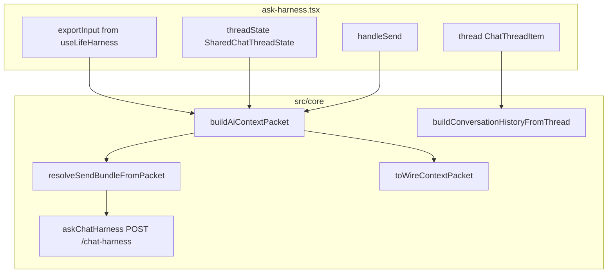
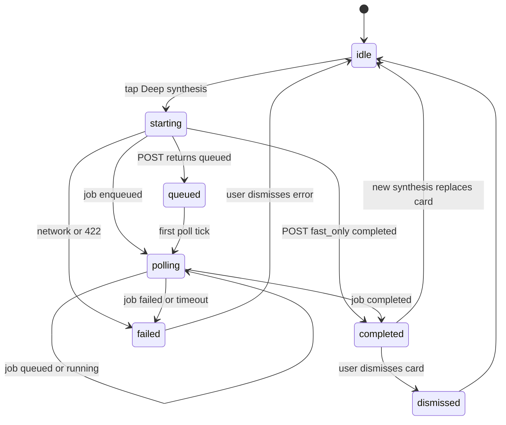

# Ask Deep Synthesis UI v0.1 — Planning Doc

> **Status note (2026-06-11):** The Ask Deep Synthesis UI has since shipped in part: app clients, eligibility checks, job polling, and `SynthesisReportCard` are present. Treat this as historical implementation context; see [`../ai-workflows-current.md`](../ai-workflows-current.md) for the current implemented workflow map.

> **Status:** Plan only — no runtime implementation in this slice.
> **Branch:** `plan/ask-deep-synthesis-ui-v0.1`
> **Goal:** Expose the existing gateway Deep Synthesis job API in Ask Harness as a manual, non-mutating structured report workflow.

**Related plans:**

| Plan | Relationship |
|------|--------------|
| [`deep-synthesis-overnight-brain-v0.1.md`](./deep-synthesis-overnight-brain-v0.1.md) | Backend contract, report shape, `/ai/*` routes |
| [`local-ai-deep-ux-v0.1.md`](./local-ai-deep-ux-v0.1.md) | Human labels, phased loading, approval patterns |
| [`context-packet-builder-v0.1.md`](./context-packet-builder-v0.1.md) | Ranked `AiContextPacket` assembly |

**Guardrails:** root [`AGENTS.md`](../../AGENTS.md) — no board mutation, no auto memory, no Raw Lab export.

**Do not touch:** `services/ai-gateway/`, smoke docs, model config, Raw Lab, Career UI, app shell/nav, new npm dependencies.

---

## 1. Current Ask architecture summary

Ask Harness is a **fat screen orchestrator** in [`app/ask-harness.tsx`](../../app/ask-harness.tsx) with presentation components under [`src/components/askHarness/`](../../src/components/askHarness/).



| Concern | Location | Notes |
|---------|----------|-------|
| Thread UI | [`ChatThread.tsx`](../../src/components/askHarness/ChatThread.tsx) | Per-turn memory tools, variants, error bubbles |
| Composer | [`ChatComposer.tsx`](../../src/components/askHarness/ChatComposer.tsx) | Send loading spinner; shared with Raw Lab |
| Board read | [`HarnessReadCard.tsx`](../../src/components/askHarness/HarnessReadCard.tsx) | Context mode + counts — pattern for synthesis status |
| Inspector | [`AskHarnessAdvancedPanel.tsx`](../../src/components/askHarness/AskHarnessAdvancedPanel.tsx) | Gateway URL, sensitivity — reuse `baseUrl` + `sensitivity` |
| Context packet | [`contextPacketBuilder.ts`](../../src/core/contextPacketBuilder.ts) + [`contextPacketShim.ts`](../../src/core/contextPacketShim.ts) | Same path as `handleSend` |
| Thread history wire | [`askHarnessThreadAdapter.ts`](../../src/core/askHarnessThreadAdapter.ts) | Strips errors + UI metadata |
| Notices | [`Notice.tsx`](../../src/components/Notice.tsx) | Success toasts for manual memory saves |
| Containment tests | [`askHarness.containment.test.ts`](../../src/core/askHarness.containment.test.ts) | No Raw Lab / no auto-save / no personality |

**Gap:** No Deep Synthesis UI yet. [`companionLabels.ts`](../../src/core/companionLabels.ts) has `companionPhaseLabel()` for job phases.

### Client files — existence check (2026-06-10)

| File | Repo status |
|------|-------------|
| [`src/core/deepSynthesisTypes.ts`](../../src/core/deepSynthesisTypes.ts) | **Not present** on `main` at plan time |
| [`src/core/deepSynthesisClient.ts`](../../src/core/deepSynthesisClient.ts) | **Not present** on `main` at plan time |
| [`src/core/aiJobClient.ts`](../../src/core/aiJobClient.ts) | **Not present** on `main` at plan time |

Earlier backend branches may have added these on other branches. **Phase 0 rule:**

> If `deepSynthesisTypes.ts` / `deepSynthesisClient.ts` / `aiJobClient.ts` already exist when implementation starts, **align and extend** them. Do **not** duplicate or overwrite working client code. Verify types match the **live flat** gateway response (not the nested shape in the overnight-brain plan doc).

---

## 2. Existing Deep Synthesis backend contract summary

**Gateway routes (implemented):** [`services/ai-gateway/app/main.py`](../../services/ai-gateway/app/main.py)

| Method | Path | Role |
|--------|------|------|
| `POST` | `/ai/deep-synthesis` | `fast_only` → flat `status: completed`; `with_critic` / `with_stretch` → `status: queued` redirect |
| `POST` | `/ai/deep-synthesis-jobs` | Explicit async enqueue |
| `GET` | `/ai/jobs/{id}` | Poll; `result` is `DeepSynthesisResultBody` when complete |

**Models:** [`synthesis_models.py`](../../services/ai-gateway/app/synthesis_models.py)
**Verifier:** [`synthesis_verifier.py`](../../services/ai-gateway/app/synthesis_verifier.py)

### Critical client contract note

The overnight-brain plan’s proposed TS types use nested `{ status: "completed", result: ... }`. The **live API** returns a **flat completed body** at top level. Queued sync responses and job poll `result` match [`test_deep_synthesis_jobs.py`](../../services/ai-gateway/tests/test_deep_synthesis_jobs.py).

### Request fields (snake_case on wire)

Reuse Ask send bundle:

- `trigger: "thread_excerpt"` (v0.1: Ask thread only, not Raw Lab)
- `sensitivity` — from Ask inspector state
- `user_prompt` — built by `buildSynthesisUserPrompt()` (see §3)
- `context` — legacy `HarnessContext` from `resolveSendBundleFromPacket`
- `context_packet` — `toWireContextPacket(buildAiContextPacket(...))`
- `conversation_history` — `buildConversationHistoryFromThread(thread)`
- `thread_state` — `toWireChatHarnessThreadState(threadState)`
- `pipeline_profile` — **default `with_critic`** (async job + poll)
- `interpretation_lenses` — default `["practical", "emotional", "product"]`

**S3:** HTTP 422 before job creation — UI pre-disables when `sensitivity === "S3"`.

### Report sections (verifier-valid shape)

| UI section | Wire field |
|------------|------------|
| What we're circling | `circling` + `circling_grounding` |
| Key insight / strongest idea | `strongest_idea` + `strongest_idea_grounding` |
| Hidden risk / possible avoidance | `hidden_risk` + `hidden_risk_grounding` |
| Connections | `connections[]` |
| Suggested next pounce | `next_pounce` (exactly 1) |
| Memory candidates | `memory_proposals[]` (`requires_approval: true`) |
| Optional collapsible | `interpretations[]`, `critique`, `degraded_notes`, `confidence_notes`, `safety_notes` |

**Do not surface in v0.1:** `personality_proposals` (no Ask personality path).

---

## 3. Proposed UI entry point

### Button label (decided)

| Surface | Label |
|---------|-------|
| Toolbar button | **Deep synthesis** |
| Report card title | **Deep synthesis** |
| Report card subtitle | *A structured report for this Ask thread.* |

“Synthesize this thread” is clearer but too long for the toolbar. The subtitle carries the explanatory copy.

### Placement

[`app/ask-harness.tsx`](../../app/ask-harness.tsx) `chatThreadToolbar` beside **Clear conversation** — visible only when eligibility passes (§7).

```text
[Clear conversation]  [Deep synthesis]
```

### Behavior

- Does **not** block chat send (`loading` for chat is independent)
- Uses same `baseUrl` as Chat Harness
- On tap: build packet from current `thread`, `threadState`, `exportInput`, `contextMode` — mirror `handleSend` without a new user message
- Capture **request fingerprint** at start (see §4 stale-job protection)

**`user_prompt` construction** (`buildSynthesisUserPrompt` in `src/core/askHarnessSynthesis.ts`):

```text
Synthesize this Ask Harness conversation into a structured report.
Focus: what we are circling, the strongest idea, hidden risk, connections, and one next pounce.
```

Append last user message if present; include `threadState.recentDigest` when non-empty.

**Inspector override (Phase 1b, optional):** `pipeline_profile` pills (`fast_only` | `with_critic` | `with_stretch`) — default remains `with_critic`.

---

## 4. Proposed state machine

Local state in `ask-harness.tsx` (or extracted hook `useDeepSynthesisJob`):



| State | UI |
|-------|-----|
| `idle` | Button enabled when eligible; no report panel |
| `starting` | Button disabled; `SynthesisJobPanel` — “Starting synthesis…” |
| `queued` | `companionPhaseLabel("queued")` |
| `polling` | Phase from `job.phase`; fallback timers at 15s / 60s |
| `completed` | `SynthesisReportCard` (or stale banner — see below) |
| `failed` | `Notice kind="error"` + retry; thread untouched |
| `dismissed` | Report hidden; state reset to `idle` |

**Parallelism:** Chat `loading` and synthesis state are orthogonal — user may send while a job polls.

### Stale-job protection (request fingerprint)

If the user starts synthesis, then clears the thread or sends more messages, a completed report could refer to an **older** thread. Prevent confusing stale results with a lightweight fingerprint — no overbuilding.

**At job start**, capture:

```typescript
type SynthesisRequestFingerprint = {
  threadLength: number;
  lastItemId: string | null;   // last ChatThreadItem.id
  digestSnippet: string;       // threadState.recentDigest trimmed, first 80 chars
};
```

Build via `buildSynthesisRequestFingerprint(thread, threadState)` — no crypto hash required; structural identity is enough.

**On poll completion**, compare `requestFingerprint` to `buildSynthesisRequestFingerprint(currentThread, currentThreadState)`:

| Match? | Behavior |
|--------|----------|
| Yes | Auto-display `SynthesisReportCard` as normal |
| No | Do **not** auto-display as current. Show collapsed/stale card with banner: *“Report is for an earlier thread.”* User may still read or dismiss. Optional **Run again** CTA. |

Fingerprint mismatch does **not** cancel the in-flight job (gateway may still complete); it only gates auto-display prominence.

### Poll cleanup (required)

Implementation **must** clear polling and ignore late responses:

| Event | Required action |
|-------|-----------------|
| Component unmount | `clearInterval` / `clearTimeout`; abort in-flight poll if using `AbortController` |
| User dismisses report / error | Stop poll; reset synthesis state to `idle` |
| User starts new synthesis | Stop previous poll first; increment `pollGeneration` token |
| Late poll response after reset | Compare `pollGeneration`; **ignore** if stale |
| User clears conversation | Stop poll; dismiss any in-flight synthesis UI |

Store `pollGeneration: number` (monotonic counter) in hook state. Each poll callback checks `generation === pollGeneration` before updating UI.

---

## 5. Proposed report card structure

New component: [`src/components/askHarness/SynthesisReportCard.tsx`](../../src/components/askHarness/SynthesisReportCard.tsx)

| Block | Content | Actions |
|-------|---------|---------|
| Header | **Deep synthesis** + subtitle *A structured report for this Ask thread.* | **Dismiss** (required v0.1) |
| Stale banner | *Report is for an earlier thread.* | Shown when fingerprint mismatch |
| Degraded warning | `degraded_notes` via `Notice kind="warning"` | — |
| Section 1 | **What we're circling** + grounding chips | — |
| Section 2 | **Strongest idea** + grounding | — |
| Section 3 | **Hidden risk** + grounding | — |
| Section 4 | **Connections** (bullet list, max 5) | — |
| Section 5 | **Next pounce** — hero: `title`, `smallest_action`, optional `card_hint` | — |
| Collapsible | Interpretations (lens + confidence + summary) | — |
| Collapsible | Critique if present | — |
| Footer | `confidence_notes`, `safety_notes` as meta pills | — |
| Phase 3 | **Memory proposals** | Per-item **Save as durable memory** only |

**Grounding chips:** `chatMetaPill` labels from `SynthesisGroundingRef.label` (no navigation v0.1).

### Copy report — defer unless helper exists

**No new dependencies** (no `expo-clipboard`). Repo audit: only ad-hoc `navigator.clipboard.writeText` in [`app/source-setup.tsx`](../../app/source-setup.tsx) (web-only); no shared clipboard helper.

| v0.1 rule |
|-----------|
| **Dismiss is sufficient** for v0.1 |
| Add **Copy report** only if an existing shared clipboard utility is found or trivially extracted without new deps |
| Do not add `expo-clipboard` or similar for this ticket |

---

## 6. Polling strategy and timeout/retry

**Flow (default `with_critic`):**

1. `POST {baseUrl}/ai/deep-synthesis` with `pipeline_profile: "with_critic"`
2. Expect `status: "queued"` + `poll_url`
3. Poll `GET {baseUrl}{poll_url}` until terminal state
4. On completion: fingerprint check (§4) before auto-display

**Constants (`src/core/aiJobClient.ts`):**

| Constant | Value | Rationale |
|----------|-------|-----------|
| `POLL_INTERVAL_MS` | 2000 | Steady updates for real jobs |
| `POLL_MAX_DURATION_MS` | 300000 (5 min) | Critic/stretch cold start headroom |
| `POLL_BACKOFF_AFTER_MS` | 60000 | After 1 min, interval → 4000ms |
| `MAX_CONSECUTIVE_POLL_ERRORS` | 3 | Transient network blips |

**Phase display:** `job.phase` → `companionPhaseLabel()` → timer fallback (“Still working…” at 15s; “This can take a few minutes…” at 60s).

**Retry:** Failed state shows **Try again** (re-enters `starting`; stops any prior poll first).

**Cancel:** Out of scope v0.1.

**Alternative enqueue:** `POST /ai/deep-synthesis-jobs` — treat identically once `job_id` + `poll_url` known.

---

## 7. Empty / short thread behavior

**Eligibility** `isAskThreadEligibleForSynthesis(thread, threadState)`:

Enable **Deep synthesis** when **all** hold:

- `sensitivity !== "S3"`
- At least one `assistant` turn with non-empty `response.answer`
- And **either:**
  - ≥ 2 user turns, **or**
  - `conversation_history` char count ≥ 200, **or**
  - `threadState.recentDigest.trim().length ≥ 40`

**When ineligible:** button hidden or disabled with *“Need a bit more conversation first — send another message.”*

**Empty thread:** button not shown.

---

## 8. Error / fallback when gateway unavailable

Mirror [`chatHarnessClient.ts`](../../src/core/chatHarnessClient.ts) patterns:

| Failure | User copy | Recovery |
|---------|-----------|----------|
| Fetch / CORS / connection | Adapted `chatHarnessFetchFailureMessage` | Dismiss + check gateway URL |
| HTTP 422 S3 | *“That content isn't included in synthesis — try a narrower prompt or lower sensitivity.”* | Disable until sensitivity changed |
| HTTP 404 job | *“Synthesis job expired — try again.”* | Retry |
| `job.status === "failed"` | `job.error` or *“Couldn't finish synthesis — your thread is safe.”* | Retry |
| Poll timeout | *“Still working on the gateway — check back or retry.”* | Retry |
| HTTP 200 + `degraded_notes` | Report + warning banner | User reads degraded output |

**No rules-only local fallback** in app v0.1.

---

## 9. No-mutation guarantees

| Guarantee | Implementation |
|-----------|----------------|
| No board mutation | No card/log/proof reducers or `primaryAction` apply |
| No auto memory | `memory_proposals` preview only; save on explicit per-proposal tap (Phase 3) |
| No auto chat summary | No `saveChatSummary` on synthesis completion |
| No personality writes | Ignore `personality_proposals` |
| No thread append | Report is separate UI state, not a `ChatThreadItem` |
| No Raw Lab | `trigger` stays Ask-scoped |

**Extend** [`askHarness.containment.test.ts`](../../src/core/askHarness.containment.test.ts): no auto-save from synthesis handlers; no `personality` in request builder.

---

## 10. Test plan

### Unit tests (Vitest)

| File | Cases |
|------|-------|
| `deepSynthesisTypes.test.ts` | Parse flat completed body + queued redirect + job poll result |
| `deepSynthesisClient.test.ts` | Snake_case body; `completed` vs `queued` union |
| `aiJobClient.test.ts` | Poll until completed; timeout; failed job; **late response ignored after generation bump** |
| `askHarnessSynthesis.test.ts` | Eligibility; `user_prompt` builder; **fingerprint match/mismatch** |
| `askHarness.containment.test.ts` | No auto-save / no personality |

### Hook / integration behavior (Phase 1+)

- Poll timer cleared on unmount, dismiss, new request, clear conversation
- Stale fingerprint → stale banner, not auto-prominent display
- `pipeline_profile: "with_critic"` by default

### Manual checklist

- Button appears when eligible; hidden on empty thread
- S3 disables action
- Poll phase labels; report sections render
- **Dismiss** works
- Stale report after send/clear shows correct banner
- Chat send works during poll
- No board mutation after synthesis

---

## 11. Implementation phases

### Phase 0 — Client + test shape (no UI)

**Branch:** `feat/ask-deep-synthesis-ui-phase0`

**First step:** check whether client files already exist on the working branch.

| If absent | If present |
|-----------|------------|
| Create `deepSynthesisTypes.ts`, `deepSynthesisClient.ts`, `aiJobClient.ts` | Align types to **flat** live API; extend missing exports; **do not overwrite** working code |
| Add Vitest files | Add tests only for gaps |

Also create:

- [`src/core/askHarnessSynthesis.ts`](../../src/core/askHarnessSynthesis.ts) — `buildDeepSynthesisRequest`, eligibility, `buildSynthesisRequestFingerprint`

**Do not touch** `services/ai-gateway`.

### Phase 1 — Button + local state

**Branch:** `feat/ask-deep-synthesis-ui-phase1`

- Toolbar **Deep synthesis** button in [`app/ask-harness.tsx`](../../app/ask-harness.tsx)
- `useDeepSynthesisJob` hook: state machine + **poll cleanup** + **pollGeneration** + fingerprint capture
- [`SynthesisJobPanel.tsx`](../../src/components/askHarness/SynthesisJobPanel.tsx) — phased loading

### Phase 2 — Report card

**Branch:** `feat/ask-deep-synthesis-ui-phase2`

- [`SynthesisReportCard.tsx`](../../src/components/askHarness/SynthesisReportCard.tsx)
- **Dismiss** handler; stale banner; degraded/safety/confidence display
- Copy report **only** if existing clipboard helper — otherwise defer

### Phase 3 — Optional manual save integration

**Branch:** `feat/ask-deep-synthesis-ui-phase3`

- Map `memory_proposals` → `createMemoryItem` + `memoryItemDedupeKey`
- Reuse per-candidate save pattern from [`ChatThread.tsx`](../../src/components/askHarness/ChatThread.tsx)

---

## 12. First implementation ticket

**Title:** Ask Deep Synthesis UI — Phase 0 client and eligibility helpers

**Branch:** `feat/ask-deep-synthesis-ui-phase0`

**Scope:**

1. Verify client files — create or align/extend per §11 Phase 0
2. Add `askHarnessSynthesis.ts` with fingerprint + eligibility
3. Vitest coverage per §10
4. No UI changes

**Verify:** `npm run typecheck` + `npm run test`

**Follow-up:** Phase 1 — Deep synthesis button, polling, stale protection (`feat/ask-deep-synthesis-ui-phase1`)

---

## Likely files (future UI branch)

| File | Purpose |
|------|---------|
| `src/core/deepSynthesisTypes.ts` | Types (create or extend) |
| `src/core/deepSynthesisClient.ts` | POST clients (create or extend) |
| `src/core/aiJobClient.ts` | Poll helper + generation guard |
| `src/core/askHarnessSynthesis.ts` | Request builder, eligibility, fingerprint |
| `app/ask-harness.tsx` | State, toolbar, hook wiring |
| `src/components/askHarness/SynthesisJobPanel.tsx` | Loading phases |
| `src/components/askHarness/SynthesisReportCard.tsx` | Report + stale banner + dismiss |
| `src/core/askHarness.containment.test.ts` | No-mutation guards |
| `src/core/companionLabels.ts` | Phase strings (reuse) |

---

## Open questions

1. **Report placement:** Below toolbar, above `ChatThreadContextPanel` (recommended) vs above toolbar?
2. **Phase 3 timing:** Ship memory proposal save in v0.1 or defer if proposals often empty in mock?
3. **Inspector profile override:** Phase 1 or Phase 1b?
4. **Stale card default:** Collapsed with banner vs fully hidden until user expands?

**Resolved:**

- Toolbar label: **Deep synthesis**
- Client Phase 0: **align/extend if exists; do not duplicate**
- Copy report: **defer** without existing helper / new deps
