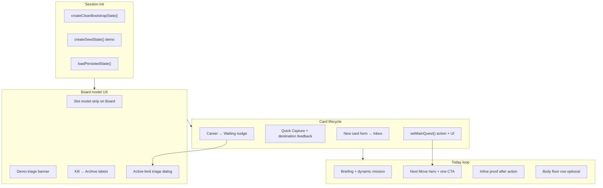

# Board Usability v0.1 — Plan

**Status:** Implemented (2026-06-13)  
**Authority:** Product rules in [`05_product_rules.md`](../05_product_rules.md), design thesis in [`01_final_design_doc.md`](../01_final_design_doc.md), v0.1 scope in [`02_v0_1_scope.md`](../02_v0_1_scope.md)

**Related docs:**
- Historical UX audit: [`ux/current_ux_audit.md`](../ux/current_ux_audit.md)
- Today Act Mode (shipped): [`today-act-mode-v0.1.md`](../today-act-mode-v0.1.md)
- Board quest cards (shipped): [`ux/board-quest-cards-v0.1.md`](../ux/board-quest-cards-v0.1.md)
- Universal Capture: [`universal-capture-v0.1.md`](../universal-capture-v0.1.md)
- Career board model: [`career-command-board-v0.1.md`](../career-command-board-v0.1.md)
- General UX consolidation: [`ux/general-ux-consolidation-v0.1.md`](../ux/general-ux-consolidation-v0.1.md)

---

## Problem statement

Dogfooding Life Harness today feels like operating a **feature demo**, not a personal executive-function harness. The core rules engine works (active limit, warmth, Next Move Contract, proof, recovery), but several gaps block the intended loop:

```text
Open app → know what matters → start one thing → log proof → recover if behind
```

### Symptoms (from real use)

1. **Seed/demo board** — four Active cards, fake follow-ups, static pounce mission; not the user's life.
2. **Board model is invisible** — Active, Waiting, Parked, Kill/Archive mean different commitment levels but look identical in importance.
3. **Card creation is hidden** — requires knowing Quick Capture grammar (`new idea:`) or Career Intake; no obvious "add to board" path.
4. **3-active limit feels wrong** — fitness, long projects, and job apps compete for the same slots with no in-app explanation of intended choreography.
5. **Main Quest has no UI** — `mainQuestId` exists in core/seed but cannot be set by the user.
6. **Daily loop doesn't close** — Today suggests moves but lacks one obvious CTA → action → proof flow; Pounce reads like completion when it only logs initiation.
7. **Lifecycle actions are buried** — Kill is under Board **More**; no delete; Archive semantics unclear.

### Root cause

**Mechanics are ahead of presentation and onboarding.** The product never teaches its own slot model or closes the act loop on the surfaces users actually open.

---

## North star

One sentence this plan serves:

> **Open app → see one real move on your board → do it → proof shows up → board state makes sense.**

If a ticket does not move that needle, defer it.

---

## Design principles (constraints)

Obey v0.1 product rules and `AGENTS.md`:

- No auth, cloud sync, notifications, or AI dependencies for this plan.
- No new motivational concepts (badges, streaks, questionnaires).
- Product rules live in `src/core/`; UI explains and triggers them.
- **Prefer copy + existing states over new data models** until dogfood proves otherwise.
- Manual before automation — nudge to Waiting, don't auto-move cards without user action.
- Parked means safe, not failed. No guilt mechanics.

### Intentionally out of scope (this plan)

- Separate slot pools (habit vs project vs application limits).
- Career hub / nav restructure.
- AI board triage or auto-classification.
- Beautiful UI rabbit hole / full visual redesign.
- Permanent card delete (unless Archive + clean bootstrap still fails dogfood).
- Notifications or calendar integration.

---

## Target mental model (what the app should teach)

Board columns are **commitment levels**, not equal task buckets.

| Column | Meaning | Counts toward Active limit? |
|--------|---------|------------------------------|
| **Inbox** | Captured, not committed yet | No |
| **Active** | Executing *this week* (max 3) | Yes |
| **Waiting** | Blocked / applied — ball elsewhere | **No** |
| **Parked** | Care about it, not now — safe, not failed | No |
| **Done** | Completed or shipped | No |
| **Archived** (UI for `killed`) | Intentionally closed | No |

**Main Quest** — one Active card flagged as *the* weekly priority. Today and Next Move bias toward it.

### Recommended choreography (copy + nudges, not new types)

| Kind of work | Typical path |
|--------------|--------------|
| **Job application** | Inbox → Active (while tailoring/applying) → **Waiting** (after submit) → Done |
| **Build project** | Inbox → Active (1–2 max) → Park when not this week's focus |
| **Body / fitness habit** | Usually **Parked**; log via MVD, Salvage, or capture — not a permanent Active slot |
| **New idea** | Inbox always — never Active by default |
| **Demo / noise** | Archive (UI) / `killed` (data) |

### Why 3 Active is still correct

The limit models **weekly execution threads**, not everything the user cares about. Waiting (job pipeline) and Parked (long threads, habits) exist precisely so fitness + two projects does not require four Active slots.

---

## Current state (codebase)

### What works

| Area | Status |
|------|--------|
| Active limit enforcement | `src/core/guards.ts` — `ACTIVE_CARD_LIMIT = 3` |
| Main Quest read path | `getMainQuest()` — **no set path in UI** |
| Next Move Contract + Today Act Mode | Shipped — `app/index.tsx`, `src/core/nextMoveContract.ts` |
| Board quest actions | Start / Done / More — `src/core/questCardActions.ts` |
| Career application cards | `createCareerApplicationCard()` — Waiting does not count Active |
| Universal Capture | `new idea:` → Inbox card — grammar not discoverable |
| Persistence + reset to seed | `app/progress.tsx` — resets to **demo** seed only |

### Key gaps

| Gap | Evidence |
|-----|----------|
| Demo seed overload | `src/data/seed.ts` — 4 Active, fake Qualcomm follow-up |
| No clean bootstrap | `createSeedState()` only — no empty/minimal init |
| Kill UX | `CardStateButtons`, Board column "Killed" — buried, sounds permanent |
| No main quest setter | `mainQuestId` in `DailyState` — seed-only |
| Static pounce mission | `seedDailyState.pounceMission` vs computed briefing |
| Capture de-emphasized | `QuickCapture.tsx` — secondary submit, strict prefix |
| Body floor not on Today | Design doc lists it; recovery/MVD only at bottom |

---

## Architecture (target)



**Routing rule:** No new primary screens required. Extend Board, Today, Card Detail, Progress, and core actions.

---

## Implementation phases

### Phase A — Make dogfood possible

**Goal:** Stop fighting the demo board on day one.

| ID | Ticket | Summary |
|----|--------|---------|
| LH-UX-01 | Clean bootstrap state | Add `createCleanBootstrapState()` — 0–1 active, no fake apps/follow-ups, empty logs/proof |
| LH-UX-02 | Reset options | Progress: "Reset to clean board" vs "Reset to demo seed" (clear labels) |
| LH-UX-03 | Demo triage banner | Dismissible banner when seed IDs detected or Active > 3 — points to Park/Archive |
| LH-UX-04 | Rename Kill → Archive | UI labels only; keep `killed` in types/persistence |

#### LH-UX-01 — Clean bootstrap state

**Files:**
- `src/data/createSeedState.ts` (or `createCleanBootstrapState.ts`)
- `src/state/LifeHarnessState.tsx` / `src/state/lifeHarness/persistence.ts`
- `src/core/stateHydration.ts` (if merge defaults needed)

**Shape (suggested):**
- `cards: []` or one optional starter Inbox card ("Capture your first idea")
- `logs: []`, `proofItems: []`
- `dailyState`: no `mainQuestId`, no static pounce mission (derive on session start in Phase D)
- Same empty slices as seed for job scout, memory, etc.

**Tests:** bootstrap creates valid `LifeHarnessData`; hydration round-trip.

#### LH-UX-02 — Reset options

**Files:** `app/progress.tsx`, `src/state/lifeHarness/snapshotProviderActions.ts`

**Copy:**
- Clean: "Clears local data and starts an empty board."
- Demo: "Restores demo seed data for feature exploration."

#### LH-UX-03 — Demo triage banner

**Files:** `app/board.tsx`, optionally `app/index.tsx`, `src/core/guards.ts`

**Trigger (deterministic):**
- Known seed card IDs present, OR
- `getActiveLimitStatus().isOverLimit`

**Dismiss:** persist flag in `dailyState` or local storage key `demoTriageDismissed`.

#### LH-UX-04 — Archive labels

**Files:** `app/board.tsx`, `src/components/CardStateButtons.tsx`, `src/core/questCardActions.ts`, `src/core/labels.ts`

**Acceptance:** No user-facing string says "Kill"; data model unchanged.

---

### Phase B — Teach the board model

**Goal:** Answer "how should fitness, jobs, and projects coexist?" inside the app.

| ID | Ticket | Summary |
|----|--------|---------|
| LH-UX-05 | Slot model strip | Always-visible Board copy for Active / Waiting / Parked / Inbox |
| LH-UX-06 | Main quest picker | `setMainQuest(cardId)` in core + UI on Card Detail and Today |
| LH-UX-07 | Active-limit triage dialog | When activate fails, show actives + one-tap Park / Waiting / Archive |
| LH-UX-08 | Career Waiting nudge | After apply/follow-up capture or intake, suggest Move to Waiting |

#### LH-UX-05 — Slot model strip

**Files:** `app/board.tsx`, new `src/components/BoardSlotModelStrip.tsx` (optional)

**Content:** Short table or bullet strip (see Target mental model above). Link to "Archive demo cards" when triage banner active.

#### LH-UX-06 — Main quest picker

**Core:**
- `applySetMainQuest(state, cardId)` in `src/core/actions.ts`
- Rules: card must exist, must be `active`, only one at a time; clear if card archived/parked

**UI:**
- Card Detail: "Set as main quest" / "Main quest" badge
- Today Active threads: same control
- Visual: badge on `CardTile` when `card.id === dailyState.mainQuestId`

**Tests:** `actions.test.ts`, `guards.test.ts`, `nextMoveContract.test.ts` (main quest boost already exists)

#### LH-UX-07 — Active-limit triage dialog

**Files:** `src/components/QuestCardActions.tsx`, `src/components/CardStateButtons.tsx`, new `ActiveLimitTriageDialog.tsx`

**When:** `canActivateCard()` returns `ok: false`

**Show:** Current actives with quick actions:
- **Waiting** — "Applied / waiting on reply"
- **Park** — "Not this week's focus"
- **Archive** — "Done with this thread"

#### LH-UX-08 — Career Waiting nudge

**Files:** `src/core/actions.ts` (applyQuickCapture follow-up paths), `app/career-intake.tsx`, optional Card Detail career block

**Triggers:**
- User logs follow-up / applied-style capture linked to application card
- Career Intake with status hint "already applied" → default Waiting

**UI:** Notice or inline banner with `[Move to Waiting]` — one tap, user-approved.

---

### Phase C — Make card creation obvious

**Goal:** Answer "how do I add something to the board?"

| ID | Ticket | Summary |
|----|--------|---------|
| LH-UX-09 | Board Inbox empty state | Primary Create + secondary Add job |
| LH-UX-10 | New card form | Title + area + optional NTA → Inbox (rules-only) |
| LH-UX-11 | Capture polish | Destination in success message; primary submit styling |

#### LH-UX-09 — Board Inbox empty state

**Files:** `app/board.tsx`

**Actions:**
- **Capture idea** — focus Today Quick Capture or inline mini-input
- **Add job** — link to Career Intake

#### LH-UX-10 — New card form

**Core:** `applyCreateCard(state, { title, area, nextTinyAction? })` → Inbox card

**UI:** Modal or inline form on Board (Inbox column header) and/or Today capture section

**Defaults:** `state: inbox`, `progress: 0`, sensible default NTA if omitted

**Tests:** `actions.test.ts` — never creates Active card directly

#### LH-UX-11 — Capture polish

**Files:** `src/components/QuickCapture.tsx`, `src/core/actions.ts` (messages)

**Changes:**
- Submit uses primary action styling
- Success: `"Added to Inbox: {title}"` / `"Logged win on {card}"` etc.
- Placeholder prominently shows `new idea:` example

---

### Phase D — Close the daily loop

**Goal:** Today feels like a harness, not a dashboard.

| ID | Ticket | Summary |
|----|--------|---------|
| LH-UX-12 | Today one CTA | Next Move panel primary button deep-links; returns to proof |
| LH-UX-13 | Pounce semantics | Start vs done copy; avoid competing with Next Move hero |
| LH-UX-14 | Dynamic daily mission | Sync pounce/smallest-start from briefing on session start |

#### LH-UX-12 — Today one CTA

**Files:** `src/components/lofi/NextMoveContractPanel.tsx`, `app/index.tsx`

**Behavior:**
- One primary button from `targetRoute` or card action
- After relevant mutations, expand "You moved" / pulse proof shelf (extend existing `proofPulse`)

**Future (same ticket or follow-up):** Act buttons on contract (park, log proof) via Assistant Action Registry — see [`assistant-action-registry-v0.1.md`](../assistant-action-registry-v0.1.md)

#### LH-UX-13 — Pounce semantics

**Options (pick one in implementation):**
1. Rename to **Start pounce**; add optional **Log pounce done** with separate proof, OR
2. Demote TinyQuestCard when Next Move exists; pounce lives in backroom only

**Files:** `app/index.tsx`, `src/core/actions.ts`, `TinyQuestCard.tsx`

#### LH-UX-14 — Dynamic daily mission

**Files:** `src/core/briefing.ts`, session start in `src/state/LifeHarnessState.tsx` or `startSession`

**Rule:** On session start, if not demo mode, set `pounceMission` / `smallestStart` from briefing + main quest — single source of truth with Career Pounce / TinyQuest copy.

**Do not overwrite** user-edited mission if we add manual override later (optional flag).

---

### Phase E — Optional v0.1.5 (only if A–D insufficient)

**Goal:** Structural clarity without new slot limits.

| ID | Ticket | Summary |
|----|--------|---------|
| LH-UX-15 | Card role tag | Optional `cardRole`: project \| habit \| application — UX hints only |
| LH-UX-16 | Body floor on Today | Small row when body area cold — log via MVD/capture, not Active slot |
| LH-UX-17 | Hide archived cards | Collapse Archived column or filter Board — defer delete forever |

#### LH-UX-15 — Card role tag

**Only if** Park + Waiting nudges fail dogfood for fitness vs projects.

**Core:** optional field on `LifeCard`; creation defaults by area (body → suggest habit/Park).

**UI:** one-line hint on create; no separate limits.

#### LH-UX-16 — Body floor on Today

**Files:** `app/index.tsx`, `src/core/recovery.ts` or `briefing.ts`

**When:** body-area card cold/cooling OR no body log since `briefingSinceAt`

**Copy:** "Body floor: walk 10 min or eat something real" + log shortcut

---

## Recommended build order

```mermaid
flowchart LR
  A1[LH-UX-01 Clean bootstrap] --> A2[LH-UX-02 Reset options]
  A2 --> A4[LH-UX-04 Archive labels]
  A4 --> A3[LH-UX-03 Triage banner]
  A3 --> B6[LH-UX-06 Main quest]
  B6 --> B5[LH-UX-05 Slot strip]
  B5 --> B7[LH-UX-07 Limit dialog]
  B7 --> C10[LH-UX-10 New card form]
  C10 --> C11[LH-UX-11 Capture polish]
  C11 --> B8[LH-UX-08 Waiting nudge]
  B8 --> D12[LH-UX-12 Today CTA]
  D12 --> D14[LH-UX-14 Dynamic mission]
  D14 --> D13[LH-UX-13 Pounce semantics]
  D13 --> E15[Phase E optional]
```



### Suggested slices (PR-sized)

| Slice | Tickets | Outcome |
|-------|---------|---------|
| **S1 — Clean dogfood** | 01, 02, 03, 04 | Can reset to empty board; archive demo junk; understand labels |
| **S2 — Board makes sense** | 05, 06, 07 | Slot model visible; main quest works; full board triage |
| **S3 — Create & capture** | 09, 10, 11 | Obvious add-to-board path |
| **S4 — Career churn** | 08 | Jobs free Active slots via Waiting |
| **S5 — Today loop** | 12, 13, 14 | Exec function feels real |
| **S6 — Optional** | 15, 16, 17 | Only if dogfood still fails |

**Start here:** S1 + LH-UX-06 (main quest) — smallest change that makes the rest testable on a real board.

---

## Dogfood validation checklist

Before calling this plan done for v0.1 usability:

- [ ] Reset to **clean board**; board is empty or minimal, not demo chaos
- [ ] Capture a real idea; lands in **Inbox** with clear confirmation
- [ ] Create card via form (title + area); stays Inbox until Started
- [ ] Activate card; at 3/3, triage dialog explains Park / Waiting / Archive
- [ ] Set **main quest**; Today / Next Move prefer it
- [ ] Add job → apply → **Move to Waiting**; Active slot freed
- [ ] Keep fitness **Parked**; log body via MVD/capture without Active slot
- [ ] Archive seed cards; they leave Active/Waiting pressure
- [ ] Open Today; know next move in **<10 seconds** without reading six sections
- [ ] Complete move; **proof visible** without hunting Log screen

---

## File map (likely touch list)

| Area | Files |
|------|-------|
| Bootstrap / seed | `src/data/createSeedState.ts`, `src/data/seed.ts`, `src/core/stateHydration.ts` |
| Core actions | `src/core/actions.ts`, `src/core/guards.ts`, `src/core/briefing.ts` |
| Board UI | `app/board.tsx`, `src/components/CardTile.tsx`, `QuestCardActions.tsx`, `CardStateButtons.tsx` |
| Today UI | `app/index.tsx`, `NextMoveContractPanel.tsx`, `QuickCapture.tsx`, `TinyQuestCard.tsx` |
| Card detail | `app/card/[id].tsx` |
| Progress / reset | `app/progress.tsx`, `src/state/lifeHarness/snapshotProviderActions.ts` |
| State | `src/state/LifeHarnessState.tsx`, `src/core/types.ts` |
| Tests | `src/core/actions.test.ts`, `guards.test.ts`, `nextMoveContract.test.ts`, `questCardActions.test.ts` |

**Agent task router:** use `core-board-product-logic` block in [`AGENT_CONTEXT_MAP.md`](../AGENT_CONTEXT_MAP.md).

---

## Verify (each slice)

```bash
npm run agent:typecheck
npm run agent:test -- -- src/core/actions.test.ts src/core/guards.test.ts
npm run test
```

Add targeted tests for every new core action (`setMainQuest`, `createCard`, clean bootstrap).

---

## Risks and mitigations

| Risk | Mitigation |
|------|------------|
| New users lose demo seed entirely | Keep demo reset as explicit second option |
| Main quest on parked card | Guard in core; clear quest when card leaves Active |
| Dynamic mission overwrites intentional copy | Demo mode keeps static seed; clean mode derives; optional manual lock later |
| Phase E card roles become second taxonomy | Ship A–D first; E only if dogfood fails |
| Scope creep into career hub rewrite | Waiting nudge + copy only; no pipeline UI redesign |

---

## Future backlog (post-plan)

Not required for board usability v0.1:

- Merge TinyQuestCard and Next Move into single CTA ([`today-act-mode-v0.1.md`](../today-act-mode-v0.1.md) future path)
- Sticky Quick Capture bar ([`ux/general-ux-consolidation-v0.1.md`](../ux/general-ux-consolidation-v0.1.md))
- Progress "week in review" narrative
- `/career-hub` single pipeline view ([`ux/current_ux_audit.md`](../ux/current_ux_audit.md) UX-007)
- Act buttons on Next Move via Assistant Action Registry
- Permanent delete with audit trail

---

## Ticket index

| ID | Title | Phase |
|----|-------|-------|
| LH-UX-01 | Clean bootstrap state | A |
| LH-UX-02 | Reset to clean vs demo | A |
| LH-UX-03 | Demo triage banner | A |
| LH-UX-04 | Kill → Archive (UI) | A |
| LH-UX-05 | Slot model strip on Board | B |
| LH-UX-06 | Main quest picker | B |
| LH-UX-07 | Active-limit triage dialog | B |
| LH-UX-08 | Career Waiting nudge | B |
| LH-UX-09 | Board Inbox empty state CTAs | C |
| LH-UX-10 | New card form → Inbox | C |
| LH-UX-11 | Capture destination + primary submit | C |
| LH-UX-12 | Today Next Move one CTA + inline proof | D |
| LH-UX-13 | Pounce start vs done semantics | D |
| LH-UX-14 | Dynamic daily mission from briefing | D |
| LH-UX-15 | Card role tag (optional) | E |
| LH-UX-16 | Body floor row on Today (optional) | E |
| LH-UX-17 | Hide archived on Board (optional) | E |

---

## Acceptance (plan complete)

This plan is **implemented** when S1–S5 dogfood checklist passes for a real user board (not demo seed), with no new v0.1 scope violations, and docs updated:

- Mark status **Implemented** at top of this file
- Add link under Plans in [`README.md`](../README.md)
- Optional: add `core-board-usability` task block to `AGENT_CONTEXT_MAP.md`
