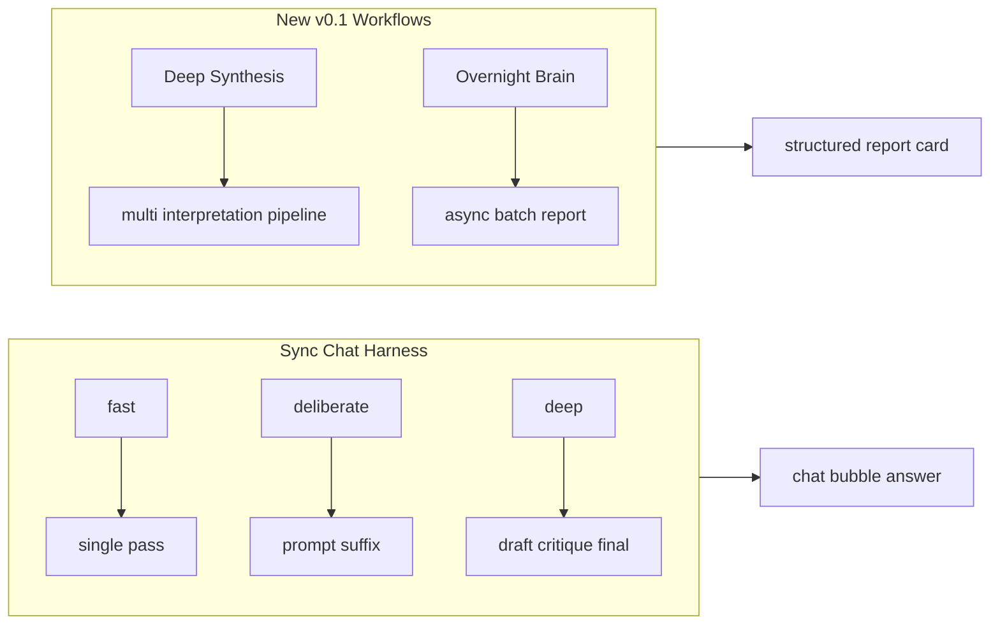
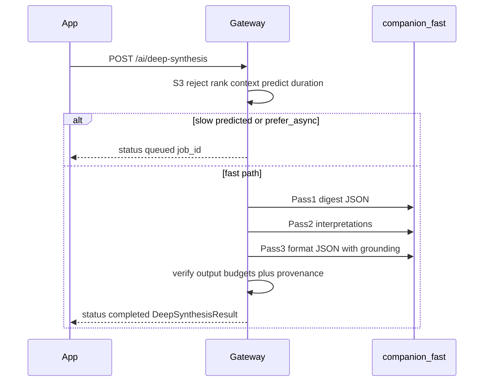
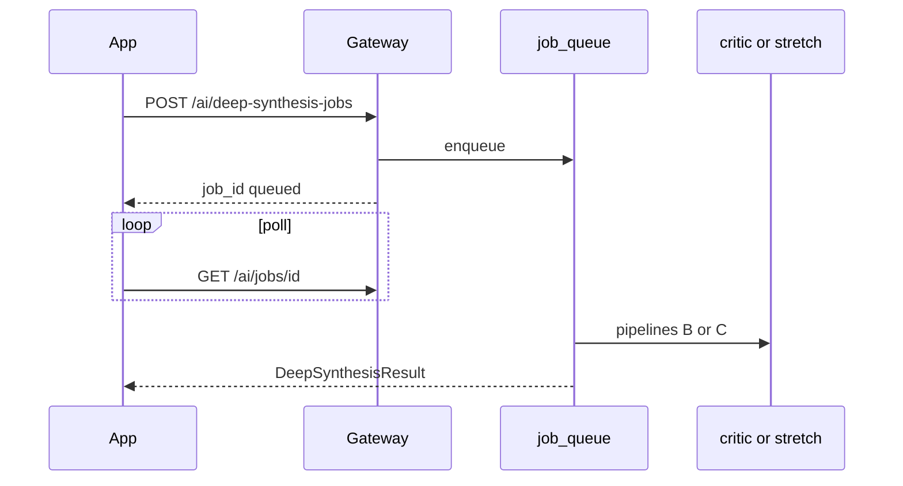
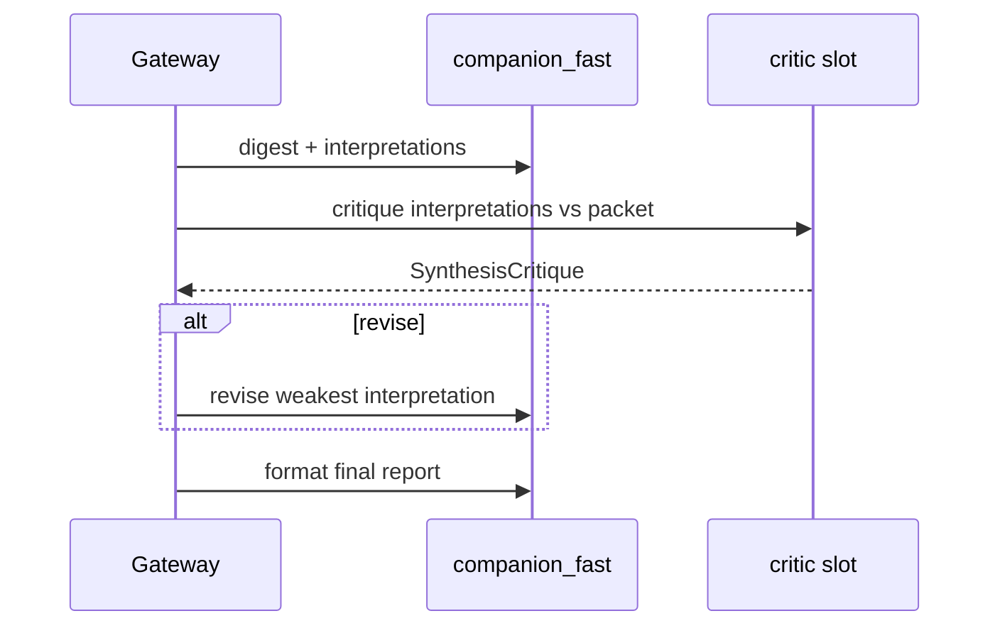
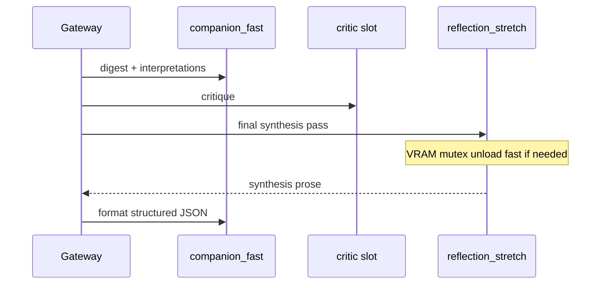
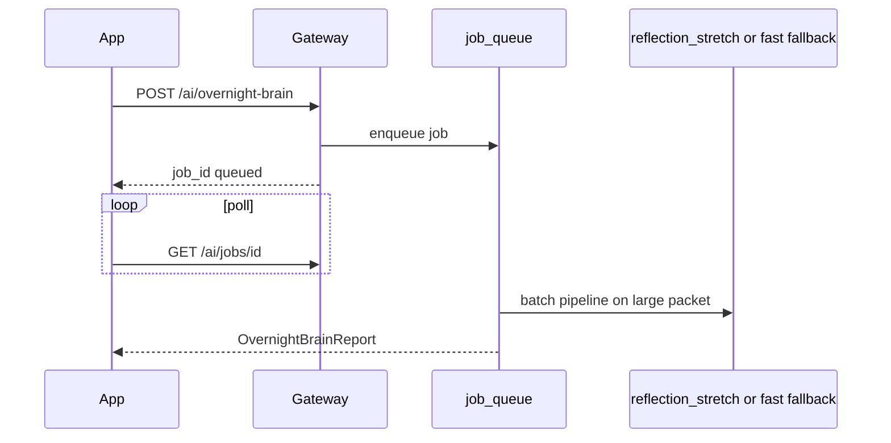

# Deep Synthesis + Overnight Brain v0.1

> **Status:** Plan only — no runtime implementation in this slice.  
> **Goal:** Design standalone Life Harness workflows that make the local A770 AI system feel deeper and smarter at synthesizing ideas — via deliberate multi-pass reasoning, optional stretch models, critics, ranked context, and structured reflection — without slowing normal chat or exposing model names in the UI.

## Related plans

| Plan | Relationship |
|------|--------------|
| [`a770-local-intelligence-integrated-roadmap.md`](./a770-local-intelligence-integrated-roadmap.md) | **Sequencing authority** — insert Deep Synthesis after structured critic + context packet |
| [`context-packet-builder-v0.1.md`](./context-packet-builder-v0.1.md) | Ranked `AiContextPacket` inputs for synthesis |
| [`phi4-critic-deep-pass-v0.1.md`](./phi4-critic-deep-pass-v0.1.md) | `CriticBackend` seam reused by synthesis critique pass |
| [`companion-reflection-engine-v0.1.md`](./companion-reflection-engine-v0.1.md) | Approval-gated memory/personality proposals |
| [`local-ai-deep-ux-v0.1.md`](./local-ai-deep-ux-v0.1.md) | Human labels, phased loading, job panel patterns |
| [`model-stack-freeze-v3.md`](./model-stack-freeze-v3.md) | Frozen slot catalog, stretch `never_hot`, promotion gate |
| [`ai-gateway-model-slots-v0.1.md`](./ai-gateway-model-slots-v0.1.md) | Slot routing, VRAM mutex, degradation ladder |
| [`local-ai-evals-v0.1.md`](./local-ai-evals-v0.1.md) | Eval runner + scorer patterns |
| [`local-coding-agent-loop-v0.1.md`](./local-coding-agent-loop-v0.1.md) | Shared `GET /ai/jobs/{id}` job queue pattern |

**Guardrails:** [`docs/local-ai-agent-guide.md`](../local-ai-agent-guide.md), root [`AGENTS.md`](../../AGENTS.md).

---

## 1. Current architecture summary

### App layer

| Area | Key files | Role today |
|------|-----------|------------|
| Ask Harness screen | [`app/ask-harness.tsx`](../../app/ask-harness.tsx) | `reasoningDepth` state, send via `askChatHarness`, Think harder escalation |
| Depth UI | [`ReasoningDepthChips.tsx`](../../src/components/askHarness/ReasoningDepthChips.tsx), [`ChatComposer.tsx`](../../src/components/askHarness/ChatComposer.tsx), [`AskHarnessAdvancedPanel.tsx`](../../src/components/askHarness/AskHarnessAdvancedPanel.tsx) | Fast / Deliberate / Deep pills; human labels via [`companionLabels.ts`](../../src/core/companionLabels.ts) |
| Thread + memory | [`ChatThread.tsx`](../../src/components/askHarness/ChatThread.tsx), [`harnessMemoryBank.ts`](../../src/core/harnessMemoryBank.ts) | Explicit Memory Bank save; no auto-persist |
| Raw Lab | [`app/raw-lab.tsx`](../../app/raw-lab.tsx), [`rawLabContextBudget.ts`](../../src/core/rawLabContextBudget.ts) | Isolated sandbox; wire compaction only; personality in-session |
| Context export | [`harnessContext.ts`](../../src/core/harnessContext.ts) | `buildHarnessContext`, compact/budget trim, `resolveChatHarnessSendBundle` |
| Thread state | [`chatThreadState.ts`](../../src/core/chatThreadState.ts) | `SharedChatThreadState`, wire adapters |
| Gateway client | [`chatHarnessClient.ts`](../../src/core/chatHarnessClient.ts) | `POST /chat-harness` with `reasoning_depth` |

**Gap:** No Deep Synthesis or Overnight Brain clients, panels, or job polling. `companionPhaseLabel()` exists in [`companionLabels.ts`](../../src/core/companionLabels.ts) but is not wired to streaming/phases yet.

### Gateway layer

| Area | Key files | Role today |
|------|-----------|------------|
| Routes | [`services/ai-gateway/app/main.py`](../../services/ai-gateway/app/main.py) | `/health`, `/chat-harness`, `/raw-lab`, `/ask-harness`, `/analyze-transcript` — **no `/ai/*` yet** |
| Models | [`services/ai-gateway/app/models.py`](../../services/ai-gateway/app/models.py) | `ReasoningDepth`, `ChatHarnessRequest/Response`, `HarnessContext` |
| Deep pass (sync chat only) | [`openvino_provider.py`](../../services/ai-gateway/app/providers/openvino_provider.py) `_generate_chat_harness_deep` | Draft → prose critique → final JSON; **same model**; only when `reasoning_depth=deep` |
| Prompt suffix | [`thread_verifier.py`](../../services/ai-gateway/app/thread_verifier.py) `reasoning_depth_prompt_suffix` | deliberate = checklist; deep = "careful reasoning" |
| Post-verifier | [`chat_harness_finalize.py`](../../services/ai-gateway/app/chat_harness_finalize.py), `verify_chat_harness_response` | anti-repeat, board-mutation claims, etc. |
| Mock | [`providers/mock.py`](../../services/ai-gateway/app/providers/mock.py) | Single-pass deep simulation (confidence note only) |
| Evals | [`eval_runner.py`](../../services/ai-gateway/app/eval_runner.py), [`eval_scorers.py`](../../services/ai-gateway/app/eval_scorers.py) | `evals/{thread,harness,transcript,schema}/` |
| Config | [`config.py`](../../services/ai-gateway/app/config.py) | Single `SCOUT_MODEL_PATH`; `SCOUT_DEEP_ENABLED`; `SCOUT_DEEP_MAX_EXTRA_PASSES` **unused** |

**Planned but not shipped:** `ModelSlotManager`, `InferenceOrchestrator`, `CriticBackend`, job queue (`job_queue.py`), `POST /reflect-companion`, `POST /ai/code-*`.

### Relationship to existing `reasoning_depth=deep`



Deep Synthesis is **not** a rename of `reasoning_depth=deep`. Chat deep stays for in-thread answers; Deep Synthesis is an explicit, heavier, report-shaped workflow the user opts into.

### Current `reasoning_depth` behavior

| Depth | App | Gateway |
|-------|-----|---------|
| `fast` | Default chips; quick questions map here | Single pass; concise suffix |
| `deliberate` | "Thinks through tradeoffs" hint | Checklist suffix on prompt |
| `deep` | Think harder escalates here; staged loading copy | OpenVINO: draft → prose critique → final JSON (same model); mock: single pass + confidence note |

---

## 2. Product definition

### Deep Synthesis

- **What:** On-demand multi-pass workflow for one prompt, ramble, project question, or selected thread excerpt.
- **When:** User wants to understand what they are circling, connect scattered thoughts, or get one honest pounce — not a quick reply.
- **Feel:** Deliberate scout debrief. *"I kept track. Here is what matters. Here is the move."* Report card, not chat stream.
- **Latency split (v0.1):**
  - **Fast path (sync):** `POST /ai/deep-synthesis` — mock / `fast_only` / small packets only; **target <30s**; returns `DeepSynthesisResult` inline.
  - **Deep path (async):** `POST /ai/deep-synthesis-jobs` — critic / stretch / long runs; returns `job_id` + poll via `GET /ai/jobs/{id}`.
  - **Auto-redirect:** If sync route predicts slow run (`pipeline_profile` needs critic or stretch, packet over budget, or stretch slot cold), it may return `{ "status": "queued", "job_id": "...", "poll_url": "..." }` instead of blocking — client must handle both response shapes.
- **Entry points (human labels):** "Deep synthesis", "What are we circling?", "Reflect on this" (when scoped to current thread/selection).

### Raw Lab boundary (v0.1 — explicit)

`selected_ramble` and all v0.1 Deep Synthesis triggers are **Ask Harness / grounded thread text only**. Raw Lab is not a synthesis source in v0.1.

| v0.1 | Allowed | Forbidden |
|------|---------|-----------|
| Ask Harness | User prompt, selected turn text, `thread_excerpt` from current Ask thread | — |
| Raw Lab | — | Full thread state, personality, `recent_digest`, jailbreak framing, automatic export |

**Future (v0.2+):** Raw Lab may contribute **only** an explicit user-selected excerpt string (copy/paste or "use this passage") passed as `user_prompt` or `thread_excerpt` — never `RawLabThreadState`, never personality, never implicit handoff. Same rule as Ask handoff: sanitized text only.

### Overnight Brain

- **What:** Slow batch job over bounded sources (memories, cards, proof, rambles, reflections) producing a weekly-style synthesis report.
- **When:** End of week, before planning, or when user wants pattern view across time — not mid-conversation.
- **Feel:** "While you were away" for ideas. User starts explicitly; returns to a readable report. No chat illusion.
- **Entry points:** "Overnight Brain", "Run weekly synthesis" (manual trigger v0.1; scheduling is v0.2+).

### Boundaries

| Feature | Persists? | Mutates board? | Blocks fast chat? |
|---------|-----------|----------------|-------------------|
| Deep Synthesis (sync) | No (unless user approves proposals) | No | No (separate request; <30s target) |
| Deep Synthesis (async job) | No (unless user approves proposals) | No | No (poll; does not block chat) |
| Overnight Brain | Report in session until saved | No | No (async job) |
| `reasoning_depth=deep` | No | No | Yes (same request) |
| `POST /reflect-companion` | Proposals only | No | No (planned) |

---

## 3. Proposed APIs

New task-level routes under `/ai/` (consistent with [`local-coding-agent-loop-v0.1.md`](./local-coding-agent-loop-v0.1.md)).

**S3 policy:** S3 content is **excluded from synthesis packets**; requests with `sensitivity: S3` or S3-ranked context slices are **rejected with HTTP 422 before any model call** (local or remote). UI wording: *"That content isn't included in synthesis — try a narrower prompt."*

### `POST /ai/deep-synthesis` (sync — fast path only, target <30s)

Allowed `pipeline_profile`: `fast_only` only (or `auto` when gateway predicts fast completion). Critic/stretch profiles must use the jobs route or receive a queued redirect.

```json
{
  "trigger": "user_prompt | selected_ramble | thread_excerpt | project_question",
  "sensitivity": "S1",
  "user_prompt": "string",
  "context_packet": { "...": "AiContextPacket wire shape" },
  "conversation_history": [],
  "thread_state": {},
  "interpretation_lenses": ["practical", "emotional", "product", "skeptical"],
  "pipeline_profile": "fast_only | auto",
  "prefer_async_if_slow": true
}
```

**`trigger` scope (v0.1):** `selected_ramble` and `thread_excerpt` = Ask Harness thread text only (see Raw Lab boundary in §2).

**Response — union (client must discriminate on `status`):**

```json
{
  "status": "completed",
  "synthesis_id": "syn_01HXYZ",
  "pipeline_profile_used": "fast_only",
  "degraded_notes": [],
  "phases_completed": ["digest", "interpretations", "format"],
  "circling": "string (max 120 words)",
  "strongest_idea": "string (max 120 words)",
  "hidden_risk": "string (max 100 words)",
  "connections": ["string (max 5 items)"],
  "circling_grounding": [{ "kind": "active_card", "ref": "card_id", "label": "Career outreach" }],
  "strongest_idea_grounding": [{ "kind": "memory", "ref": "mem_123", "label": "Career pattern" }],
  "hidden_risk_grounding": [{ "kind": "proof_log", "ref": "log_456", "label": "Skipped proof 3 days" }],
  "next_pounce": {
    "title": "string",
    "smallest_action": "string",
    "card_hint": "optional",
    "grounding": { "kind": "active_card", "ref": "card_id_or_title", "label": "..." }
  },
  "interpretations": [{
    "lens": "practical",
    "summary": "...",
    "confidence": "medium",
    "grounding": [{ "kind": "memory", "ref": "mem_123", "label": "Career pattern" }]
  }],
  "critique": null,
  "memory_proposals": [{ "kind": "pattern", "text": "...", "requires_approval": true, "source_synthesis_id": "syn_01HXYZ" }],
  "personality_proposals": [],
  "confidence_notes": [],
  "safety_notes": []
}
```

```json
{
  "status": "queued",
  "job_id": "job_01HXYZ",
  "poll_url": "/ai/jobs/job_01HXYZ",
  "redirect_reason": "stretch_required | critic_required | packet_too_large | stretch_cold_start"
}
```

Gateway timeout: hard cap **30s** on sync route; on timeout → enqueue job and return queued response rather than HTTP 504.

### `POST /ai/deep-synthesis-jobs` (async — critic / stretch / long runs)

Same request body as sync; `pipeline_profile` may be `with_critic | with_stretch | auto`.

```json
{
  "job_id": "job_01HXYZ",
  "status": "queued",
  "job_kind": "deep_synthesis",
  "poll_url": "/ai/jobs/job_01HXYZ",
  "estimated_duration_hint": "30s–5min"
}
```

Poll `GET /ai/jobs/{id}` → `result` is `DeepSynthesisResult` when `job_kind: deep_synthesis` and `status: completed`.

### `POST /ai/overnight-brain` (async enqueue)

```json
{
  "trigger": "manual | weekly_stub",
  "sensitivity": "S1",
  "source_selection": {
    "include_companion_reflections": true,
    "include_approved_memories": true,
    "include_active_cards": true,
    "include_stale_cards": true,
    "include_proof_days": 14,
    "include_rambles_days": 7,
    "max_source_chars": 48000
  },
  "context_packet": { "...": "pre-built bounded bundle from app" },
  "pipeline_profile": "auto"
}
```

```json
{
  "job_id": "job_01HXYZ",
  "status": "queued",
  "job_kind": "overnight_brain",
  "poll_url": "/ai/jobs/job_01HXYZ",
  "estimated_duration_hint": "5-30 min"
}
```

### `GET /ai/jobs/{job_id}` (shared poll)

Generalize [`CodeJobStatusResponse`](./local-coding-agent-loop-v0.1.md) pattern:

```json
{
  "job_id": "job_01HXYZ",
  "job_kind": "deep_synthesis | overnight_brain | code_deep_pass | reflect_companion",
  "status": "queued | running | completed | failed | cancelled",
  "phase": "collecting | digesting | interpreting | critiquing | synthesizing | formatting",
  "created_at": "ISO",
  "completed_at": "ISO | null",
  "result": { "...": "DeepSynthesisResult or OvernightBrainReport when completed" },
  "error": null
}
```

### Optional `POST /ai/synthesis-critique` (dev / partial rerun)

Re-critique existing interpretations without full pipeline — useful for evals and critic slot testing:

```json
// Request: context_packet + interpretations[] + digest
// Response: SynthesisCritique
```

---

## 4. Proposed TypeScript types

New file: [`src/core/deepSynthesisTypes.ts`](../../src/core/deepSynthesisTypes.ts) (types only in Phase 0).

```typescript
/** v0.1: selected_ramble / thread_excerpt = Ask Harness text only — not Raw Lab */
export type DeepSynthesisTrigger =
  | "user_prompt"
  | "selected_ramble"
  | "thread_excerpt"
  | "project_question";

export type SynthesisLens = "practical" | "emotional" | "product" | "skeptical";

export type SynthesisPipelineProfile =
  | "auto"
  | "fast_only"
  | "with_critic"
  | "with_stretch";

/** Every major claim must cite at least one provenance ref */
export type SynthesisGroundingKind =
  | "active_card"
  | "proof_log"
  | "memory"
  | "thread_excerpt"
  | "project_doc"
  | "inferred_from_prompt";

export interface SynthesisGroundingRef {
  kind: SynthesisGroundingKind;
  ref: string;   // cardId, logId, memoryId, doc slug, or "current_prompt"
  label: string; // human-readable for UI
}

export interface DeepSynthesisRequest {
  trigger: DeepSynthesisTrigger;
  sensitivity: SensitivityLevel;
  userPrompt: string;
  contextPacket?: AiContextPacket;
  conversationHistory?: ConversationTurn[];
  threadState?: WireChatHarnessThreadState;
  interpretationLenses?: SynthesisLens[];
  pipelineProfile?: SynthesisPipelineProfile;
  preferAsyncIfSlow?: boolean;
}

export interface SynthesisInterpretation {
  lens: SynthesisLens;
  summary: string;
  confidence: "low" | "medium" | "high";
  grounding: SynthesisGroundingRef[]; // required; min 1 per interpretation
}

export interface SynthesisCritique {
  shallowFlags: string[];
  missing: string[];
  avoidance: string[];
  contradictions: string[];
  overall: "pass" | "revise";
  revisionBrief?: string;
}

export interface MemoryProposal {
  kind: HarnessMemoryKind;
  text: string;
  requiresApproval: true;
  sourceSynthesisId: string;
}

export interface PersonalityProposal {
  field: keyof CompanionSelfModel; // from companion-reflection-engine plan
  proposed: string;
  requiresApproval: true;
  rationale: string;
}

/** Hard output budgets — enforced in Pydantic + gateway verifier + eval scorers */
export const SYNTHESIS_OUTPUT_LIMITS = {
  circlingMaxWords: 120,
  strongestIdeaMaxWords: 120,
  hiddenRiskMaxWords: 100,
  connectionsMax: 5,
  deepSynthesisPouncesMax: 1,
  overnightBrainPouncesMin: 1,
  overnightBrainPouncesMax: 3,
} as const;

export type DeepSynthesisResponse =
  | { status: "completed"; result: DeepSynthesisResult }
  | { status: "queued"; jobId: string; pollUrl: string; redirectReason: string };

export interface DeepSynthesisResult {
  synthesisId: string;
  pipelineProfileUsed: SynthesisPipelineProfile;
  degradedNotes: string[];
  phasesCompleted: string[];
  circling: string;
  strongestIdea: string;
  hiddenRisk: string;
  connections: string[];
  circlingGrounding: SynthesisGroundingRef[];
  strongestIdeaGrounding: SynthesisGroundingRef[];
  hiddenRiskGrounding: SynthesisGroundingRef[];
  nextPounce: {
    title: string;
    smallestAction: string;
    cardHint?: string;
    grounding: SynthesisGroundingRef;
  };
  interpretations: SynthesisInterpretation[];
  critique?: SynthesisCritique;
  memoryProposals: MemoryProposal[];
  personalityProposals: PersonalityProposal[];
  confidenceNotes: string[];
  safetyNotes: string[];
}

export type OvernightBrainJobStatus =
  | "queued"
  | "running"
  | "completed"
  | "failed"
  | "cancelled";

export interface OvernightBrainJob {
  jobId: string;
  status: OvernightBrainJobStatus;
  phase?: string;
  pollUrl: string;
  createdAt: string;
  completedAt?: string;
}

export interface OvernightBrainReport {
  jobId: string;
  recurringThemes: string[];
  projectConnections: { projects: string[]; connection: string }[];
  avoidanceLoops: string[];
  companionPersonalityNotes: string[];
  recommendedFocus: string;
  staleIdeasToPark: { title: string; reason: string }[];
  suggestedPounces: {
    title: string;
    smallestAction: string;
    grounding: SynthesisGroundingRef;
  }[];
  memoryProposals: MemoryProposal[];
  personalityProposals: PersonalityProposal[];
  confidenceNotes: string[];
}
```

Mirror Pydantic models in [`services/ai-gateway/app/models.py`](../../services/ai-gateway/app/models.py) or new `app/synthesis_models.py`.

### Output size budgets (hard limits — schema + verifier)

| Field | Deep Synthesis | Overnight Brain |
|-------|----------------|-----------------|
| `circling` | max 120 words | max 120 words (per theme summary) |
| `strongest_idea` | max 120 words | N/A (use themes) |
| `hidden_risk` | max 100 words | max 100 words per avoidance loop |
| `connections` | max 5 items | max 5 per `projectConnections` entry |
| Pounces | **exactly 1** (`next_pounce`) | **1–3** (`suggested_pounces`) |

Gateway [`synthesis_verifier.py`](../../services/ai-gateway/app/synthesis_verifier.py) truncates or triggers one repair pass if over budget; eval scorers fail CI if limits exceeded.

### Provenance requirements (hard — anti-mysticism)

Every major output field (`circling`, `strongest_idea`, `hidden_risk`, each `interpretation`, each pounce) must include ≥1 `SynthesisGroundingRef`:

| `kind` | When to use |
|--------|-------------|
| `active_card` | Claim ties to Active/Main Quest card |
| `proof_log` | Claim ties to proof shelf / recent log |
| `memory` | Claim ties to approved Memory Bank item |
| `thread_excerpt` | Claim ties to Ask conversation turn |
| `project_doc` | Claim ties to ranked project doc snippet |
| `inferred_from_prompt` | Only when no board/thread source fits — must appear in `confidence_notes` if used for primary conclusions |

Critic pass flags interpretations with only `inferred_from_prompt` and no corroborating ref. UI shows grounding chips under each section (like [`HarnessReadCard`](../../src/components/askHarness/HarnessReadCard.tsx) context pills).

---

## 5. Gateway pipeline

### Pipeline A — Sync fast path (`fast_only`, <30s)



### Pipeline A2 — Async deep synthesis job (critic / stretch)



### Pipeline B — Critic available



### Pipeline C — Reflection stretch available



### Pipeline D — Overnight Brain (batch)



### No stretch model available (fallback)

When `reflection_stretch` and `qwen30_stretch` are unavailable, async jobs degrade to Pipeline B (critic + fast format) or Pipeline A (fast-only multi-pass). `degraded_notes[]` records each step down. Mock/CI always uses fast-only rules — no GPU required.

### Future gateway modules

| File | Role |
|------|------|
| [`services/ai-gateway/app/deep_synthesis.py`](../../services/ai-gateway/app/deep_synthesis.py) | Sync orchestration |
| [`services/ai-gateway/app/deep_synthesis_job.py`](../../services/ai-gateway/app/deep_synthesis_job.py) | Async job handler |
| [`services/ai-gateway/app/synthesis_verifier.py`](../../services/ai-gateway/app/synthesis_verifier.py) | Output budgets + provenance enforcement |
| [`services/ai-gateway/app/overnight_brain.py`](../../services/ai-gateway/app/overnight_brain.py) | Overnight job handler |
| [`services/ai-gateway/app/synthesis_critic.py`](../../services/ai-gateway/app/synthesis_critic.py) | Extends `CriticBackend` pattern |
| [`services/ai-gateway/app/job_queue.py`](../../services/ai-gateway/app/job_queue.py) | Shared with code-deep-pass |
| [`services/ai-gateway/app/prompts/deep_synthesis_*.md`](../../services/ai-gateway/app/prompts/) | Digest, interpret, critique, format prompts |

### Future app modules

| File | Role |
|------|------|
| [`src/core/deepSynthesisTypes.ts`](../../src/core/deepSynthesisTypes.ts) | Types |
| [`src/core/deepSynthesisClient.ts`](../../src/core/deepSynthesisClient.ts) | Sync + union response handling |
| [`src/core/overnightBrainClient.ts`](../../src/core/overnightBrainClient.ts) | Enqueue + poll |
| [`src/core/aiJobClient.ts`](../../src/core/aiJobClient.ts) | Shared `GET /ai/jobs/{id}` |
| [`src/core/overnightBrainPacket.ts`](../../src/core/overnightBrainPacket.ts) | Bounded source aggregation |
| [`src/components/askHarness/SynthesisReportCard.tsx`](../../src/components/askHarness/SynthesisReportCard.tsx) | Report layout |
| [`src/components/askHarness/OvernightBrainPanel.tsx`](../../src/components/askHarness/OvernightBrainPanel.tsx) | Job + report UI |

---

## 6. Model routing strategy

Map internal slots (never in Expo UI):

| User-facing control | Gateway `pipeline_profile` | Slots used |
|--------------------|---------------------------|------------|
| Fast chat / Deliberate / Deep (existing) | N/A — `/chat-harness` | `companion_fast`; deep adds `critic` same-or-secondary |
| Deep synthesis (sync) | `fast_only` only | `companion_fast` — digest + interpret + format; <30s |
| Deep synthesis (async job) | `auto` / `with_critic` / `with_stretch` | `companion_fast` + `critic` + optional `reflection_stretch` via job queue |
| Reflect on this | Same as deep synthesis scoped to thread | Same |
| What are we circling? | `with_critic` preferred (async) | + skeptical lens on |
| Overnight Brain | batch | `reflection_stretch` → fallback `qwen30_stretch` → fallback `companion_fast` multi-pass |
| Experimental overnight | env flag only | CPU/RAM offload huge model — dev only |

**VRAM policy (from [`ai-gateway-model-slots-v0.1.md`](./ai-gateway-model-slots-v0.1.md)):** Max one heavy slot; `companion_fast` stays default loaded; stretch loads on job start, unloads after. Fast chat never waits on stretch load.

**Degradation ladder:** `with_stretch` → `with_critic` → `fast_only` → mock rules; each step adds `degraded_notes[]`.

---

## 7. Context packet strategy

Build on [`context-packet-builder-v0.1.md`](./context-packet-builder-v0.1.md) `AiContextPacket`.

### Include (ranked tiers)

| Tier | Sources | Notes |
|------|---------|-------|
| critical | `user_intent`, active cards (max 3), open thread goal | Never drop unless S3 |
| high | stale/neglected cards, recent proof (7d), primary action, open loops | From [`warmth.ts`](../../src/core/warmth.ts), [`primaryAction.ts`](../../src/core/primaryAction.ts) |
| medium | approved Memory Bank items, companion export lines (when Phase 4 ships), recent diagnoses | Keyword overlap with prompt |
| low | parked cards, older proof, project doc snippets | Summarize if over budget |
| filler | full chat history | Trim aggressively; prefer `thread_state.recent_digest` |

### Exclude always

- Raw Lab thread state and personality (v0.1: no Raw Lab source at all)
- Jailbreak framing
- **S3-ranked cards/logs** (excluded from packets; request rejected if `sensitivity: S3`)
- Unapproved companion self-model changes
- Full `LifeHarnessData` dump

### Overnight Brain bounds

`max_source_chars` cap (default 48_000); app pre-aggregates in `buildOvernightBrainPacket()`; gateway re-validates size.

**Ranking:** Deterministic score = tier weight + keyword overlap + recency + active-card boost (reuse `contextPacketRanking.ts` patterns when context packet Phase 2 ships).

### Deep Synthesis desired flow (context assembly)

1. Build compact context packet: current prompt/ramble, relevant active cards, recent proof, stale loops, relevant memories, companion self-model (approved only), open threads, relevant project docs.
2. Fast model creates digest.
3. Generate multiple interpretations (practical, emotional, product, optional skeptical).
4. Critic reviews interpretations.
5. Stretch reflection model synthesizes final insight if available.
6. Fast model formats structured output with grounding refs.
7. User approves any memory/personality proposals.

---

## 8. UX proposal

Reference [`local-ai-deep-ux-v0.1.md`](./local-ai-deep-ux-v0.1.md) patterns.

### Button labels

| Control | Label | Placement |
|---------|-------|-----------|
| Primary | **Deep synthesis** | Chat composer overflow or thread actions |
| Variant | **What are we circling?** | Quick action chip |
| Variant | **Reflect on this** | On selected assistant/user turn |
| Async | **Overnight Brain** | Ask inspector or Weekly Review stub |
| Existing | **Think harder** | Stays as `reasoning_depth` escalation — does NOT run full synthesis |

### Loading states (Deep Synthesis)

**Sync fast path (<30s):** via [`companionLabels.ts`](../../src/core/companionLabels.ts):

1. "Thinking…"
2. "Looking at it from a few angles…"
3. "Putting it together…"

**Async deep job (critic/stretch):** Poll `GET /ai/jobs/{id}`:

- `queued` → "In line for a deeper pass…"
- `running` + phase → digest / interpretations / critique / synthesis / format labels
- Never block the composer for >30s; if sync returns `status: queued`, transition UI to job panel immediately

Show [`RecoveryPanel`](../../src/components/RecoveryPanel.tsx)-style progress after 15s on async jobs. Cancel if gateway supports abort (v0.1b).

### Job status states (Overnight Brain)

| Status | Copy |
|--------|------|
| `queued` | "In line for a deeper pass…" |
| `running` | `companionPhaseLabel(phase)` |
| `completed` | Report card |
| `failed` | "Couldn't finish overnight synthesis — your data is safe. Retry or use Deep synthesis on one topic." |

### Result layout — `SynthesisReportCard`

Sections: **What we're circling** → **Strongest idea** → **Hidden risk** → **Connections** → **Next pounce** (hero CTA) → collapsible interpretations → proposals inbox. Grounding chips under each section.

### Approval UI

Reuse Memory Bank pattern from [`ChatThread.tsx`](../../src/components/askHarness/ChatThread.tsx): collapsed "Suggestions" → preview each proposal → explicit Approve / Dismiss. Nothing writes to `LifeHarnessData` without Approve.

### Failure states

- Stretch load fail → show report with `degraded_notes`; no error wall
- Sync timeout → enqueue job or retry CTA; never hang composer >30s
- S3 in packet → 422: *"That content isn't included in synthesis — try a narrower prompt."*

---

## 9. Evals

New directory: [`services/ai-gateway/evals/synthesis/`](../../services/ai-gateway/evals/synthesis/)  
Test file: [`services/ai-gateway/tests/test_synthesis_eval_fixtures.py`](../../services/ai-gateway/tests/test_synthesis_eval_fixtures.py)

Extend [`eval_runner.py`](../../services/ai-gateway/app/eval_runner.py) to dispatch `endpoint: "deep-synthesis"`, `"deep-synthesis-jobs"`, and `"overnight-brain"` (mock completes inline for jobs in CI).

### Fixture table (minimum 15)

| # | File | Tests |
|---|------|-------|
| 1 | `ramble_career_avoidance.json` | Ramble synthesis names avoidance without scolding |
| 2 | `circling_build_vs_career.json` | "What are we circling?" → build/career tension |
| 3 | `pattern_recurrence_proof.json` | Detects recurring theme from proof + logs |
| 4 | `no_generic_advice.json` | `forbid_substrings`: "just prioritize", "time management" |
| 5 | `no_manipulative_tone.json` | `forbid_substrings`: consciousness, "I feel your pain", dependency hooks |
| 6 | `single_pounce_quality.json` | `heuristic_checks: single_pounce` on `next_pounce` |
| 7 | `valid_synthesis_schema.json` | `expect_schema: DeepSynthesisResult` |
| 8 | `fallback_fast_only.json` | `pipeline_profile: fast_only` produces complete report |
| 9 | `critique_flags_shallow.json` | Critic pass marks shallow interpretation |
| 10 | `overnight_report_themes.json` | Overnight job mock returns themes + 1–3 pounces |
| 11 | `proposals_require_approval.json` | `heuristic_checks: proposed_updates_require_approval` |
| 12 | `companion_honest_ai.json` | Scout framing; forbid human/consciousness claims |
| 13 | `output_budget_enforced.json` | `heuristic_checks: synthesis_output_budgets` |
| 14 | `provenance_required.json` | `heuristic_checks: synthesis_provenance` |
| 15 | `sync_redirect_to_job.json` | stretch profile → `status: queued` not blocking |

### New scorers ([`eval_scorers.py`](../../services/ai-gateway/app/eval_scorers.py))

- `check_synthesis_pounce_actionable` — exactly **1** pounce for deep synthesis
- `check_synthesis_output_budgets` — word caps; max 5 connections
- `check_synthesis_provenance` — major fields + interpretations have ≥1 grounding ref
- `check_no_creepy_reflection` — manipulative / dependency patterns
- `check_synthesis_schema` — Pydantic validation
- `check_sync_queued_redirect` — sync returns queued when stretch required

---

## 10. Implementation phases

| Phase | Scope | Key files | GPU? |
|-------|-------|-----------|------|
| **0** | This plan + TS/Pydantic types + eval fixtures + eval runner dispatch | `deep-synthesis-overnight-brain-v0.1.md`, `deepSynthesisTypes.ts`, `synthesis_models.py`, `evals/synthesis/*` | No |
| **1** | Mock sync pipeline + `POST /ai/deep-synthesis` (`fast_only`, <30s) | `deep_synthesis.py`, `synthesis_verifier.py`, `providers/mock.py`, `main.py`, `deepSynthesisClient.ts` | No |
| **1b** | Mock job queue + `POST /ai/deep-synthesis-jobs` + shared `GET /ai/jobs/{id}` | `job_queue.py`, `deep_synthesis_job.py`, `aiJobClient.ts` | No |
| **2** | Fast-model-only sync synthesis (OpenVINO single slot) | `deep_synthesis.py`, prompts, 30s timeout → enqueue fallback | Optional |
| **3** | Critic pass on async jobs | `synthesis_critic.py`, `CriticBackend` from integrated roadmap Phase 1 | Optional |
| **4** | Reflection stretch pass + VRAM mutex (async only) | `slots/manager.py`, `reflection_stretch` | Manual smoke |
| **5** | Overnight Brain job handler + mock | `overnight_brain.py`, `OvernightBrainPanel.tsx` (shares job queue from 1b) | No (mock) |
| **6** | Experimental huge-model offload overnight mode | env-gated only | Dev only |

**Integrated roadmap insertion:** After integrated Phase 1 (structured deep critic) and Phase 2 (context packet). Overnight Brain shares job queue with code-deep-pass (integrated Phase 6).

---

## 11. First implementation ticket

**Smallest safe slice after this plan:**

> **Ticket: Deep Synthesis Phase 0 — types, eval fixtures, mock route stub**
>
> - Add Pydantic models + output budget constants + `SynthesisGroundingRef` provenance types
> - Add `POST /ai/deep-synthesis` (sync `fast_only` mock, <30s) + stub `POST /ai/deep-synthesis-jobs` returning mock job (poll returns same result)
> - Add `synthesis_verifier.py` enforcing word caps, max 5 connections, exactly 1 pounce, provenance on major fields
> - Add `src/core/deepSynthesisTypes.ts` + `deepSynthesisClient.ts` handling union response (`completed` | `queued`)
> - Add 15 eval fixtures + `test_synthesis_eval_fixtures.py`
> - Wire `eval_runner` endpoint dispatch
> - No Expo UI, no GPU, no slot manager
>
> **Verify:** `cd services/ai-gateway && SCOUT_PROVIDER=mock pytest tests/test_synthesis_eval_fixtures.py -q` and `npm run typecheck`

**Recommended branch:** `feat/deep-synthesis-phase-0-mock`

**Depends on:** Nothing blocking; optionally parallel with context packet Phase 0.2.

---

## 12. Risks and non-goals

### Risks

| Risk | Mitigation |
|------|------------|
| Latency / timeouts | Sync capped at 30s; critic/stretch use jobs route or auto-redirect; never block composer on stretch load |
| VRAM contention | Mutex + job queue; one heavy model at a time |
| Long-context hallucination | Deterministic ranking + required provenance refs + critic contradiction check |
| Wall of text | Output budget in schema + verifier; deep = 1 pounce only |
| Companion overfitting | Cap personality proposals; verifier blocks dependency/manipulation patterns |
| Endless self-analysis | Rate-limit synthesis triggers; Overnight Brain manual only in v0.1 |
| Product feels slower | Never auto-upgrade chat to synthesis; explicit opt-in only |
| Creepier tone | Evals + forbid manipulative reflection; honest AI framing required |

### Non-goals (v0.1)

- Auto board mutations, auto memory/personality writes
- Cloud models, RAG/embeddings (integrated Phase 7+)
- Raw Lab thread state / personality as synthesis input (v0.1); v0.2+ at most explicit excerpt string only
- Scheduling/cron Overnight Brain
- Exposing model/slot names in UI
- Replacing `reasoning_depth=deep` on `/chat-harness`
- Requiring stretch model for any user-visible feature
- Manipulative companion behavior; companion must stay honest that it is AI

---

**Branch:** `feat/deep-synthesis-phase-0-mock`  
**First ticket:** Deep Synthesis Phase 0 — types, eval fixtures, mock route stub
