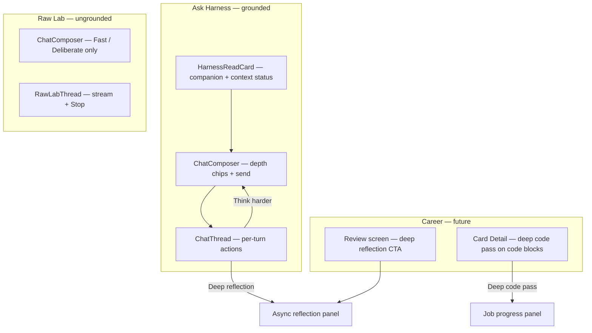
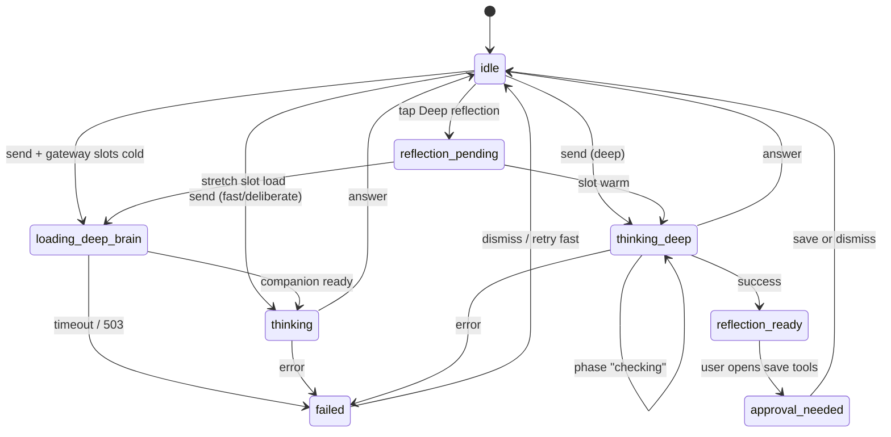
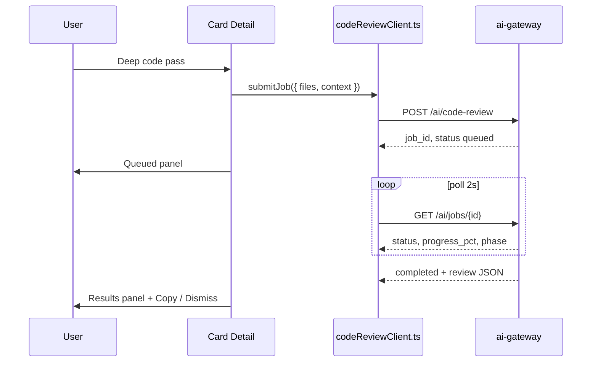

# Local AI Deep UX v0.1 — Planning Doc

**Status:** Planning only (no runtime implementation in this ticket).  
**Goal:** Design how users interact with fast / deliberate / deep local AI — and stretch operations (reflection, code review) — **without seeing model names, VRAM, or backend jargon**.

**Companion docs:**

| Doc | Relationship |
|-----|----------------|
| [`docs/plans/a770-local-intelligence-roadmap.md`](./a770-local-intelligence-roadmap.md) | Slot routing, async jobs, gateway phases |
| [`docs/plans/local-ai-evals-v0.1.md`](./local-ai-evals-v0.1.md) | Quality bar for scout tone and approval gates |
| [`docs/ask-harness-v0.1.md`](../ask-harness-v0.1.md) | Current Ask screen behavior |
| [`docs/ux/current_ux_audit.md`](../ux/current_ux_audit.md) | IA and warmth baseline |
| [`AGENTS.md`](../../AGENTS.md) | Product mission, Raw Lab containment, thread rules |

---

## 0. Current state (repo audit)

### What exists today

| Area | Path | Today |
|------|------|-------|
| Ask screen | [`app/ask-harness.tsx`](../../app/ask-harness.tsx) | `reasoningDepth` state (`useState<ReasoningDepth>("fast")`), `loading` boolean, `Notice` for save success |
| Reasoning depth UI | [`src/components/askHarness/AskHarnessAdvancedPanel.tsx`](../../src/components/askHarness/AskHarnessAdvancedPanel.tsx) | Raw enum pills: `fast` / `deliberate` / `deep`; help text mentions **OpenVINO** |
| Gateway wire | [`src/core/chatHarnessClient.ts`](../../src/core/chatHarnessClient.ts) | `ReasoningDepth` type; maps to `reasoning_depth` on `POST /chat-harness` |
| Composer | [`src/components/askHarness/ChatComposer.tsx`](../../src/components/askHarness/ChatComposer.tsx) | `ActivityIndicator` in Send button when `loading`; no depth chips |
| Thread | [`src/components/askHarness/ChatThread.tsx`](../../src/components/askHarness/ChatThread.tsx) | Accepts `loading` but **no in-thread thinking row**; variant chips from `RESPONSE_VARIANTS` |
| Board read card | [`src/components/askHarness/HarnessReadCard.tsx`](../../src/components/askHarness/HarnessReadCard.tsx) | Context pills (`Compact context`, card counts) — good pattern for companion status |
| Memory approval | [`ChatThread.tsx`](../../src/components/askHarness/ChatThread.tsx) `AssistantTurn` | Collapsed “Memory tools” → preview → explicit **Save chat summary** / **Save to Memory Bank** |
| Raw Lab | [`app/raw-lab.tsx`](../../app/raw-lab.tsx) | Streaming via `streamRawLab()`; `Stop` button; `bannerWarning` / `bannerInfo`; no reasoning depth |
| Raw Lab personality | [`RawLabThread.tsx`](../../src/components/rawLab/RawLabThread.tsx) | “Shape personality” actions apply **immediately** to in-session state (not Memory Bank) |
| Feedback | [`src/components/Notice.tsx`](../../src/components/Notice.tsx) | `success` / `warning` / `error` / `info` — auto-dismiss pattern on Today |
| Recovery framing | [`src/components/RecoveryPanel.tsx`](../../src/components/RecoveryPanel.tsx) | Left brass accent border, progress text (“2/4 done”) — reuse for long-running AI |
| Hero CTA | [`src/components/PrimaryActionHero.tsx`](../../src/components/PrimaryActionHero.tsx) | Single primary action block with help text when disabled |
| Gateway health | [`services/ai-gateway/app/models.py`](../../services/ai-gateway/app/models.py) `HealthResponse` | `status`, `provider_ready`, `model` string — **not consumed by Expo UI yet** |
| Async jobs | — | Planned in roadmap (`POST /ai/code-review`, `GET /ai/jobs/{id}`) — **no app client yet** |

### Gaps vs product goal

1. **Depth control is buried** in the inspector behind “Show inspector” on narrow layouts ([`ask-harness.tsx`](../../app/ask-harness.tsx) `advancedOpen`).
2. **Labels are engineer-facing** (`fast`, `deliberate`, `deep`, `OpenVINO`).
3. **Slow work looks like a hang** — Ask shows only a spinner on Send; no staged status (“Checking my work…”) for multi-pass deep.
4. **No first-class** “Think harder”, “Deep reflection”, or “Deep code pass” — only `RESPONSE_VARIANTS` follow-ups (`Shorter`, `Sharper`, etc.) in [`chatThreadState.ts`](../../src/core/chatThreadState.ts).
5. **No gateway readiness UI** — first OpenVINO request can take 15–30s with no “warming up” message (see gateway smoke docs).

---

## 1. UX principles

### Human-first language

| Show users | Hide (advanced / debug only) |
|------------|------------------------------|
| Fast · Deliberate · Deep | `reasoning_depth`, slot names |
| Thinking… · Checking my work… · Loading a deeper brain… | Qwen, Phi, Gemma, model paths |
| Reflection ready · Queued · Still working | VRAM, llama.cpp, OpenVINO, `SCOUT_*` env |
| Companion · Scout · Harness | `provider`, `companion_fast`, `critic` |

Copy tone matches AGENTS.md scout voice:

```text
I kept track.
Here is what changed.
Here is what matters.
Here is the move.
```

Not: “Model loading failed” → **“Companion is waking up — first reply may take a moment.”**

### Intentional slowness, not broken UI

Stretch operations (deep pass, reflection, code review job) must:

- Set expectations **before** the user commits (“This usually takes 30–90 seconds”).
- Show **named phases** in plain language, not a frozen spinner.
- Allow **cancel** where the gateway supports abort (Raw Lab already has `Stop` in [`raw-lab.tsx`](../../app/raw-lab.tsx)).
- Keep **fast chat usable** while a background job runs (roadmap Phase 4).

### Warmth over guilt

- Never blame the user for choosing Deep (“you made it slow”).
- On failure: “Couldn’t finish that pass — your thread is safe. Try Fast or retry.”
- Reuse error bubble pattern from [`ChatThread.tsx`](../../src/components/askHarness/ChatThread.tsx) (`chatBubbleError`, “Your message is still here”).

### Approval before persistence

- **Memory Bank** and **chat summaries**: already explicit save — keep and extend to reflection outputs.
- **Raw Lab personality**: stays in-session; if we ever surface “export personality” it needs the same approval pattern as Memory Bank, never auto-write.
- **Board mutations**: never auto-apply; any future “suggested card update” uses approval UI (see §4).

### Progressive disclosure

| Tier | Audience | Contents |
|------|----------|----------|
| Default | Everyone | Fast / Deliberate / Deep chips, thinking status, stretch CTAs |
| Context | Power users | [`HarnessReadCard`](../../src/components/askHarness/HarnessReadCard.tsx), thread context panel |
| Inspector | Dev bridge | Gateway URL, sensitivity, JSON preview — [`AskHarnessAdvancedPanel`](../../src/components/askHarness/AskHarnessAdvancedPanel.tsx) |
| Debug | Local AI tuning | Slot health, char budgets — [`RawLabBudgetInspector`](../../src/components/rawLab/RawLabBudgetInspector.tsx) pattern |

---

## 2. Proposed controls and labels

### 2.1 Label map (wire values unchanged)

Internal `ReasoningDepth` in [`chatHarnessClient.ts`](../../src/core/chatHarnessClient.ts) stays `fast | deliberate | deep` for gateway compatibility. UI shows:

| Wire | Primary label | Short hint (composer) | When to default |
|------|---------------|----------------------|-----------------|
| `fast` | **Fast** | “Quick read on your board” | Default; casual follow-ups |
| `deliberate` | **Deliberate** | “Thinks through tradeoffs” | Operator / builder quick questions |
| `deep` | **Deep** | “Double-checks before answering” | User taps “Think harder” or enables Deep chip |

**Remove** from default UI: help text “Deep mode may take longer on local OpenVINO” ([`AskHarnessAdvancedPanel.tsx`](../../src/components/askHarness/AskHarnessAdvancedPanel.tsx) line 157–158). Replace with: “Deep may take up to a minute — I’ll show progress.”

### 2.2 Control placement by surface



#### Ask Harness ([`app/ask-harness.tsx`](../../app/ask-harness.tsx))

| Control | Location | Behavior |
|---------|----------|----------|
| **Fast / Deliberate / Deep** | New row in [`ChatComposer`](../../src/components/askHarness/ChatComposer.tsx), above quick questions | Uses `chatQuickChip` / `chatMetaPillAccent` from [`styles.ts`](../../src/components/styles.ts); mirrors mode pills pattern in advanced panel |
| **Think harder** | [`ChatThread`](../../src/components/askHarness/ChatThread.tsx) assistant bubble, beside existing `RESPONSE_VARIANTS` | Re-sends last user message with `reasoningDepth: deliberate` if currently fast, else `deep`; label not “Analytical” |
| **Deep reflection** | New button on assistant turn when `mode === reflection` or weekly-style prompts | Calls future `POST /companion/reflect` (roadmap Phase 2); does not block composer |
| Companion status | Extend [`HarnessReadCard`](../../src/components/askHarness/HarnessReadCard.tsx) | Add pill: `Companion ready` / `Warming up` / `Busy with deep work` |
| Depth (debug) | Keep in [`AskHarnessAdvancedPanel`](../../src/components/askHarness/AskHarnessAdvancedPanel.tsx) | Duplicate OK for dev; primary chips are source of truth |

#### Raw Lab ([`app/raw-lab.tsx`](../../app/raw-lab.tsx))

| Control | Location | Notes |
|---------|----------|-------|
| **Fast / Deliberate** only | Composer chips | No Deep by default — deep critique is grounded-operator behavior; Raw Lab stays single-pass + stream |
| Optional **Think harder** | Assistant bubble | Maps to `deliberate` on resend if we add `reasoning_depth` to Raw Lab later; v0.1 can omit |
| **Stop** | Existing toolbar | Keep prominent during stream |

Raw Lab must **not** gain board context export or Memory Bank shortcuts beyond existing handoff banner.

#### Career ([`app/card/[id].tsx`](../../app/card/[id].tsx), [`app/review.tsx`](../../app/review.tsx))

| Control | Location | Notes |
|---------|----------|-------|
| **Deep code pass** | Card Detail when `thread_state.task_mode` is `write_code` / `debug` or message contains code fence | Submits async job; user stays on card |
| **Deep reflection** | Review screen “This week” section | Optional CTA: “Reflect on this week” → grounded reflection job with `HarnessContext` |

Career surfaces use **Ask** gateway with board context — never Raw Lab.

### 2.3 Quick questions ↔ depth hints

Existing quick questions in [`ask-harness.tsx`](../../app/ask-harness.tsx) can **suggest** depth without exposing wire values:

| Quick chip | Suggested depth |
|------------|-----------------|
| Avoiding? / Next? | Deliberate |
| Over-opt? | Deliberate or Deep |
| Build? | Deliberate |
| Blunt / Talk normally | Fast |

Implementation: `handleQuickQuestion` sets `reasoningDepth` alongside `mode` (one line in screen, not new product concept).

---

## 3. States

### 3.1 State inventory

| State | User-visible label | Typical trigger | UI treatment |
|-------|-------------------|-----------------|--------------|
| `idle` | (none) | Ready to type | Normal composer |
| `thinking` | “Thinking…” | `POST /chat-harness` in flight, fast/deliberate | In-thread assistant **placeholder bubble** + Send spinner ([`ChatComposer`](../../src/components/askHarness/ChatComposer.tsx)) |
| `thinking_deep` | “Thinking deeply…” → “Checking my work…” | Multi-pass deep | **Staged** status line in thread; optional step dots |
| `loading_deep_brain` | “Loading a deeper brain…” | Gateway slot cold start / critic load | [`bannerInfo`](../../src/components/styles.ts) above chat surface; HarnessReadCard pill `Warming up` |
| `queued` | “Queued — N ahead of you” | Stretch job waiting | Recovery-style panel ([`RecoveryPanel`](../../src/components/RecoveryPanel.tsx) border pattern) |
| `running_job` | “Still working on your code pass…” | Job `running` | Progress sublabel + Cancel |
| `failed` | “Couldn’t finish that” | 502/503/timeout | Existing `chatBubbleError` + `Notice` kind `error` |
| `reflection_ready` | “Reflection ready” | `POST /companion/reflect` complete | [`PrimaryActionHero`](../../src/components/PrimaryActionHero.tsx)-style card: “Read reflection” |
| `approval_needed` | “Review before saving” | Memory candidate / reflection save | Inline card with Save / Dismiss (§4) |

### 3.2 Ask Harness send flow (state machine)



### 3.3 Status copy (phase → string)

Gateway should return **opaque** `companion_status` phases (future); app maps to strings:

| Phase (wire) | User string |
|--------------|-------------|
| `companion_warmup` | “Waking up companion…” |
| `drafting` | “Thinking…” |
| `critiquing` | “Checking my work…” |
| `finalizing` | “Putting it together…” |
| `queued` | “In line for a deeper pass…” |
| `running` | “Still working…” |

Until gateway exposes phases, **client-side timers** on deep mode:

1. 0–3s: “Thinking deeply…”
2. 3s+: “Checking my work…”
3. 15s+: “Still here — deep passes take longer.”

Raw Lab already streams tokens into a draft bubble ([`RawLabThread.tsx`](../../src/components/rawLab/RawLabThread.tsx) `streamingDraft`) — map `thinking` to partial stream; Ask should adopt streaming in a later ticket or mimic with placeholder bubble.

### 3.4 Gateway health → companion readiness

Poll `GET /health` (lightweight, on Ask mount + before first deep send):

| `HealthResponse` signal | User-facing |
|-------------------------|-------------|
| `status: ok`, `provider_ready: true` | HarnessReadCard: “Companion ready” |
| `status: degraded` | “Companion offline — start local gateway or use rules-only board” |
| Future `slots[].state: loading` | “Loading a deeper brain…” |

**Do not** surface `model` field from health in default UI.

---

## 4. Approval UI for memory / personality changes

### 4.1 Memory Bank (Ask) — extend existing pattern

Current flow in [`ChatThread.tsx`](../../src/components/askHarness/ChatThread.tsx) `AssistantTurn`:

1. User expands **Memory tools**
2. **Preview memory** shows `buildChatSummary()` output
3. Explicit **Save chat summary** / **Save to Memory Bank** per candidate

**Keep this.** Improvements for v0.1:

| Change | Detail |
|--------|--------|
| Rename for clarity | “Save chat summary” → “Save to chat memory”; “Save to Memory Bank” → “Save as durable memory” |
| Approval card | When candidates exist, show a compact [`bannerInfo`](../../src/components/styles.ts) block: title + summary + **Save** / **Not now** (dismisses card, not thread) |
| Reflection output | Same card pattern for `POST /companion/reflect` — preview `patterns` + `suggested_moves` before any Memory Bank write |
| Success | Existing `Notice` kind `success` in [`ask-harness.tsx`](../../app/ask-harness.tsx) |

### 4.2 Raw Lab personality — in-session only

[`RawLabThread.tsx`](../../src/components/rawLab/RawLabThread.tsx) “Shape personality” actions apply immediately to [`rawLabThreadState.ts`](../../src/core/rawLabThreadState.ts). **No approval UI** for in-session tweaks (ephemeral by design per [`AGENTS.md`](../../AGENTS.md)).

If we add “Promote to Ask memory” (out of scope v0.1): require handoff via **Use board context** only — never auto-merge personality into Ask `thread_state`.

### 4.3 Future board mutation proposals

When gateway returns structured proposals:

- Show [`HarnessReadCard`](../../src/components/askHarness/HarnessReadCard.tsx)-sized approval block: “Suggested inbox card” with **Add to Inbox** / **Dismiss**
- Never use `primaryAction` auto-apply
- S3 content: reject at gateway; show `Notice` kind `error` without retry

---

## 5. Job progress UI for deep code pass

### 5.1 Pattern (async stretch)

Align with roadmap Phase 4 (`POST /ai/code-review`, `GET /ai/jobs/{id}`):



### 5.2 UI component sketch

New **`StretchJobPanel`** (suggested path: `src/components/askHarness/StretchJobPanel.tsx`):

| Job status | Visual | Actions |
|------------|--------|---------|
| `queued` | `bannerInfo` + “Queued” | Cancel |
| `running` | `RecoveryPanel`-style left accent + phase text | Cancel |
| `completed` | Collapsible findings list | Copy markdown, Dismiss |
| `failed` | `Notice` kind `error` | Retry with Fast fallback link |

**Placement:**

- **Card Detail** ([`app/card/[id].tsx`](../../app/card/[id].tsx)): below code / improve lane when user triggers review
- **Ask thread**: optional chip on assistant message with code block — “Deep code pass”
- **Not** on Today / Board primary loop — avoids overwhelm ([`current_ux_audit.md`](../ux/current_ux_audit.md))

### 5.3 Concurrent job rule

Max **one** active stretch job (roadmap). If user queues second:

> “Already working on a deep code pass. I’ll finish that first.”

Show link to in-progress panel; do not block Fast/Deliberate chat on Ask.

### 5.4 Polling and lifecycle

- Poll every 2s while `queued` / `running`; stop on terminal states
- Persist `job_id` in **screen state only** (not AsyncStorage) — same as thread memory rules
- On navigate away: show compact pill on Ask nav entry “1 job running” (optional v0.2)

---

## 6. Minimal first implementation ticket

**Title:** Promote human reasoning controls to Ask composer + thinking status (no gateway slot work)

**Scope:** Smallest UX slice that satisfies “no model jargon” and “slow feels intentional” **using existing** `POST /chat-harness` sync API.

### 6.1 Files to touch

| File | Change |
|------|--------|
| [`src/core/companionLabels.ts`](../../src/core/companionLabels.ts) | **New** — `reasoningDepthLabel()`, `thinkingStatusForDepth()`, phase map (unit-testable, no React) |
| [`src/components/askHarness/ReasoningDepthChips.tsx`](../../src/components/askHarness/ReasoningDepthChips.tsx) | **New** — chip row using `chatQuickChip` / `chatMetaPillAccent` |
| [`src/components/askHarness/ChatComposer.tsx`](../../src/components/askHarness/ChatComposer.tsx) | Optional props: `reasoningDepth`, `onReasoningDepthChange`, `thinkingLabel` |
| [`src/components/askHarness/ChatThread.tsx`](../../src/components/askHarness/ChatThread.tsx) | When `loading`, render placeholder assistant bubble with `thinkingLabel`; add **Think harder** toggle calling `onThinkHarder` |
| [`app/ask-harness.tsx`](../../app/ask-harness.tsx) | Wire chips to existing `reasoningDepth` state; compute `thinkingLabel` from depth + elapsed ms; `handleThinkHarder` escalates depth and re-sends last user turn |
| [`src/components/askHarness/AskHarnessAdvancedPanel.tsx`](../../src/components/askHarness/AskHarnessAdvancedPanel.tsx) | Display human labels; remove OpenVINO mention; add “Also in composer” help text |
| [`src/core/chatThreadState.ts`](../../src/core/chatThreadState.ts) | Add `{ label: "Think harder", prompt: "__THINK_HARDER__" }` sentinel or handle in screen |
| [`src/core/companionLabels.test.ts`](../../src/core/companionLabels.test.ts) | **New** — label map tests |

### 6.2 Out of scope for this ticket

- Gateway slot status / `GET /health` polling
- `POST /companion/reflect`, code review jobs
- Raw Lab depth chips
- Streaming Ask responses
- Career / Review integration

### 6.3 Acceptance criteria

1. On narrow layout, user can set Fast / Deliberate / Deep **without** opening inspector.
2. No user-visible string contains `OpenVINO`, `Qwen`, `Phi`, `Gemma`, `llama`, or `VRAM`.
3. While `loading`, thread shows assistant placeholder (“Thinking…” or “Checking my work…” for Deep).
4. **Think harder** on last assistant turn escalates depth and re-asks; failed gateway still uses `chatBubbleError`.
5. `npm run typecheck` and `npm run test` pass.

### 6.4 Follow-up tickets (ordered)

| # | Title | Depends on |
|---|-------|------------|
| 2 | Companion readiness — poll `/health`, HarnessReadCard pill | Gateway P1-6 health extension |
| 3 | Deep reflection button + `reflectionClient.ts` + approval card | Gateway Phase 2 |
| 4 | `StretchJobPanel` + `codeReviewClient.ts` | Gateway Phase 4 |
| 5 | Ask streaming + live phase events | Gateway SSE or stream endpoint |
| 6 | Review screen “Reflect on this week” | Ticket 3 |

---

## 7. Style and component reuse checklist

| Pattern | Source | Use for |
|---------|--------|---------|
| `chatQuickChip` / `chatMetaPillAccent` | [`styles.ts`](../../src/components/styles.ts) | Depth chips, job phase pills |
| `chatBubbleAssistant` placeholder | [`styles.ts`](../../src/components/styles.ts) | Thinking row |
| `bannerInfo` / `bannerWarning` | [`styles.ts`](../../src/components/styles.ts) | Queue notice, Raw Lab-style warnings |
| `Notice` | [`Notice.tsx`](../../src/components/Notice.tsx) | Save success, job failure |
| `InspectorSection` | [`InspectorSection.tsx`](../../src/components/askHarness/InspectorSection.tsx) | Collapse debug job details |
| `RecoveryPanel` left border | [`RecoveryPanel.tsx`](../../src/components/RecoveryPanel.tsx) | In-progress stretch job |
| `PrimaryActionHero` | [`PrimaryActionHero.tsx`](../../src/components/PrimaryActionHero.tsx) | Reflection ready CTA |
| `MetaPill` in thread | [`ChatThread.tsx`](../../src/components/askHarness/ChatThread.tsx) | `Memory saved`, `Deep pass` |
| Handoff banner row | [`raw-lab.tsx`](../../app/raw-lab.tsx) `splitRow` + `smallButton` | Approval Save / Dismiss |

---

## 8. Open questions (resolve before ticket 2+)

1. **Streaming Ask:** adopt Raw Lab `streamRawLab` pattern for fast perceived latency, or staged placeholders only?
2. **Deep in Raw Lab:** allow or keep Ask-only for critic pass?
3. **Nav label:** rename “Ask Harness Dev” header to “Ask” to match [`navRoutes.ts`](../../src/components/navRoutes.ts)?
4. **Physical device copy:** gateway URL hints stay in inspector only — confirm no leakage into thinking states.

---

*Planning doc only. Implementation tracked in follow-up tickets §6.*
