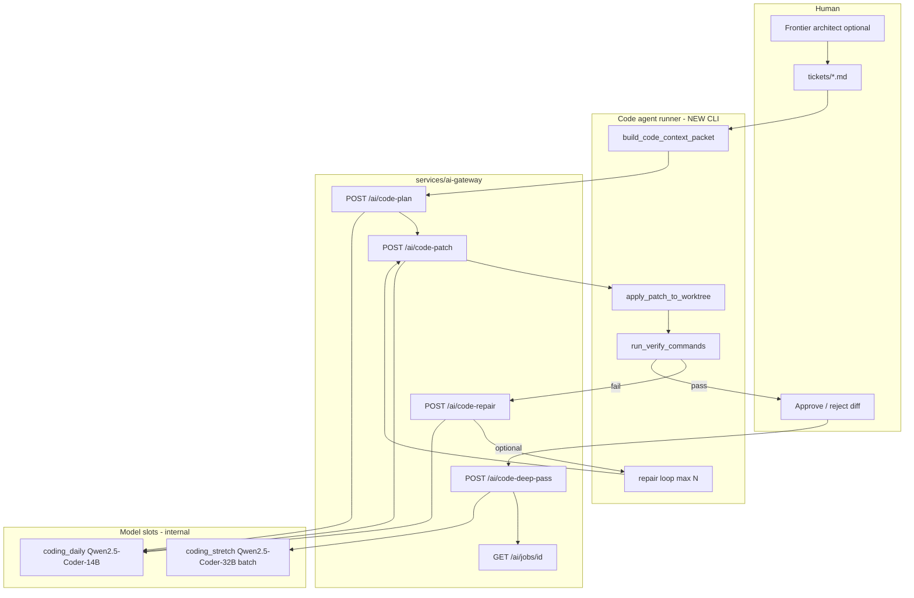
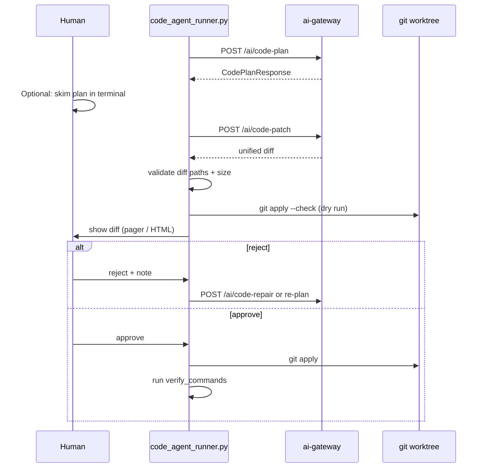

# Local Coding Agent Loop v0.1 — Planning Doc

**Status:** Planning only (no runtime wiring in this ticket).  
**Goal:** Design a **scoped, human-approved** local coding workflow where **Qwen2.5-Coder-14B** (`coding_daily`) implements narrow tickets and **Qwen2.5-Coder-32B** (`coding_stretch`) optionally reviews patches in a slow async batch — without expecting the local model to “improve the whole app.”

**Companion docs:**

| Doc | Relationship |
|-----|--------------|
| [`docs/plans/a770-local-intelligence-roadmap.md`](./a770-local-intelligence-roadmap.md) | Model slots (`coding_daily`, `coding_stretch`), job queue sketch, Phi-4 critic for Chat Harness deep mode |
| [`docs/plans/local-ai-evals-v0.1.md`](./local-ai-evals-v0.1.md) | Coding patch-plan eval fixtures (`evals/coding/`) |
| [`docs/09_agent_development_guide.md`](../09_agent_development_guide.md) | Ticket size, agent guardrails, verify commands |
| [`docs/08_ai_provider_and_a770_plan.md`](../08_ai_provider_and_a770_plan.md) | Task-level `/ai/*` endpoints (aspirational) |
| [`prompts/feature_ticket_prompt_template.md`](../../prompts/feature_ticket_prompt_template.md) | Ticket prompt shape |

**Non-goals for v0.1:**

```text
Autonomous multi-file refactors without approval
In-app Expo UI for code editing (dev CLI / gateway playground first)
Binding the product core loop to local LLM
Replacing Cursor / frontier models for architecture or ticket authoring
Auto-commit or auto-push
Reading or writing S3-style user secrets from board state
```

---

## 0. Scope boundary

The local coding agent is a **developer tool** for implementing **one ticket at a time** in this repo. It is **not** Ask Harness, **not** Raw Lab, and **not** a board mutation path.

**Allowed loop (mandatory order):**

```text
ticket → retrieve files → plan → patch → verify → summarize failures → repair → inspect diff → human approval
```

**Explicitly out of scope for the local model:**

```text
“Review the whole app”
“Figure out the best architecture”
Cross-cutting styling passes
New product concepts
Tickets larger than ~5 touched files / ~300 LOC delta (split ticket or use frontier architect)
```

Frontier models (Cursor Agent, Claude, etc.) remain **architect / ticket author / final reviewer** for broad decisions. Local Coder 14B is the **implementer** inside a frozen context packet.



---

## 1. Proposed local code-agent API

New routes live in [`services/ai-gateway/app/main.py`](../../services/ai-gateway/app/main.py) under the **`/ai/`** task prefix (aligned with [`docs/08_ai_provider_and_a770_plan.md`](../08_ai_provider_and_a770_plan.md)). Schemas extend [`services/ai-gateway/app/models.py`](../../services/ai-gateway/app/models.py) using existing `StrictModel` + `extra="forbid"` patterns.

**Provider routing (internal only — never exposed to Expo):**

| Slot | Model | Backend | Sync/async | Used by |
|------|-------|---------|------------|---------|
| `coding_daily` | Qwen2.5-Coder-14B Q4_K_M | llama.cpp SYCL (target) / mock (CI) | Sync | `/ai/code-plan`, `/ai/code-patch`, `/ai/code-repair` |
| `coding_stretch` | Qwen2.5-Coder-32B partial offload | llama.cpp batch only | Async job | `/ai/code-deep-pass` |
| `companion_fast` | Qwen3-8B-int4-ov | OpenVINO | Sync | Fallback when coder slot not ready |
| Frontier | — | Outside gateway | Human | Ticket authoring, architecture |

Env flags (extend [`services/ai-gateway/app/config.py`](../../services/ai-gateway/app/config.py)):

```text
SCOUT_CODING_AGENT_ENABLED=true
SCOUT_SLOT_CODING_DAILY_BACKEND=mock|llamacpp
SCOUT_SLOT_CODING_DAILY_MODEL=models/qwen2.5-coder-14b-q4_k_m.gguf
SCOUT_SLOT_CODING_STRETCH_BACKEND=llamacpp
SCOUT_SLOT_CODING_STRETCH_MODEL=models/qwen2.5-coder-32b-q4_k_m.gguf
SCOUT_CODE_AGENT_MAX_REPAIR_PASSES=3
SCOUT_CODE_AGENT_MAX_INPUT_CHARS=24000
```

### 1.1 `POST /ai/code-plan`

**Purpose:** Given a context packet, return a **file-scoped implementation plan** (no diff yet). Structured JSON for parse + repair passes (same pattern as `/analyze-transcript`).

**Request:** `CodePlanRequest`

```json
{
  "ticket_id": "005_quick_capture",
  "context_packet": { "...": "see section 2" },
  "sensitivity": "S0"
}
```

| Field | Type | Notes |
|-------|------|-------|
| `ticket_id` | string | Slug from `tickets/` filename stem |
| `context_packet` | `CodeContextPacket` | Full packet (section 2) |
| `sensitivity` | `S0`–`S3` | Default `S0` (repo metadata). `S3` → HTTP 422 before provider (match existing S3 gate in `main.py`) |

**Response:** `CodePlanResponse`

```json
{
  "summary": "Add rule-based quick capture parser in src/core/parsing.ts",
  "steps": [
    {
      "order": 1,
      "file": "src/core/parsing.ts",
      "action": "add",
      "description": "Implement parseQuickCapture(sentence) with inbox routing",
      "touch_kind": "modify"
    }
  ],
  "files_to_touch": ["src/core/parsing.ts", "src/core/parsing.test.ts"],
  "verify_commands": ["npm run typecheck", "npm test -- src/core/parsing.test.ts"],
  "risks": ["Must not add AI classification"],
  "confidence_notes": ["Ticket names single feature; no new routes required"],
  "safety_notes": []
}
```

**Errors:** 422 validation / oversize packet; 502 JSON parse failure (one repair pass); 503 coder slot not ready.

**Logging:** Log `ticket_id`, `files_count`, `packet_chars` — never full file bodies.

### 1.2 `POST /ai/code-patch`

**Purpose:** Produce a **unified diff** for the approved plan. Does not write to disk.

**Request:** `CodePatchRequest`

```json
{
  "ticket_id": "005_quick_capture",
  "context_packet": { "...": "..." },
  "plan": { "...": "CodePlanResponse or subset" },
  "pass": "initial"
}
```

| Field | Type | Notes |
|-------|------|-------|
| `pass` | `"initial" \| "repair"` | `repair` requires `failure_report` |
| `failure_report` | `CodeFailureReport \| null` | Required when `pass=repair` |

**Response:** `CodePatchResponse`

```json
{
  "format": "unified_diff",
  "diff": "--- a/src/core/parsing.ts\n+++ b/src/core/parsing.ts\n...",
  "files_changed": ["src/core/parsing.ts"],
  "summary": "Add parseQuickCapture and unit tests",
  "confidence_notes": [],
  "safety_notes": ["Diff touches only files listed in plan"]
}
```

**Validation (gateway-side, before return):**

- Every path in diff must be ⊆ `context_packet.allowed_files`
- No path in `context_packet.forbidden_files`
- Max files changed ≤ `context_packet.limits.max_files` (default 5)
- Max diff lines ≤ `context_packet.limits.max_diff_lines` (default 400)

Violations → HTTP 422 with `detail` explaining which rule failed (do not return the diff).

### 1.3 `POST /ai/code-repair`

**Purpose:** Convenience alias that sets `pass=repair` on the patch pipeline with a structured failure report. Same response shape as `code-patch`. Keeps the runner CLI simple.

**Request:** `CodeRepairRequest` = `CodePatchRequest` with `pass` fixed to `"repair"` and required `failure_report`.

### 1.4 `POST /ai/code-deep-pass`

**Purpose:** Enqueue **async** stretch review of an already-generated diff (32B batch reviewer). **Never auto-applies** a patch.

**Request:** `CodeDeepPassRequest`

```json
{
  "ticket_id": "005_quick_capture",
  "context_packet": { "...": "..." },
  "plan_summary": "Add parseQuickCapture",
  "diff": "--- a/...",
  "review_focus": ["correctness", "scope_creep", "missing_tests"]
}
```

**Response:** `CodeJobEnqueueResponse`

```json
{
  "job_id": "job_01HXYZ",
  "status": "queued",
  "slot": "coding_stretch",
  "poll_url": "/ai/jobs/job_01HXYZ"
}
```

### 1.5 `GET /ai/jobs/{job_id}`

**Purpose:** Poll stretch job status (same queue design as [`docs/plans/a770-local-intelligence-roadmap.md`](./a770-local-intelligence-roadmap.md) Phase 4).

**Response:** `CodeJobStatusResponse`

```json
{
  "job_id": "job_01HXYZ",
  "status": "completed",
  "slot": "coding_stretch",
  "created_at": "2026-06-10T12:00:00Z",
  "completed_at": "2026-06-10T12:04:30Z",
  "result": {
    "verdict": "approve_with_notes",
    "findings": [
      { "severity": "warning", "file": "src/core/parsing.ts", "line_hint": 42, "message": "Edge case: empty string not handled" }
    ],
    "suggested_followups": ["Add test for empty capture string"],
    "scope_creep_detected": false
  },
  "error": null
}
```

`status` enum: `queued | running | completed | failed | cancelled`.

### 1.6 Mock provider behavior (CI)

Extend [`services/ai-gateway/app/providers/mock.py`](../../services/ai-gateway/app/providers/mock.py):

- Deterministic `CodePlanResponse` keyed off `ticket_id` hash
- Tiny valid unified diff against first `allowed_files` entry
- Stretch jobs complete in-process with fixed review JSON
- Enables `SCOUT_PROVIDER=mock pytest tests/test_code_agent_contract.py` without GPU

---

## 2. Repo context packet format

`CodeContextPacket` is the **only** context the local coder may see. Built by a new runner module — not exported from Ask Harness or board state.

**Builder (planned):** `services/ai-gateway/app/code_context_packet.py`  
**CLI (planned):** `services/ai-gateway/scripts/build_code_context_packet.py`

```json
{
  "version": "1",
  "repo_root": "C:/Users/nicki/Projects/life-harness",
  "ticket": {
    "id": "005_quick_capture",
    "path": "tickets/005_quick_capture.md",
    "markdown": "# Ticket 005: Quick Capture\n\n## Task\n..."
  },
  "read_first": [
    "AGENTS.md",
    "docs/02_v0_1_scope.md",
    "docs/05_product_rules.md"
  ],
  "constraints": [
    "Do not add AI.",
    "Do not add Supabase unless the ticket explicitly asks.",
    "Do not introduce new product concepts.",
    "Put reusable product logic in src/core.",
    "Make the smallest useful change."
  ],
  "relevant_files": [
    {
      "path": "src/core/parsing.ts",
      "language": "typescript",
      "content": "... full file or truncated with line range ...",
      "reason": "ticket_implementation_target"
    },
    {
      "path": "src/core/parsing.test.ts",
      "language": "typescript",
      "content": "...",
      "reason": "existing_tests"
    }
  ],
  "allowed_files": [
    "src/core/parsing.ts",
    "src/core/parsing.test.ts",
    "src/components/QuickCaptureBar.tsx"
  ],
  "forbidden_files": [
    "package.json",
    "package-lock.json",
    "app.json",
    ".env",
    ".env.*",
    "services/ai-gateway/models/**",
    "node_modules/**",
    "src/state/LifeHarnessState.tsx"
  ],
  "verify_commands": [
    {
      "id": "typecheck",
      "cwd": ".",
      "cmd": "npm run typecheck",
      "required": true
    },
    {
      "id": "unit",
      "cwd": ".",
      "cmd": "npm test -- src/core/parsing.test.ts",
      "required": true
    }
  ],
  "limits": {
    "max_files": 5,
    "max_diff_lines": 400,
    "max_repair_passes": 3
  },
  "placement_rules": {
    "product_rules": "src/core",
    "ui": "src/components or app/",
    "ai_provider_code": "services/ai-gateway only",
    "seed_data": "src/data/seed.ts"
  }
}
```

### 2.1 File retrieval strategy

| Source | How |
|--------|-----|
| Ticket body | Parse `## Task`, `## Acceptance criteria`, optional `## Files` section |
| Default read-first | Inject `AGENTS.md`, scope doc, product rules (from ticket template) |
| Symbol search | Runner uses `rg` / ticket-provided globs (e.g. `src/core/parsing.ts`) |
| Test pairing | If `src/foo.ts` listed, auto-include `src/foo.test.ts` when present |
| Budget | Truncate large files: head + tail + export signature-only for `LifeHarnessState.tsx`-scale files unless ticket explicitly allows |

**Ticket extension (optional, v0.1b):** Add a `## Files` block to tickets:

```markdown
## Files

```text
src/core/parsing.ts
src/components/QuickCaptureBar.tsx
```
```

Until then, the runner accepts `--files` CLI override.

### 2.2 Verify commands (actual repo today)

Root [`package.json`](../../package.json):

| Script | Command | When |
|--------|---------|------|
| `typecheck` | `npm run typecheck` → `tsc --noEmit` | Always for TS tickets |
| `test` | `npm test` → `vitest run` | Always; prefer scoped `npm test -- src/core/foo.test.ts` |
| `scout:runner:test` | `npm run scout:runner:test` | Job Scout tickets only |

Gateway Python ([`services/ai-gateway/pyproject.toml`](../../services/ai-gateway/pyproject.toml)):

| Command | When |
|---------|------|
| `cd services/ai-gateway && pytest -q` | Any `services/ai-gateway/**` change |
| `pytest tests/test_raw_lab_contract.py -q` | Targeted gateway contract |

**No ESLint script** exists at repo root today — do not invent a lint gate until a ticket adds it. Typecheck + Vitest/pytest are the v0.1 verify bar.

[`vitest.config.ts`](../../vitest.config.ts) includes `src/**/*.test.ts` and `services/job-scout-runner/tests/**/*.test.ts`.

### 2.3 Alignment with harness context packet (future)

[`docs/plans/a770-local-intelligence-roadmap.md`](./a770-local-intelligence-roadmap.md) defines a **product** context packet (`harness_context`, `thread_state`, retrieval). `CodeContextPacket` is **orthogonal** — repo files and ticket markdown only. Shared field names (`version`, `budget.max_input_chars`) may align, but **no board export** enters the coding packet unless a ticket explicitly implements harness code.

Planned spec sibling: `services/ai-gateway/docs/code-context-packet-v1.md` (not yet written).

---

## 3. Patch approval model

Patches are **suggestions until a human approves**. The runner never commits.

### 3.1 Workflow



### 3.2 Presentation surfaces (v0.1)

| Surface | Path | Role |
|---------|------|------|
| Terminal | `scripts/code_agent_runner.py --ticket 005` | Default: colorized diff + plan summary |
| Gateway playground | `services/ai-gateway/playground/code_agent.html` (new) | Dev-only diff viewer + Approve/Reject buttons calling local runner hook |
| IDE | Human copies diff | Fallback |

### 3.3 Approval record

Runner writes a local-only audit file (gitignored): `services/ai-gateway/.local/code-agent-runs/{run_id}.json`

```json
{
  "run_id": "run_01HXYZ",
  "ticket_id": "005_quick_capture",
  "plan_approved": true,
  "diff_approved": true,
  "diff_sha256": "...",
  "verify_results": [{ "id": "typecheck", "exit_code": 0 }],
  "stretch_review_job_id": null,
  "human_note": "approved after test pass"
}
```

### 3.4 Rejection paths

| Rejection | Next action |
|-----------|-------------|
| Plan too broad | Human edits ticket or re-runs with tighter `allowed_files` |
| Diff touches forbidden file | Auto-reject (422 from gateway); no apply attempted |
| Diff scope creep | Human rejects → `code-repair` with `failure_report.kind=scope_creep` |
| Tests fail after apply | Repair loop (section 4); human may reject and discard worktree |
| Stretch review `reject` | Human decides; **stretch suggestions never auto-apply** |

### 3.5 Git safety

- Runner operates on current branch or optional `--worktree` path
- `git apply --check` before human approval
- `git checkout -- .` documented escape hatch
- Runner does **not** call `git commit` (matches user commit rules — human commits explicitly)

---

## 4. Failure repair loop

After patch apply, the runner executes `verify_commands` sequentially and builds a `CodeFailureReport` for the gateway.

### 4.1 `CodeFailureReport` shape

```json
{
  "kind": "verify_failed",
  "pass_number": 1,
  "max_passes": 3,
  "commands": [
    {
      "id": "typecheck",
      "cmd": "npm run typecheck",
      "exit_code": 2,
      "stdout_tail": "...",
      "stderr_tail": "src/core/parsing.ts(12,5): error TS2322: ..."
    },
    {
      "id": "unit",
      "cmd": "npm test -- src/core/parsing.test.ts",
      "exit_code": 1,
      "stdout_tail": "FAIL src/core/parsing.test.ts ...",
      "stderr_tail": ""
    }
  ],
  "parsed_errors": [
    {
      "tool": "tsc",
      "file": "src/core/parsing.ts",
      "line": 12,
      "message": "TS2322: Type 'string' is not assignable..."
    }
  ],
  "human_hint": null
}
```

`kind` enum: `verify_failed | apply_failed | scope_creep | parse_failed`.

**Stdout/stderr tails:** Max 4 KB each per command — enough for model repair without dumping full vitest output.

### 4.2 Loop policy

```text
1. Apply approved diff to worktree
2. Run all required verify_commands
3. If all exit 0 → mark run success; stop
4. If pass_number >= max_repair_passes → stop; human fixes manually
5. POST /ai/code-repair with failure_report + current diff context
6. Present new diff; human must re-approve each repair pass
7. goto 1
```

**Important:** Each repair pass requires **fresh human approval** of the new diff (not auto-chain).

### 4.3 Runner pseudocode

```python
# services/ai-gateway/scripts/code_agent_runner.py (planned)
for pass_num in range(1, max_passes + 1):
    patch = gateway.code_patch(...) if pass_num == 1 else gateway.code_repair(...)
    if not human.approve(patch.diff):
        break
    apply_patch(patch.diff)
    report = run_verify(context_packet.verify_commands)
    if report.ok:
        break
    failure_report = summarize_failures(report, pass_num)
```

### 4.4 Failure summarization (deterministic pre-model)

Before sending to the model, runner extracts structured errors:

| Tool | Parser |
|------|--------|
| `tsc` | Regex `(.+)\((\d+),\d+\): error (TS\d+):` |
| `vitest` | FAIL file name + first assertion block |
| `pytest` | `FAILED .* - ` line |

This mirrors the gateway’s existing “log lengths only” privacy posture — failures are repo code, not user journal data.

---

## 5. Job queue design for slow batch tasks

Reuse the stretch queue sketch from [`docs/plans/a770-local-intelligence-roadmap.md`](./a770-local-intelligence-roadmap.md) §2.2 `StretchJobQueue`.

### 5.1 Components (planned)

| File | Role |
|------|------|
| `services/ai-gateway/app/job_models.py` | `JobStatus`, `CodeJobRecord` |
| `services/ai-gateway/app/job_queue.py` | In-memory queue + worker thread; optional sqlite `services/ai-gateway/.local/jobs.db` |
| `services/ai-gateway/app/tasks/code_deep_pass.py` | Load `coding_stretch`, run review prompt, store JSON result |

### 5.2 Queue rules

```text
Max 1 active stretch model loaded on A770 at a time
coding_stretch jobs never block coding_daily sync endpoints
Job worker runs on gateway process start when SCOUT_CODING_AGENT_ENABLED=true
Cancel: DELETE /ai/jobs/{id} (optional v0.1b)
S3 rejected before enqueue (consistency with main.py)
```

### 5.3 VRAM interaction

When a stretch job starts:

1. Evict `coding_stretch` competitor slots if loaded (`critic`, other stretch)
2. Load Qwen2.5-Coder-32B with partial CPU offload
3. Run batch inference (no streaming required)
4. Unload stretch model; restore `coding_daily` or `companion_fast` resident policy

Daily chat (`/chat-harness`) must remain responsive — stretch work is **batch-only**, typically launched after human already has a passing local verify.

### 5.4 When to use stretch review

| Use | Don't use |
|-----|-----------|
| Multi-file tickets at upper file limit | Initial implementation (14B only) |
| Security-sensitive `src/core/guards.ts` changes | Typo fixes |
| Human wants second opinion before commit | Repair loop (14B repair is enough) |

---

## 6. Safety

### 6.1 Hard rules

| Rule | Enforcement |
|------|-------------|
| Never auto-apply stretch patches | Stretch returns review JSON only; no `diff` field in `CodeDeepPassResult` |
| Always show diff | Runner refuses `git apply` until `human.approve` |
| Run tests before approval prompt | Order: `git apply --check` → show diff → on approve → apply → verify → offer commit |
| No forbidden paths | Gateway 422 + runner preflight |
| No secrets in packet | Exclude `.env*`; runner strips env-file paths from retrieval |
| No whole-app refactors | `limits.max_files`, `limits.max_diff_lines`, plan validator |
| Mock-first CI | All contract tests pass without GPU |
| Localhost only | Gateway bind `127.0.0.1` (existing policy) |

### 6.2 Sensitivity for coding tasks

Repo implementation tickets default **`S0`**. If a ticket touches persistence of user exports, treat as **`S1`** — still local-only on gateway. Do not send therapy/reflection content from Memory Bank into coding packets.

### 6.3 Product containment

- Do **not** add coding-agent UI to Today/Board screens
- Do **not** weaken Ask Harness S3 routing or Raw Lab containment
- Coding agent prompts live in `services/ai-gateway/app/prompts/code_agent_*.md` — separate from `chat_harness.md` / `raw_lab.md`

### 6.4 Eval gates (from local-ai-evals plan)

Before trusting Coder 14B for daily use, manual smoke:

- `services/ai-gateway/evals/coding/smallest_patch_for_bug.json`
- `services/ai-gateway/evals/coding/no_drive_by_refactor.json`

Tags: `model_smoke` (not CI). Mock CI tests validate **schema and diff path rules** only.

---

## 7. First implementation ticket

**Ticket:** `Code agent v0.1a — mock gateway contracts + context packet builder (no GPU, no auto-apply)`

**Why first:** Proves API shapes, packet builder, diff validation, and runner dry-run path before llama.cpp + Qwen weights. Matches gateway discipline: “ship mock + tests first” ([`services/ai-gateway/AGENTS.md`](../../services/ai-gateway/AGENTS.md)).

### 7.1 Scope (smallest shippable slice)

1. **Pydantic models** — `services/ai-gateway/app/models.py`
   - Add `CodeContextPacket`, `CodePlanRequest/Response`, `CodePatchRequest/Response`, `CodeFailureReport`, `CodeJobEnqueueResponse`, `CodeJobStatusResponse`
2. **Context packet builder** — `services/ai-gateway/app/code_context_packet.py`
   - `build_code_context_packet(ticket_path, repo_root, files, verify_commands)` → dict
   - Load ticket markdown from `tickets/{id}.md`
   - Merge default `read_first` + constraints from [`prompts/feature_ticket_prompt_template.md`](../../prompts/feature_ticket_prompt_template.md)
3. **Mock coder methods** — `services/ai-gateway/app/providers/mock.py`
   - `code_plan()`, `code_patch()`, `code_repair()`, `enqueue_code_deep_pass()`
4. **Routes** — `services/ai-gateway/app/main.py`
   - `POST /ai/code-plan`, `POST /ai/code-patch`, `POST /ai/code-repair`, `POST /ai/code-deep-pass`, `GET /ai/jobs/{job_id}`
   - Wire through `get_provider()`; 422 on forbidden diff paths
5. **Provider protocol** — `services/ai-gateway/app/providers/base.py`
   - Extend `TranscriptProvider` with code-agent methods (or `CodeAgentProvider` mixin protocol)
6. **CLI builder** — `services/ai-gateway/scripts/build_code_context_packet.py`
   - `python scripts/build_code_context_packet.py --ticket 005_quick_capture --files src/core/parsing.ts`
   - Prints JSON to stdout for inspection
7. **Runner skeleton** — `services/ai-gateway/scripts/code_agent_runner.py`
   - `--dry-run` only: plan → patch → print diff → **no** `git apply`
   - Calls mock gateway via `httpx` or `TestClient`
8. **Tests** — `services/ai-gateway/tests/test_code_agent_contract.py`
   - Plan returns valid schema
   - Patch diff only touches `allowed_files`
   - Forbidden path in mock diff → 422
   - Deep pass returns job_id; poll → `completed`
   - S3 → 422
9. **Docs** — `services/ai-gateway/docs/code-context-packet-v1.md` (schema); README endpoint section
10. **Eval fixtures (optional same PR)** — `services/ai-gateway/evals/coding/smallest_patch_for_bug.json` (file only; runner not required yet)

### 7.2 Out of scope for v0.1a

```text
llama.cpp provider + real Qwen2.5-Coder-14B weights
git apply in runner (dry-run only)
playground HTML
sqlite job persistence
Expo integration
Auto repair loop
```

### 7.3 Acceptance criteria

```text
cd services/ai-gateway
pip install -e ".[dev]"
$env:SCOUT_PROVIDER="mock"
pytest tests/test_code_agent_contract.py -q
pytest -q   # no regressions

python scripts/build_code_context_packet.py --ticket 005_quick_capture --files src/core/parsing.ts
# prints valid CodeContextPacket JSON

python scripts/code_agent_runner.py --ticket 005_quick_capture --files src/core/parsing.ts --dry-run
# prints plan + diff; does not modify repo

cd ../..
npm run typecheck
npm test
```

### 7.4 Follow-up tickets (ordered)

| ID | Title | Key files |
|----|-------|-----------|
| v0.1b | Runner apply + verify + repair loop | `scripts/code_agent_runner.py`, `app/code_verify.py` |
| v0.2 | llama.cpp `coding_daily` slot | `app/providers/llamacpp_provider.py`, `app/model_slots.py`, `docs/plans/llamacpp-sycl-setup.md` |
| v0.3 | Stretch job worker + OpenVINO/llama 32B smoke | `app/job_queue.py`, `app/tasks/code_deep_pass.py` |
| v0.4 | Coding eval runner + manual smoke | `evals/coding/*.json`, extend `eval_runner.py` |
| v0.5 | Playground diff viewer | `playground/code_agent.html` |

### 7.5 Example ticket for dogfooding (v0.1b)

Use a **completed** ticket shape to test the loop without changing product behavior — e.g. re-run planning against `tickets/005_quick_capture.md` with `--files src/core/parsing.ts` and confirm the plan mentions `parseQuickCapture` and `parsing.test.ts`.

For a **live** micro-ticket (when runner apply lands):

```markdown
# Ticket DEV-001: Add code_agent_runner --version flag

## Task
Print package version in code_agent_runner.py --version.

## Files
src/core/not applicable — gateway only:
services/ai-gateway/scripts/code_agent_runner.py

## Acceptance criteria
- --version prints 0.1.0
- pytest tests/test_code_agent_contract.py passes
```

---

## 8. Suggested commands (reference)

### App (root)

```powershell
cd C:\Users\nicki\Projects\life-harness
npm run typecheck
npm test
npm test -- src/core/parsing.test.ts
```

### AI gateway

```powershell
cd services/ai-gateway
pip install -e ".[dev]"
$env:SCOUT_PROVIDER="mock"
pytest -q
uvicorn app.main:app --host 127.0.0.1 --port 8111
```

### Planned coding-agent CLI

```powershell
# Build packet only
python scripts/build_code_context_packet.py --ticket 005_quick_capture --files src/core/parsing.ts

# Dry-run loop (v0.1a)
python scripts/code_agent_runner.py --ticket 005_quick_capture --files src/core/parsing.ts --dry-run

# Full loop (v0.1b+)
python scripts/code_agent_runner.py --ticket DEV-001 --apply --max-repair-passes 3

# Optional stretch review after local verify passes
python scripts/code_agent_runner.py --ticket DEV-001 --deep-review --job-poll
```

---

## 9. Related plans status

| Referenced plan | Status in repo |
|-----------------|----------------|
| [`docs/plans/a770-local-intelligence-roadmap.md`](./a770-local-intelligence-roadmap.md) | **Exists** — slots, job queue, Phase 3–4 coding |
| [`docs/plans/local-ai-evals-v0.1.md`](./local-ai-evals-v0.1.md) | **Exists** — coding eval fixtures §H |
| `services/ai-gateway/docs/context-packet-v1.md` | **Not written** (product packet; Phase 0 of A770 roadmap) |
| `phi4-critic` | **Not a separate doc** — covered as `critic` slot in A770 roadmap Phase 1 |
| `context-packet-builder` | **Not implemented** — this doc defines `CodeContextPacket` builder for repo tickets |

---

## 10. Summary

The local coding agent is a **ticket-scoped, verify-gated, human-approved** loop sitting beside the existing scout gateway. **Qwen2.5-Coder-14B** owns sync plan/patch/repair; **Qwen2.5-Coder-32B** is an optional async reviewer only. The gateway grows task-level `/ai/code-*` endpoints with strict diff validation; a CLI runner owns git apply and `npm run typecheck` / `npm test` / `pytest` verification. First shippable slice is **mock contracts + context packet builder + dry-run runner** — no GPU, no auto-apply, no product UI.
