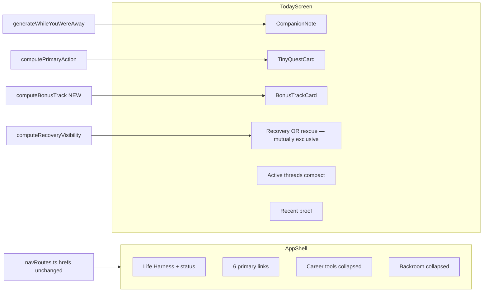

# Lo-Fi Companion OS Shell v0.1 — Implementation Plan

**Branch:** `feat/lofi-companion-os-shell-v0.1`
**UX spec:** [`docs/ux/lofi-companion-os-shell-v0.1.md`](../ux/lofi-companion-os-shell-v0.1.md)

## Current state

**Documented but not built:** UX doc acceptance criteria unchecked.

**Partial groundwork on `main`:**
- Grouped routes in `src/components/navRoutes.ts` — but `Nav.tsx` renders all 15 pills expanded
- `buildCompanionNote()` + tests — not wired to UI
- `computePrimaryAction()` — inline on Today, not a hero component
- `computeRecoveryVisibility()` — AI context only, not Today UI
- `CollapsibleSection` — used on Progress / Today career shortcuts
- Field Ops theme in `styles.ts` — no lo-fi tokens yet

---

## Architecture (target)



**Routing rule:** change labels and grouping only — keep `/ask-harness`, `/raw-lab`, `/progress`, etc.

---

## Phase 1 — UX doc + tokens + nav contract

### 1a. UX doc (start + finish)

Update `docs/ux/lofi-companion-os-shell-v0.1.md` at start with planned scope; finalize at end with actual changes and backlog.

### 1b. Lo-fi tokens (additive, no font loading)

Extend `src/components/styles.ts` with exported `lofiColors` / `lofiTypography` alongside existing Field Ops palette. Document Outfit + DM Mono as future; use system + `fontLofiMono: "monospace"` only.

### 1c. Nav labels + hierarchy in `navRoutes.ts`

| href | New label | Group |
|------|-----------|-------|
| `/` | Today | primary |
| `/board` | Board | primary |
| `/career` | Career | primary |
| `/ask-harness` | Companion | primary |
| `/progress` | Playback | primary |
| `/review` | Replay | primary |
| career tool hrefs | unchanged labels | `careerTools` (collapsed) |
| `/raw-lab` | Raw Signal | system/backroom |
| `/memory-bank` | Tape Archive | system/backroom |
| `/log` | Log | system/backroom |
| `/source-setup` | Setup | backroom **only** (remove from careerTools) |

**Group id naming (prefer label over refactor):**
- User-facing group label: **Backroom** (not "System").
- Keep internal group id as `system` unless renaming to `backroom` is a trivial find-replace with no behavioral risk (`isSystemPath`, tests, etc.).
- User-facing clarity matters more than internal purity.

---

## Phase 2 — AppShell + responsive Nav

### New components

| File | Role |
|------|------|
| `src/components/AppShell.tsx` | Brand block + nav chrome + content slot |
| `src/components/SidebarNav.tsx` | Vertical nav for `width >= 900` |
| Refactor `src/components/Nav.tsx` | Compact top nav for narrow; collapsible Career + Backroom |

**Shell behavior:**
- **Wide (≥900px):** fixed left sidebar (~220px), brand "Life Harness", subtitle "local companion awake", primary links stacked, Career/Backroom collapsed by default (auto-open when active route matches group).
- **Narrow:** primary row only (6 items); single "Backroom ▸" toggle; Career tools **not** in global nav — reachable via Career hub.
- **Exception:** `app/card/[id].tsx` keeps Stack header (`showShell={false}`).

### Integrate via `Screen.tsx`

Refactor `Screen.tsx` so shell chrome is fixed outside ScrollView. Remove `<Nav />` from all `app/*.tsx` screens (mechanical). Do not restructure Expo Router.

---

## Phase 3 — Today's Loop transformation

Refactor `app/index.tsx` to this order:

```
PageHeader: "Today's Loop" / "Good, you're back. One tiny quest is enough."
CompanionNote          ← buildCompanionNote()
ActiveLimitBanner      ← compact, below note (not page center)
TinyQuestCard          ← dominant visual (NEW)
BonusTrackCard         ← quiet optional (NEW)
Recovery surface       ← see Recovery rules below
QuickCapture           ← after hero
Active threads         ← collapsed: main quest + follow-ups + CardTile compact
Recent proof           ← ProofShelf compact limit={3}
```

### Recovery — mutually exclusive surfaces

**Do not show RecoveryPanel and quiet rescue buttons as competing full surfaces.**

```
if computeRecoveryVisibility().shouldPromote:
  show RecoveryPanel (MVD and/or Salvage promoted with context from briefing)
else:
  show quiet rescue row only: "Minimum viable day" | "Salvage mode"
```

- `RecoveryPanel` replaces the bottom "Recovery Systems" section when promoted.
- When not promoted, a single quiet row (not a full-width dual panel) keeps MVD/Salvage one tap away.
- Never render both as equal-weight blocks on the same screen.

### Remove/demote from default Today view

- "While You Were Away" bullet stack → CompanionNote
- Standalone "Primary Objective" → Active threads
- Duplicate "Career Pounce" block → hero + collapsed career shortcuts when pounce
- "What should I do now?" → TinyQuestCard
- Old full-width "Recovery Systems" side-by-side panel → recovery rules above

### New UI primitives

| Component | File | Reuses |
|-----------|------|--------|
| `CompanionNote` | `src/components/lofi/CompanionNote.tsx` | `buildCompanionNote` |
| `TinyQuestCard` | `src/components/lofi/TinyQuestCard.tsx` | `PrimaryAction` + pounce/link handlers |
| `BonusTrackCard` | `src/components/lofi/BonusTrackCard.tsx` | `computeBonusTrack` |
| `RecoveryPanel` | `src/components/lofi/RecoveryPanel.tsx` | `MvdChecklist` + `SalvagePicker` when promoted |
| `RescueRow` | `src/components/lofi/RescueRow.tsx` | compact MVD/Salvage triggers when not promoted |

### New core: `bonusTrack.ts`

Derive one secondary action from `briefing.prepared` not consumed by primary action. Rules-only; no new persistence.

---

## Phase 4 — Light copy cleanup

### Companion (`app/ask-harness.tsx`)
- Title: **Companion**; subtitle: grounded safety copy
- Wide layout: inspector default closed

### Raw Signal (`app/raw-lab.tsx`)
- `PageHeader` + concise `SafetyBanner`
- Handoff: **"Open in Companion with board context"**
- Default-collapse thread memory + personality panels

### Headers only
- Playback, Replay, Career hub subtitle, Tape Archive — label alignment only
- Board card Start/Done/More — **document only**, do not implement

---

## Phase 5 — Tests + verification

```bash
npm run typecheck
npm run test
```

- `navRoutes.test.ts` — Setup only in backroom group; hrefs unchanged
- `bonusTrack.test.ts` — new
- Optional `Nav.test.tsx` — backroom collapsed by default
- Copy test updates for renamed labels

No gateway pytest.

---

## Stop conditions

**File-count rule (adjusted):**

Stop if **non-mechanical product changes** spread beyond **AppShell/Nav + Today + light copy**.

Mechanical `<Nav />` removal from route screens **does not count** against the stop condition — expect ~15 route files touched for that alone.

**Hard stops:**
- No route path renames
- No font native deps
- No board card action redesign
- No Raw Lab board-context weakening

If non-mechanical scope grows, ship AppShell + Nav + Today first and defer Companion/Raw Signal copy to follow-up PR.

---

## Deferred backlog

- Board card Start/Done/More
- Outfit + DM Mono via expo-font
- Full Playback / Replay visual pass
- Sticky/docked Quick Capture footer
- `dailyState` pounce mission write-back (UX-005)
- Progress week-in-review narrative
- `/more` hub or 5-tab ConsolidatedNav
- Migrate remaining `screenIntro` → `PageHeader`
- Card Detail progressive disclosure

---

## Implementation todos

1. Create branch; draft UX doc scope
2. Lo-fi tokens + navRoutes labels/groups (Backroom label; id rename only if trivial)
3. AppShell + SidebarNav + Nav refactor; Screen.tsx integration
4. Strip `<Nav />` from route screens (mechanical)
5. Today loop: CompanionNote, TinyQuest, BonusTrack, mutually exclusive recovery
6. `bonusTrack.ts` + tests
7. Light Companion/Raw Signal/header copy
8. typecheck + test; finalize UX doc
