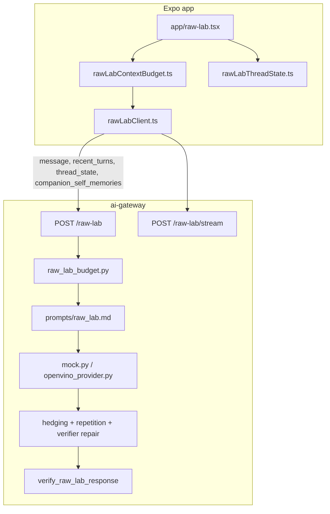
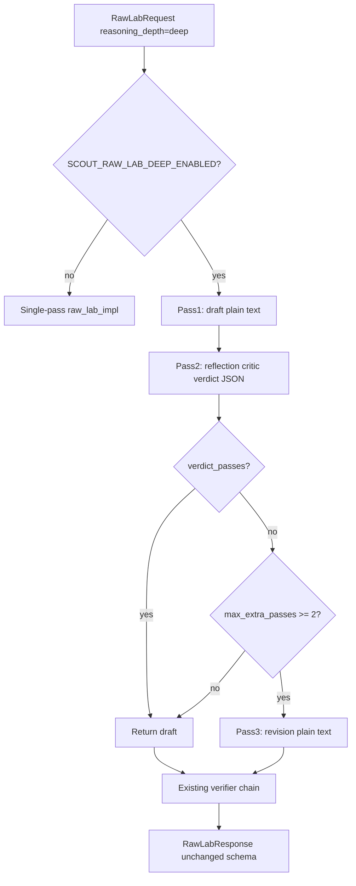

# Raw Lab Deep Thinking v0.1 — Planning Doc

**Status:** Planning only (no runtime implementation in this ticket).
**Goal:** Design a Raw Lab Deep mode that thinks longer about open-ended user input, without cloning Ask Harness’s grounded pounce/board critic.

**Product line:** *"Think longer about anything I give you."* — not *"Turn this into a board action."*

**Companion docs:**

| Doc | Relationship |
|-----|--------------|
| [`docs/plans/local-ai-deep-ux-v0.1.md`](./local-ai-deep-ux-v0.1.md) | Human-first depth labels, phased loading copy |
| [`docs/plans/phi4-critic-deep-pass-v0.1.md`](./phi4-critic-deep-pass-v0.1.md) | Chat Harness deep critic pattern to borrow (not reuse wholesale) |
| [`docs/raw-lab-thread-state.md`](../raw-lab-thread-state.md) | Thread + personality containment |
| [`AGENTS.md`](../../AGENTS.md) | Raw Lab sandbox rules, no board export |

---

## Goal

Raw Lab today is single-pass (plus post-hoc hedging/repetition/verifier repair on OpenVINO). Ask Harness already has `reasoning_depth` (`fast` / `deliberate` / `deep`) with a multi-pass deep pipeline for grounded operator chat.

Raw Lab Deep should add **sandbox reflection** — draft → reflection critic → optional revision — while:

- Keeping `RawLabResponse` schema unchanged (`answer`, `mode`, `safety_notes`, `used_context: false`)
- Never mutating board state or Memory Bank
- Never auto-saving memories
- Not importing pounce, active-card, or career-priority critic checks

---

## 1. Current Raw Lab architecture map

### End-to-end flow



**Today:** No `reasoning_depth` on Raw Lab wire. Chat Harness owns depth on [`ChatHarnessRequest`](../../services/ai-gateway/app/models.py).

### UI layer

| File | Role |
|------|------|
| [`app/raw-lab.tsx`](../../app/raw-lab.tsx) | Main screen: turns, thread state, streaming send, gateway health budget, companion self-memories, handoff to Ask Harness, clear chat |
| [`src/components/rawLab/RawLabThread.tsx`](../../src/components/rawLab/RawLabThread.tsx) | Thread bubbles, streaming draft, shape-thread/personality actions |
| [`src/components/rawLab/RawLabEmptyState.tsx`](../../src/components/rawLab/RawLabEmptyState.tsx) | Empty-state quick prompts |
| [`src/components/rawLab/RawLabThreadMemoryPanel.tsx`](../../src/components/rawLab/RawLabThreadMemoryPanel.tsx) | In-session thread memory + personality editor |
| [`src/components/rawLab/RawLabBudgetInspector.tsx`](../../src/components/rawLab/RawLabBudgetInspector.tsx) | Serialized input estimate + compaction level |
| [`src/components/rawLab/CompanionSelfMemoryPanel.tsx`](../../src/components/rawLab/CompanionSelfMemoryPanel.tsx) | Persisted companion self-memories + reflection proposals |
| Shared: [`ChatComposer`](../../src/components/askHarness/ChatComposer.tsx), [`ChatSurfaceFrame`](../../src/components/chat/ChatSurfaceFrame.tsx), [`SafetyBanner`](../../src/components/SafetyBanner.tsx) | Composer, layout, S3 warning |

### Client / core

| File | Role |
|------|------|
| [`src/core/rawLabClient.ts`](../../src/core/rawLabClient.ts) | `askRawLab`, `streamRawLab` (SSE), body builder, 422 budget retry, `RawLabError` |
| [`src/core/rawLabContextBudget.ts`](../../src/core/rawLabContextBudget.ts) | `buildRawLabSendBundle`, staged compaction, char estimate |
| [`src/core/rawLabThreadState.ts`](../../src/core/rawLabThreadState.ts) | Thread + personality state, wire serializers, post-turn updates |
| [`src/core/rawLabSelfReflectionClient.ts`](../../src/core/rawLabSelfReflectionClient.ts) | `POST /raw-lab/self-reflection` (separate from chat deep) |
| [`src/core/companionSelfMemory.ts`](../../src/core/companionSelfMemory.ts) + [`companionSelfMemoryStore.ts`](../../src/core/companionSelfMemoryStore.ts) | Self-memory model + localStorage persistence |
| [`src/core/gatewayHealthClient.ts`](../../src/core/gatewayHealthClient.ts) | `/health` → `raw_lab_max_input_chars` |

### Gateway

| File | Role |
|------|------|
| [`services/ai-gateway/app/main.py`](../../services/ai-gateway/app/main.py) | `POST /raw-lab`, `/raw-lab/stream`, `/raw-lab/self-reflection` |
| [`services/ai-gateway/app/models.py`](../../services/ai-gateway/app/models.py) | `RawLabRequest` (strict, no harness fields), `RawLabResponse` |
| [`services/ai-gateway/app/prompt_loader.py`](../../services/ai-gateway/app/prompt_loader.py) | `build_raw_lab_system_prompt()`, `estimate_raw_lab_input_chars()` |
| [`services/ai-gateway/app/prompts/raw_lab.md`](../../services/ai-gateway/app/prompts/raw_lab.md) | Unrestricted sandbox system prompt |
| [`services/ai-gateway/app/raw_lab_budget.py`](../../services/ai-gateway/app/raw_lab_budget.py) | Server-side send compaction |
| [`services/ai-gateway/app/providers/mock.py`](../../services/ai-gateway/app/providers/mock.py) | Heuristic answers + inline verifier fixes |
| [`services/ai-gateway/app/providers/openvino_provider.py`](../../services/ai-gateway/app/providers/openvino_provider.py) | Single-pass chat + hedging/repetition/verifier repair |
| [`services/ai-gateway/app/raw_lab_utils.py`](../../services/ai-gateway/app/raw_lab_utils.py) | Hedging/repetition detection + repair instructions |
| [`services/ai-gateway/app/thread_verifier.py`](../../services/ai-gateway/app/thread_verifier.py) | `verify_raw_lab_response()` — board claims, steering, runtime awareness, anti-repeat |

### Existing repair / verifier (post-draft, OpenVINO)

Order after primary generation:

1. Hedging repair (unrestricted-intent + hedge phrases)
2. Repetition repair (near-duplicate of last assistant)
3. Verifier repair (`verify_raw_lab_response` — one LLM repair max)

Mock substitutes hardcoded strings instead of LLM repair. **No structured critic pass today.**

Chat Harness deep artifacts (`chat_harness_deep.py`, `chat_harness_critic.md`, `reasoning_depth_prompt_suffix()` for JSON answers) are **not** used on Raw Lab paths.

### Tests (representative)

| File | Focus |
|------|-------|
| [`services/ai-gateway/tests/test_raw_lab_contract.py`](../../services/ai-gateway/tests/test_raw_lab_contract.py) | Wire contract, forbidden fields, mock branches |
| [`services/ai-gateway/tests/test_raw_lab_budget.py`](../../services/ai-gateway/tests/test_raw_lab_budget.py) | Gateway budget compaction |
| [`services/ai-gateway/tests/test_raw_lab_self_memory_contract.py`](../../services/ai-gateway/tests/test_raw_lab_self_memory_contract.py) | Runtime awareness |
| [`services/ai-gateway/tests/test_raw_lab_ignored_steering.py`](../../services/ai-gateway/tests/test_raw_lab_ignored_steering.py) | Shorter-steering repair containment |
| [`services/ai-gateway/tests/test_thread_verifier.py`](../../services/ai-gateway/tests/test_thread_verifier.py) | `verify_raw_lab_response` unit tests |
| [`src/core/rawLabClient.test.ts`](../../src/core/rawLabClient.test.ts), [`rawLabContextBudget.test.ts`](../../src/core/rawLabContextBudget.test.ts), [`rawLabThreadState.test.ts`](../../src/core/rawLabThreadState.test.ts) | Client + budget + thread rules |
| [`src/core/rawLabScreen.containment.test.ts`](../../src/core/rawLabScreen.containment.test.ts) | No harness/board imports or mutation affordances |

### AGENTS.md constraints (must hold)

- Raw Lab: unrestricted prompt sandbox; no board context, tools, Memory Bank, or mutation path
- Thread + personality: in-memory session only; personality never exported to Ask Harness
- Handoff: explicit user action only (`buildGroundedHandoffDigest` → Ask Harness)
- Do not weaken Ask Harness / S3 / board guardrails when extending Raw Lab
- Companion self-memories: user-approved, visible, not hidden memory

---

## 2. Proposed Raw Lab thinking modes

Reuse the **same enum values** as Chat Harness (`fast` | `deliberate` | `deep`) on `RawLabRequest.reasoning_depth` — but **different prompt suffixes and deep pipeline**.

| Mode | User-facing label | Gateway behavior |
|------|-------------------|------------------|
| **fast** (default) | **Fast** | Current single-pass path + existing post-verifier repairs |
| **deliberate** | **Think longer** | Inject Raw-Lab-specific depth suffix into system prompt (private checklist: user question, thread digest, open loops, personality steering, repetition risk). **No extra model passes.** |
| **deep** | **Deep** | **Draft → reflection critic → optional revision** when `SCOUT_RAW_LAB_DEEP_ENABLED=true`. Plain-text draft throughout. |

**Deliberate suffix (new):** mirror [`reasoning_depth_prompt_suffix()`](../../services/ai-gateway/app/thread_verifier.py) pattern but replace board facts with thread-focused checklist and plain-text output (not “return only JSON”).

### UX exposure by ticket (product rule)

Do **not** show a working-looking **Deep** chip before Ticket B ships. A visible Deep control that maps to single-pass behavior or a disabled server gate feels broken.

| Ticket | Chips shown | Wire values sent |
|--------|-------------|------------------|
| **A** | **Fast** · **Think longer** | `fast` (default) · `deliberate` |
| **B+** | **Fast** · **Think longer** · **Deep** | `fast` · `deliberate` · `deep` |

- **Ticket A:** Gateway may accept `reasoning_depth=deep` in contract tests, but the **app must not expose or send `deep`** until B is merged.
- **Ticket B:** Add Deep chip in the same PR as the multi-pass pipeline — user tap must invoke draft → critic → revision when `SCOUT_RAW_LAB_DEEP_ENABLED=true`.
- If deep is requested while gate is off (API/tests only): fail-soft to single-pass with trace `fail_soft_reason=deep_disabled` — never a silent no-op once the chip exists.

**Streaming policy (v0.1):** `/raw-lab/stream` continues for `fast` and `deliberate`. **`deep` uses sync `POST /raw-lab` only** — critic passes are not token-streamed. Phased loading copy ships with Ticket B/E when Deep is exposed.

---

## 3. Proposed Deep pipeline

Pattern borrowed from [`chat_harness_deep.py`](../../services/ai-gateway/app/chat_harness_deep.py); **new module** `raw_lab_deep.py` to avoid coupling.



### Pass details

| Pass | Input | Output | Fail-soft |
|------|-------|--------|-----------|
| **Draft** | `build_raw_lab_system_prompt()` + depth suffix + multi-turn chat | Plain `answer` string | N/A |
| **Reflection critic** | New `raw_lab_critic.md`: message, `recent_turns` excerpt, `thread_state` summary, draft text | `RawLabCriticVerdict` JSON | Parse/HTTP error → `pass_verdict()` → ship draft |
| **Revision** | `build_raw_lab_deep_final_prompt()` with critic instruction | Plain revised `answer` | Revision empty/error → ship draft |
| **Post-chain** | Existing hedging → repetition → `verify_raw_lab_response` | Same as today | One repair max per stage |

**No draft JSON repair** (Raw Lab is not JSON-shaped). Critic skip reason: `draft_empty` only.

### Trace metadata

New [`raw_lab_thinking_trace.py`](../../services/ai-gateway/app/raw_lab_thinking_trace.py) (parallel to [`chat_harness_thinking_trace.py`](../../services/ai-gateway/app/chat_harness_thinking_trace.py)):

- `reasoning_depth`, `passes[]` (`draft`, `critic`, `revision`)
- `critic_checks[]`, `critic_verdict_parsed`, `revision_applied`
- `fail_soft_reason`, `latency_ms{}`
- `streaming_used: false` for deep

Emit via `SCOUT_DEBUG_THINKING_TRACE=true` with log key `raw_lab_thinking_trace`. **Never in API response.**

### Config (new env vars)

| Env | Default | Purpose |
|-----|---------|---------|
| `SCOUT_RAW_LAB_DEEP_ENABLED` | `false` | Gate multi-pass pipeline |
| `SCOUT_RAW_LAB_DEEP_MAX_EXTRA_PASSES` | `2` | `1` = critic only; `2` = critic + revision |

Reuse `SCOUT_CRITIC_SLOT` only in **Ticket D** (optional secondary critic).

---

## 4. Reflection critic criteria (Raw Lab-specific)

New enum `RawLabCriticCheckId` + prompt [`services/ai-gateway/app/prompts/raw_lab_critic.md`](../../services/ai-gateway/app/prompts/raw_lab_critic.md):

| Check ID | Product concern |
|----------|-----------------|
| `too_shallow_or_generic` | Shallow/generic — doesn't engage the actual substance |
| `misses_actual_question` | Misses what the user actually asked |
| `overconfident_psychoanalysis` | Certainty about motives, trauma, diagnosis |
| `too_productivity_pushy` | Unsolicited life-coach / hustle framing |
| `emotionally_manipulative` | Guilt, faux intimacy, pressure |
| `repetitive_or_hedgy` | Repeats prior turn or excessive hedging |
| `unsafe_memory_or_relationship_claim` | Claims hidden memory, board access, tools, or relationship facts not in thread/self-memories |
| `no_issue` | Pass |

**Critic context bundle (not board):** user message, last N turns, `thread_state.recent_digest`, `active_goal`, `current_topic`, `open_loops`, `user_steering`, `personality.current_stance`, companion self-memory count + short snippets (not full S2 dumps).

**Explicit critic rules:**

- Do NOT require a "next move", pounce, or card action
- Do NOT reference Active cards, inbox limits, or career cold threads
- Judge whether the draft **explores the user's open question** with appropriate depth and voice

---

## 5. What NOT to reuse from Ask Harness

| Ask Harness artifact | Why not for Raw Lab |
|---------------------|---------------------|
| [`chat_harness_critic.md`](../../services/ai-gateway/app/prompts/chat_harness_critic.md) + `CriticCheckId` | Board-grounded checks |
| [`resolve_critic_context_bundle_for_prompt()`](../../services/ai-gateway/app/context_packet_render.py) | Active/stale cards, proof, diagnoses |
| [`ChatHarnessResponse`](../../services/ai-gateway/app/models.py) JSON draft/revision | Raw Lab is plain text |
| [`append_deep_critic_note()`](../../services/ai-gateway/app/chat_harness_critic.py) | Harness `confidence_notes` shape |
| [`verify_chat_harness_response()`](../../services/ai-gateway/app/thread_verifier.py) | Board mutation, harness `task_mode` code fences |
| Mock deep revision in [`mock.py`](../../services/ai-gateway/app/providers/mock.py) | Pounce/cold-career/active-card heuristics |
| Deep Synthesis ([`synthesis_critic.py`](../../services/ai-gateway/app/synthesis_critic.py)) | Report schema, `next_pounce` |
| `reasoning_depth_prompt_suffix()` as-is | References board facts and final JSON |

**Safe to reuse (patterns only):**

- `run_chat_harness_deep()` state machine structure
- `CriticBackend` + `get_critic_backend()` + fail-soft parse
- `ThinkingTrace` logging pattern
- [`companionLabels.thinkingStatusForDepth()`](../../src/core/companionLabels.ts) for loading copy

---

## 6. File-by-file implementation tickets

### Ticket A — `reasoning_depth` plumbing only

**Goal:** Wire depth through app + gateway with **no deep pipeline and no Deep chip** (deliberate = prompt suffix only; user sees two chips).

| File | Change |
|------|--------|
| [`services/ai-gateway/app/models.py`](../../services/ai-gateway/app/models.py) | Add `reasoning_depth: ReasoningDepth = fast` to `RawLabRequest` |
| [`services/ai-gateway/app/thread_verifier.py`](../../services/ai-gateway/app/thread_verifier.py) | Add `raw_lab_reasoning_depth_prompt_suffix(depth)` |
| [`services/ai-gateway/app/prompt_loader.py`](../../services/ai-gateway/app/prompt_loader.py) | Inject suffix; update `estimate_raw_lab_input_chars()` |
| [`services/ai-gateway/app/prompts/raw_lab.md`](../../services/ai-gateway/app/prompts/raw_lab.md) | `{reasoning_depth}` / `{reasoning_depth_suffix}` placeholders |
| [`src/core/rawLabClient.ts`](../../src/core/rawLabClient.ts) | `ReasoningDepth` on `AskRawLabInput`; app types `fast \| deliberate` only; serialize `reasoning_depth` |
| [`src/core/rawLabContextBudget.ts`](../../src/core/rawLabContextBudget.ts) | Include depth suffix chars in estimate |
| [`app/raw-lab.tsx`](../../app/raw-lab.tsx) | `reasoningDepth` state (`fast \| deliberate`); pass on send |
| **New** `src/components/rawLab/RawLabDepthChips.tsx` | **Two chips only:** Fast · Think longer. No Deep, no disabled placeholder. |
| Tests | Gateway: default fast, accepts deliberate/deep (wire), rejects invalid. Client: serializes fast/deliberate. Containment: no Deep chip in Ticket A source. |

### Ticket B — Same-backend Raw Lab Deep pipeline + Deep chip

**Goal:** `deep` runs draft → reflection critic → optional revision. **Ship third UI chip in same ticket.**

| File | Change |
|------|--------|
| **New** `services/ai-gateway/app/raw_lab_deep.py` | `run_raw_lab_deep()` orchestrator |
| **New** `services/ai-gateway/app/raw_lab_critic.py` | Verdict parse, `verdict_passes()`, `build_raw_lab_deep_final_prompt()` |
| **New** `services/ai-gateway/app/prompts/raw_lab_critic.md` | Reflection critic template |
| [`services/ai-gateway/app/config.py`](../../services/ai-gateway/app/config.py) | `SCOUT_RAW_LAB_DEEP_ENABLED`, `SCOUT_RAW_LAB_DEEP_MAX_EXTRA_PASSES` |
| [`services/ai-gateway/app/providers/openvino_provider.py`](../../services/ai-gateway/app/providers/openvino_provider.py) | Branch `reasoning_depth==deep` → `_run_raw_lab_deep()` |
| [`services/ai-gateway/app/providers/mock.py`](../../services/ai-gateway/app/providers/mock.py) | Mock critic + revision (sandbox checks only) |
| [`services/ai-gateway/app/main.py`](../../services/ai-gateway/app/main.py) | Sync `/raw-lab` for deep; stream rejects `deep` with 400 |
| [`src/components/rawLab/RawLabDepthChips.tsx`](../../src/components/rawLab/RawLabDepthChips.tsx) | Add **Deep** chip; extend types to `fast \| deliberate \| deep` |
| [`app/raw-lab.tsx`](../../app/raw-lab.tsx) | When `deep`: sync send, basic phased status |

### Ticket C — Thinking trace + tests

| File | Change |
|------|--------|
| **New** `services/ai-gateway/app/raw_lab_thinking_trace.py` | `RawLabThinkingTrace`, `emit_raw_lab_thinking_trace()` |
| **New** `services/ai-gateway/tests/test_raw_lab_deep_critic.py` | Multi-pass mock, fail-soft critic, schema unchanged |
| **New** `services/ai-gateway/tests/test_raw_lab_reasoning_contract.py` | Mirror `test_chat_harness_reasoning_contract.py` |
| [`src/core/rawLabScreen.containment.test.ts`](../../src/core/rawLabScreen.containment.test.ts) | No harness imports after UI changes |
| [`services/ai-gateway/tests/test_raw_lab_contract.py`](../../services/ai-gateway/tests/test_raw_lab_contract.py) | Regression: `used_context: false`, forbidden fields |

### Ticket D — Optional secondary critic (later)

| File | Change |
|------|--------|
| [`services/ai-gateway/app/critic_backend.py`](../../services/ai-gateway/app/critic_backend.py) | `critique_raw_lab_draft()` or mode flag on shared backend |
| [`services/ai-gateway/app/config.py`](../../services/ai-gateway/app/config.py) | Optional `SCOUT_RAW_LAB_CRITIC_SLOT` (default `same`) |
| Tests | Extend `test_critic_secondary_slot.py` pattern |

**Defer** until Ticket B is stable on same-backend.

### Ticket E — UX polish (post-B)

| File | Change |
|------|--------|
| [`app/raw-lab.tsx`](../../app/raw-lab.tsx) | Richer phased loading via `companionLabels.ts` |
| [`src/components/rawLab/RawLabThread.tsx`](../../src/components/rawLab/RawLabThread.tsx) | Optional in-thread status row during deep (no critic text) |
| [`docs/raw-lab-thread-state.md`](../raw-lab-thread-state.md) | Document depth modes + latency |
| [`services/ai-gateway/README.md`](../../services/ai-gateway/README.md) | Env vars + deep vs stream behavior |

Human labels (not enum strings in primary UI):

- Ticket A: **Fast · Think longer**
- Ticket B+: **Fast · Think longer · Deep**

---

## 7. Test plan

| Case | Assert |
|------|--------|
| Request defaults | `RawLabRequest` without `reasoning_depth` → gateway treats as `fast` |
| Client serialization | `rawLabClient` sends `reasoning_depth` when set |
| Ticket A UI | Raw Lab source has Fast + Think longer only; no Deep label in depth control |
| Deliberate | Prompt estimate increases; single pass; no critic in trace |
| Deep multi-pass (mock) | With `SCOUT_RAW_LAB_DEEP_ENABLED=true`, mock runs draft + critic + revision; `RawLabResponse` unchanged |
| Critic fail-soft | Malformed critic JSON → draft returned; trace records `fail_soft_reason` |
| Revision fail-soft | Revision empty → draft returned |
| No board mutation | No card updates, no Memory Bank writes, `used_context: false` |
| Containment | `rawLabScreen.containment.test.ts` + forbidden-field tests pass |
| Ask Harness regression | `test_chat_harness_*` + `test_critic_secondary_slot.py` unchanged |
| Stream + deep | `POST /raw-lab/stream` with `deep` → 400 with clear message |
| Verifier chain | Post-deep output runs `verify_raw_lab_response`; repair not in `recent_turns` |

---

## 8. Recommended first implementation ticket

**Start with Ticket A (`reasoning_depth` plumbing only).**

Rationale:

- Smallest diff; validates wire contract and budget estimates before multi-pass cost
- Delivers user-visible **Think longer** immediately with prompt-only change
- **Two-chip UI only** — avoids a broken-looking Deep control before the pipeline exists
- Unblocks Ticket B without UI rework (third chip is additive)
- Lowest risk to containment: no new critic prompts, no secondary slot, no streaming ambiguity

**Ticket B** follows immediately — ships multi-pass pipeline **and** the Deep chip together so the control always does real work.

**Ticket C** can land with B or right after. **Ticket D** deferred. **Ticket E** after B/C.

---

## 9. Verification (when implementing tickets A–E)

```powershell
npm run typecheck
npm test
cd services/ai-gateway
$env:SCOUT_PROVIDER="mock"
pytest -q tests/test_raw_lab_contract.py tests/test_raw_lab_reasoning_contract.py tests/test_raw_lab_deep_critic.py
```

Restart ai-gateway after config changes so env defaults apply.
