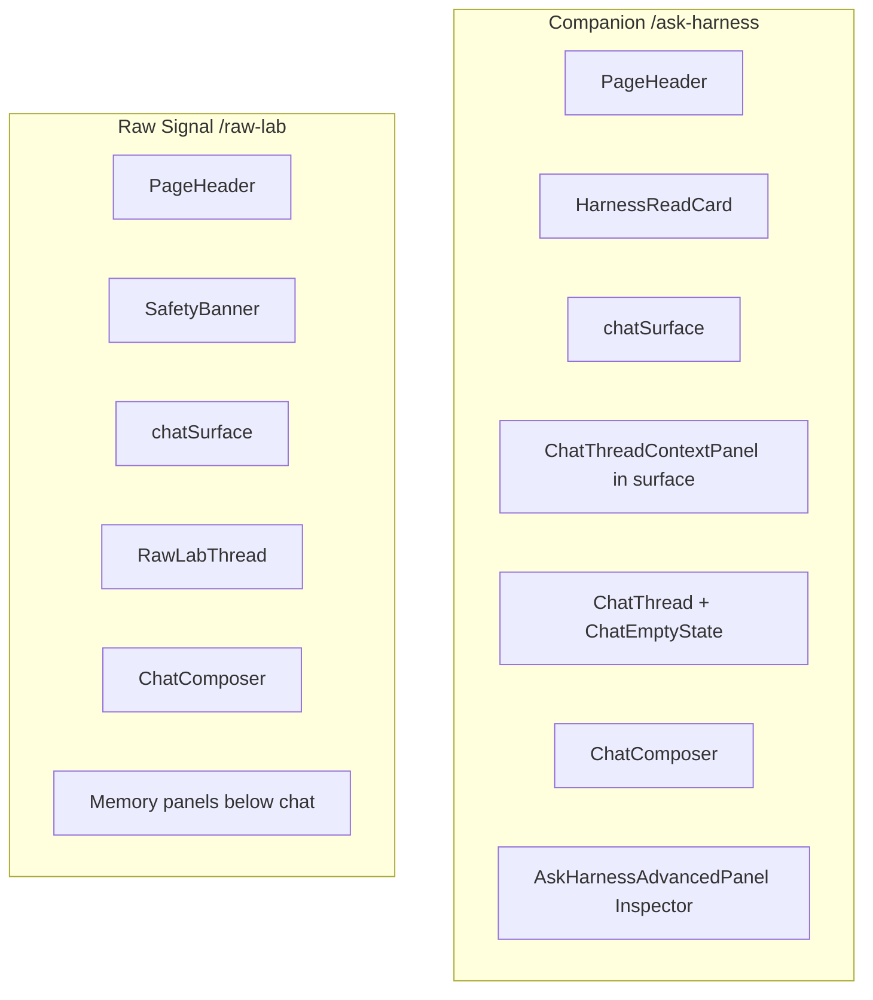

# Companion Chat Surfaces v0.1

**Builds on:** [lofi-companion-os-shell-v0.1.md](./lofi-companion-os-shell-v0.1.md), [board-quest-cards-v0.1.md](./board-quest-cards-v0.1.md)

**Branch:** `feat/companion-chat-surfaces-v0.1`

## Problem

Companion and Raw Signal still felt like dev harness screens: leftover Harness/Raw Lab language, dominant inspector panels, detached composers, and unclear mode distinction.

## Component map (before)



## Target distinction

| | Companion | Raw Signal |
|---|-----------|------------|
| Grounding | Reads board context | Ungrounded sandbox |
| Authority | Suggests only; user approves changes | No board read or mutation |
| Voice | Calm, useful, trusted (violet accent) | Weird riffs, playful (dusty blue accent) |
| Escalation | N/A | Explicit handoff → Companion |

## Layout (after)

```
PageHeader
Mode note (always visible for Companion grounding / Raw Signal safety)
ChatSurfaceFrame
  Thread + composer attached
ChatAdvancedPanel (Backroom, collapsed default)
  Debug / memory / budget internals
```

**Rule:** Grounding visible, internals hidden.

## What changed

- Shared `ChatSurfaceFrame`, `ChatModeNote`, `ChatAdvancedPanel`
- Companion: grounding note always visible; Backroom inspector collapsed; single-column layout on all widths
- Raw Signal: safety note visible; advanced panels in Backroom; playful starters preserved
- Copy: Companion / Raw Signal product language (not Ask Harness Dev / Raw Lab)
- Composer placeholders per mode

## What did not change

- Routes `/ask-harness`, `/raw-lab`
- Gateway clients, provider logic, memory architecture
- Raw Signal containment (no board context imports)
- Handoff: Open in Companion with board context

## Safety boundaries

- Raw Signal must never consume board context directly
- Companion reads board context but does not auto-mutate
- S3 / sensitivity routing unchanged

## Backlog

- Non-scroll chat viewport (Screen is ScrollView)
- Gateway health poll defer on mount (if not isolated to UI timing)
- Card detail chat polish
